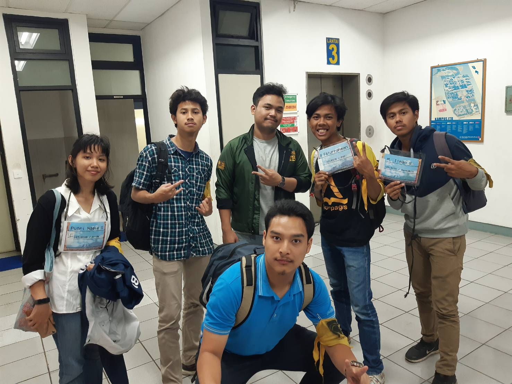

# Wawancara Kak Thareq

Sore itu, ITB seperti biasanya sedang ramai, termasuk Labtek V rumah bagi para anak Informatika dan STI. Awalnya, kami berniat untuk ngobrol santai (wawancara) bareng kak Thareq di Labtek V. Tetapi, karena terlalu ramai akhirnya kami memutuskan untuk pindah ke CC Barat yang sebenernya sedang ramai juga. Ngobrol santai kami dimulai dari perkenalan masing-masing dari kami dan termasuk kak Thareq juga, dari situ kami tahu nama lengkap kak Thareq, Thareq Muhammad Yusuf Hasnul Aziz.

Kak Thareq ini anak informatika dan alasannya simple ketika ditanya kenapa mau masuk informatika, yaitu karena IF lagi banyak dibutuhin di industry-industry dan juga kak Thareq memiliki ketertarikan dan kesenangan dalam ngoding. Kak Thareq banyak cerita tentang kehidupan chaos-nya IF, seperti tubes-tubes yang kak Thareq telah lewati. Salah satu tubes yang memorable buat kak Thareq adalah tubes disuruh membuat semacam Google Docs yang bersifat online. Menurut kak Thareq, tubes itu termasuk salah satu big boss nya dari tubes-tubes. 

Oh ya, kak Thareq punya jabatan di HMIF sebagai Director of People, mungkin ini salah satu alasan kenapa kak Thareq sangat friendly. Dulu kak Thareq juga sempet nyalonin diri buat jadi kahim, tapi hilang motivasi ditengah jalan dan gak ngadain kampanye. Alasan kak Thareq mau jadi Director of People karena kak Thareq memiliki keresahan ketika ada orang yang ikut kepanitiaan tetapi tidak dapat skill dari kepanitiaan tersebut. Kak Thareq mempunyai misi untuk mengubah hal itu. Di People kak Thareq punya beberapa proker diantaranya Latihan Kepemimpinan Organisasi untuk pembekalan calon ketua SPARTA dan ARKAVIDIA, Simulasi dan Pelatihan Keorganisasian untuk Anggota (SPARTA), Internship HMIF, dan Riset Kaderisasi untuk menentukan nilai-nilai apa aja yang harus diturunkan selanjutnya menyesuainkan dengan zaman.

Pengalaman horor kak Thareq selama di ITB adalah ketika sedang menjadi panitia pernah mencium bau melati di kolam mesin. Asal usul dari kehororan kolam mesin adalah dulu pernah ada 2 mahasiswa yang sedang naik mobil terjatuh di kolam mesin bersama dengan mobilnya. Salah satu dari 2 mahasiswa tersebut merpakan mahasiswa yang akan sidang besoknya. Anehnya, mahasiswa yang akan sudang tersebut tidak ada mayatnya, sementara teman yang ikut terjatuh ada mayatnya.

[Lanjutin Gan]
  

Foto dari kiri ke kanan : Nadia, Rafi, Bagas, kak Thareq, Fatur, Ilman
