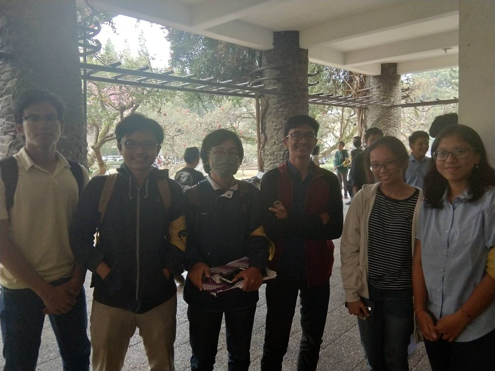

Halo! Pada hari Kamis 22 Agustus 2019, kami berkesempatan untuk berbincang
dengan Kak Rizki Alif Salman Alfarisy atau yang akrab disapa Kak Alfa.
Sebelum kami membeberkan hasil perbincangan kami. Mari kami perkenalkan
dulu, siapa sih Kak Alfa?

# Rizki Alif Salman Alfarisy
Kak Alfa adalah mahasiswa Teknik Informatika angkatan 2016, spesifiknya
dari K-2 (yep dia se-detailed ini). Kakak ini sebenarnya punya banyak panggilan.
Ada yang memanggil dia Alfa, Alif, atau Chacha. Unik, bukan? Kak Alfa adalah
sosok yang mengetuai Divisi Aksara di Internal HMIF. Perjalanan Kak Alfa di HMIF
dimulai dari saat Ia magang di BRT setelah SPARTA. Keputusannya magang di BRT
didasari karena prihatin atas kondisi sekre 2 yang besar namun (agak) tidak terawat.
Beberapa lama setelah banyak bergelut di dunia rumah tangga HMIF, Kak Alfa memutuskan
untuk masuk ke divisi Aksara. Kak Alfa bahkan dipercayakan untuk menjadi ketua divisi
tersebut. Kak Alfa menceritakan latar belakangnya yang sangat suka merangkum hal-hal 
akademik saat sekolah dahulu. Melihat keadaan di HMIF yang cukup tertutup soal 
rangkuman-rangkuman materi akademik (ada tetapi eksklusif untuk circle tersendiri), 
Kak Alfa menginginkan adanya rangkuman materi yang dibuat oleh anggota HMIF dan 
untuk anggota HMIF sendiri juga. Maka itulah, Kak Alfa memulai jalan tersebut. 
Selain kepeduliannya terhadap HMIF, Kak Alfa juga bersedia menjadi
kadiv Aksara karena dia ingin dapat sabuk juga saat wisuda (tidak bohong).

Jobdesc utama Kak Alfa yang dia fokuskan di Aksara adalah mendekatkan HMIF
dengan cara menolong teman-teman, baik di akademik maupun kesejahteraan. Passionnya diwujudkan dalam beberapa proram kerjanya
di Aksara. Proker-proker Kak Alfa adalah Sharing untuk mengajari anggota untuk memakai
Git, Sharing tentang TA, pembagian info-info beasiswa dan juga deadline akademik (tubes dkk),
Tutorial matkul, Drive Akademik, Info Oprec Aslab dan juga Advokasi.

### Kenapa ITB dan kenapa IF?
Pilihan Kak Alfa untuk berkuliah di ITB diawali dengan memang karena kakak kelahiran Bandung ini merasa bahwa
ITB adalah yang paling dekat. Tidak ada kampus lain yang memiliki prospek sebagus ITB dan juga sedekat ITB.
Selama 1 tahun TPB, Kak Alfa memutuskan untuk mengambil jurusan Teknik Informatika di STEI. Kenapa? Kak Alfa berpendapat bahwa
jurusan lain jurusan yang kurang cocok untuk dirinya, terutama STI. Kak Alfa merasa STI banyak memiliki aspek bisnis yang kemudian membuatnya lebih memilih Teknik Informatika sebagai majornya. Selain itu, Kak Alfa tidak menyukai PAR (susah katanya), dan berdasarkan uraian dari seorang kakak tingkatnya, telkom itu santai. Akhirnya, setelah mengeliminasi jurusan-jurusan yang tidak diinginkan, tersisalah Teknik Informatika.

### Pengalaman selama tingkat dua?
Tingkat dua tuh fokus belajar ke dasar-dasar computer science, sudah ada tucil dan tubes. Tapi tingkat dua nggak separah di tingkat tiga yang chaos-nya minta ampun. Kak Alif pada saat tubes OOP membuat project Insaniquarium, karena kak Alif tipe orang yang deadliner, temannya pun deadliner, maka mereka mengerjakan tubesnya tiga hari begadang. Pada saat tingkat dua, kak Alif juga lebih sibuk di luar dibandingkan akademik.

Selain itu, salah satu matkul berkesan lainnya saat tingkat dua adalah TBFO. Tubes dari matkul ini adalah membuat sebuah *compiler*. Hal ini *impossible* buat tingkat dua, menurut Kak Alfa. Nyatanya, memang hanya 2-3 kelompok di angkatannya yang mampu menyelesaikan tubes ini, sisanya gak kelar. Walaupun sempat ditawari waktu tambahan satu minggu oleh asisten untuk menyelesaikan tubes tersebut, tetapi karena tugasnya memang *impossible*, tawarannya ditolak oleh kelompok Kak Alfa. Lebih baik langsung dikumpul saja.

### Orang-orang favorit di Labtek V
Kak Alfa punya dosen-dosen favorit. Yang pertama adalah Pak Rinaldi, karena Pak Rinaldi sangat transparan soal dari mana nilai mahasiswanya berasal. Kata Kak Alfa, tidak semua dosen bisa setransparan itu soal nilai mahasiswa, ada beberapa yang matkul yang nilainya 'turun dari langit'. 

Dosen favorit kedua Kak Alfa bernama Pak Yudhis(?) karena sifatnya. Jadi, Pak Yudhis ini adalah orang yang 'sombong', keras tapi sangat pintar. Semua argumen dan penjelasannya (selama ini) selalu akurat. Rasanya seperti ingin membantah perkataan Pak Yudhis tapi tidak bisa karena apa yang dikatakan Pak Yudhis memang benar. Mengutip Kak Alfa sendiri, "Lucu aja gitu ngeliat orang dimarah-marahin." (Ck ck)  Beliau juga tahu banyak trivia soal informatika dan memiliki cara yang brilian dalam menjelaskan materi.

Kak Alfa juga mengagumi Bu Masayu karena Beliau hafal nama anak-anak satu angkatan. Hal ini menunjukan betapa dedikasi dan niat(?) Bu Masayu kepada para mahasiswanya sangat besar. Cara mengajar Bu Masayu juga enak. Sementara kalau soal *staff* Labtek V seperti orang dapur atau *maintenance*, Kak Alfa mengaku tidak sedekat itu dengan mereka dan masih *awkward*.

Lalu, mahasiswa favorit Kak Alfa katanya rahasia karena itu topik sensitif (wah berarti orang favoritnya *memang* orang labtek V). Akhirnya pertanyaan untuk bagian ini diganti: *Kalau Kakak jadi cewek, siapa cowok BIT yang mau Kakak pacarin?*
Pertanyaan ini cukup sulit untuk Kak Alfa karena dia harus melihat katalog (*read: member grup angkatan*) dulu baru bisa memutuskan. Setelah beberapa kali *scroll* naik dan *scroll* turun, Kak Alfa menjatuhkah pilihan ke Kak Rama, karena (katanya) Kak Rama alim, baik, dan seorang sultan.

### Kalau pengalaman magang gimana, Kak?
Kak Alfa pernah magang di Traveloka, posisinya sebagai *quality engineer*. Tugasnya adalah mengotomatisasi *testing* produk, misalnya di aplikasi jika memencet A akan keluar apa, jika memencet B akan keluar apa, apakah sesuai dengan harapan atau tidak. Karena melelahkan kalau manusia yang melakukannya satu-satu, maka dibuatlah sebuah program, sebuah emulator untuk secara otomatis mengetes fitur-fitur aplikasi tersebut. Emulator ini akan me-*load* sendiri, memencet-mencet tombol di app, membandingkan hasilnya dengan ekspektasi, dan melaporkan mana saja yang ada *error* atau kesalahan. 

Kenapa Kak Alfa bisa ada di posisi ini? Jadi, dia sebenarnya mendaftar sebagai *back-end engineer*,  tapi atasan(?)nya menyuruh Kak Alfa untuk ikut wawancara di *quality engineer* dan ternyata diterima di sana. Ketika magang, pernah ada sebuah fitur voucher di traveloka yang ketika dipake membuat aplikasinya *crash*. Ketika hal-hal tersebut terjadi, apalagi saat aplikasinya udah tersebar secara publik, maka harus dilakukan *update* dadakan (Hot Fix). Biasanya, hal yang menandai telah terjadinya hot fix ini adalah adanya tiga bilangan yang dipisahkan oleh dua tanda titik di versi aplikasinya tersebut, seperti 3.12.1, 3.12.2 (artinya telah dilakukan 2 kali hot fix pada aplikasi versi 3.12).

Kalau perbedaan antara magang dan kuliah, Kak Alfa berpendapat kalau magang itu lebih ke penerapan, mendapat ilmu *practical*; sementara kuliah lebih bersifat teori.

### Rencana setelah lulus
"PENGEN PENSIUN", kata Kak Alfa. Jawaban tersebut memang jawaban yang benar-benar berasal dari hati. Sebisa mungkin kalau memang bisa langsung pensiun kenapa tidak, kan? Tapi setelah itu dijabarkan jawabannya yang lebih cocok diaplikasikan untuk kehidupan. Kak Alfa sangat ingin kerja di luar negeri, pekerjaannya sendiri Ia ingin yang tidak repetitif, tentu biar tidak bosan. Ada keinginginan untuk bekerja di Google ketika Ia lulus. Untuk menikah sendiri, Kak Alfa sudah menetapkan angka. 28 tahun, tidak kurang tidak lebih. Amin ya, Kak.

### Harapan untuk angkatan 2018?
Harapannya semoga angkatan kalian menjadi angkatan yang solid, bukan cuma pada saat kegiatan SPARTA aja tapi untuk seterusnya. Kalian harus bisa bekerja sama dengan orang lain karena pada saat dunia kerja nanti dibutuhkan kerja sama dengan pekerja kantor yang lain dalam hal pembuatan kode misalnya. Kalau bisa kerjakan tugas dengan baik, usahakan jangan deadliner karena nanti bakal chaos sendiri.

### Apa kendala yang ada di Aksara?
Salah satu kendala di Aksara yaitu kurangnya mahasiswa STI yang ada di Aksara. Pada tahun sebelumnya tidak ada mahasiswa STI di aksara, sedangkan pada tahun ini ada satu mahasiswa STI di Aksara. Masalahnya adalah Kak Alif merupakan mahasiswa Teknik Informatika, sehingga dia tidak tahu bagaimana kehidupan di STI, bagaimana kekeosan di STI, dan juga akademik di STI, jadi bingung untuk menambahkan materi STI. Di setiap kelas ada satu orang yang bertugas memantau kelas tersebut, untuk melihat bagaimana keadaan kelas, keadaan orang-orang yang ada di kelas, dan juga mengawasi orang-orang yang bermasalah. Tetapi karena tahun sebelumnya tidak ada yang memantau di STI jadi Aksara kurang tahu keadaan orang-orang di STI tahun lalu. 

### Gimana pengalaman kakak nginep di sekre?
Kak Alif itu sering nginep di sekre. Katanya, sekre itu baru enak dan nyaman sejak tahun lalu. Seringnya nginep di sekre karena nubes, jadi panitia SPARTA, pernah juga memeriksa bukang Unix, rapat DE saat malam hari yang dilanjutkan esok paginya sehingga lebih memilih untuk menginap di sekre. Katanya, kenal orang-orang di labtek V itu penting. Dengan dekat dengan orang- orang yang ada di labtek V, biasanya urusan yang ada di labtek V lebih dimudahkan. Misalnya saat menginap di sekre atau meminjam ruangan di labtek V.

