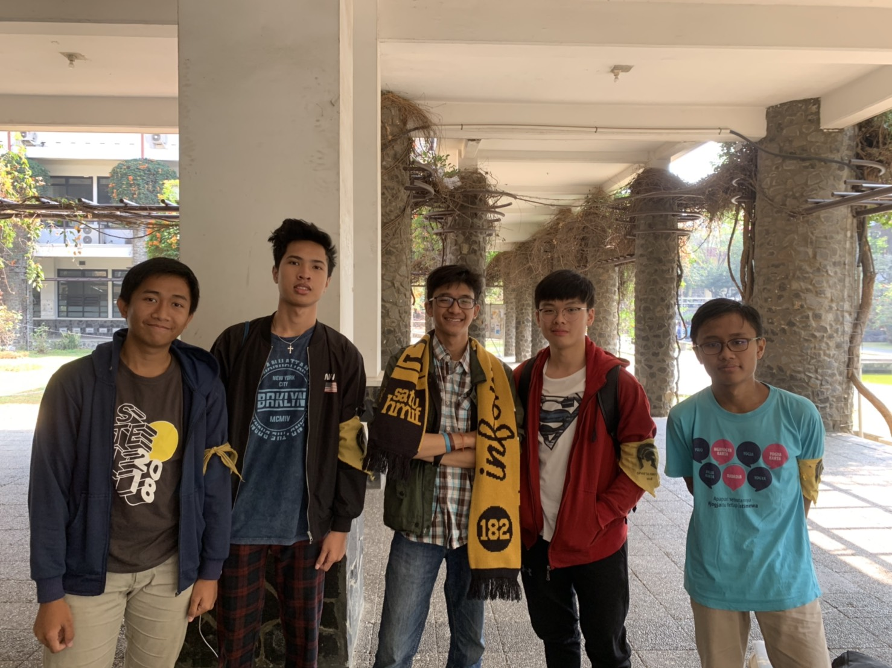

# Wawancara Daemon Kak Rizky Alif Salman Al Farisy

Wawancara oleh :
1. Aditias Alif Mardiano (16518044)
2. Brandon Oktavia Pardede (16518151)
3. Muhammad Mirza Fathan Al-Arsyad (16518189)
4. Jones Napoleon Autumn (16518283) 

Pada Selasa, 27 Agustus 2019, kami mewawancarai kak Rizky Alif Salam Al Farisy, yang biasa dipanggil Cha atau Alif dari jurusan Teknik Informatika angkatan 2016. DI HMIF Kak Cha menjabat di Departemen Internal sebagai Ketua Divisi Aksara.

## Mengapa memilih Divisi Aksara
Dulunya, Kak Alif magang di Divisi BRT, alasannya karena enak aja buat sekre nyaman gitu, juga sekre kan gede dan ada 2 lagi. Akan tetapi, karena masalah satu dan lain hal, akhirnya akhirnya Kak Cha beralih ke Aksara. Alasan lainnya adalah karena emang Kak Alif suka perihal-perihal akademik, suka bkin rangkuman. Namun, semua orang sebenernya sudah bikin rangkuman sendiri" per circle maupun kelas, dan isinya bisa berbeda-beda, makanya Kak Alif ingin mengubah itu dengan cara menjabat di Aksara. Alasan alternatifnya juga karena tidak ada yang mau menjabat di Aksara.

## Job Desc dan Proker Divisi Aksara
Job Desc Proker yang dimiliki Aksara adalah bertanggung jawab terhadap Akademik dan Kesejahtraan anggota. Proker-proker yang dimiliki mengingatkan tentang deadline tugas dan memberikan akses untuk tutorial matkul anggota-anggotanya. Juga membuat drive akademik untuk anggota HMIF yang berguna menjawab permintaan anggotanya untuk bertanya hal-hal yang belum terjawab atau belum jelas, juga ada workshop Git yang memang diajarkan untuk mempermudah anggotanya dalam mengerjakan tugas-tugas akademik. Lalu ada Sharing TA untuk memudahkan pengerjaan angkatan atas angkatan atas. Dan juga ada advokasi yang gunanya untuk mencari anak-anak yang bermasalah di tiap kelas, dilakukan pendekatan agar bisa membantu kesejahtraannya.

## Cara Kak Alif untuk Catch Up Proker
Kak Alif memberitau cara-cara yang Ia lakukan untuk memanage waktu untuk membagi fokus proker dan akademik ITB yang penuh akan deadline tugas. Sebagai Kadiv, ia memulai kepengurusan dengan membuat shift-shift yang dibagi antara staff tingkat dua dan tingkat tiga, ia juga mengasih tips-tips manajemen waktu seperti memberi target atau deadline serta timeline agar kejaran proker dapat terus berjalan. Ia juga memberi tau bahwa tiap proker memiliki multichatnya.

## Kuliah Praktek
Nah, jadi Kak Alif baru menjalani kuliah prakteknya di salah satu unicorn Indonesia yang disebut Traveloka. Memiliki job sebagai Quality Engineer Intern, Kak Alif mengatakan ternyata walaupun company yang sebesar Traveloka juga memiliki banyak bug di dalam applicationnya. Nah, jadi jobdesc seorang Quality Engineer itu sebenarnya hanyalah mengetest program secara manual, berbeda dengan Software Quality Assurance. Kemudian mencoba debug program yang ada.

## CV menurut Kak Alif
Berhasil menjadi bagian dari suatu perusahaan business-technological yang besar, kakak ini pun memberi kami banyak input mengenai caranya membuat CV. Katanya beliau juga tidak mempunyai lomba atau project yang sangat mapan. Akan tetapi, diberitahu bahwa apapun yang dikontribusi, tuliskan saja, seperti Kadiv Mamet SPARTA misalnya. Jadi, kepada yang membaca jika galau, mungkin advice kakak ini dapat diambil dan dicoba.

# Foto

