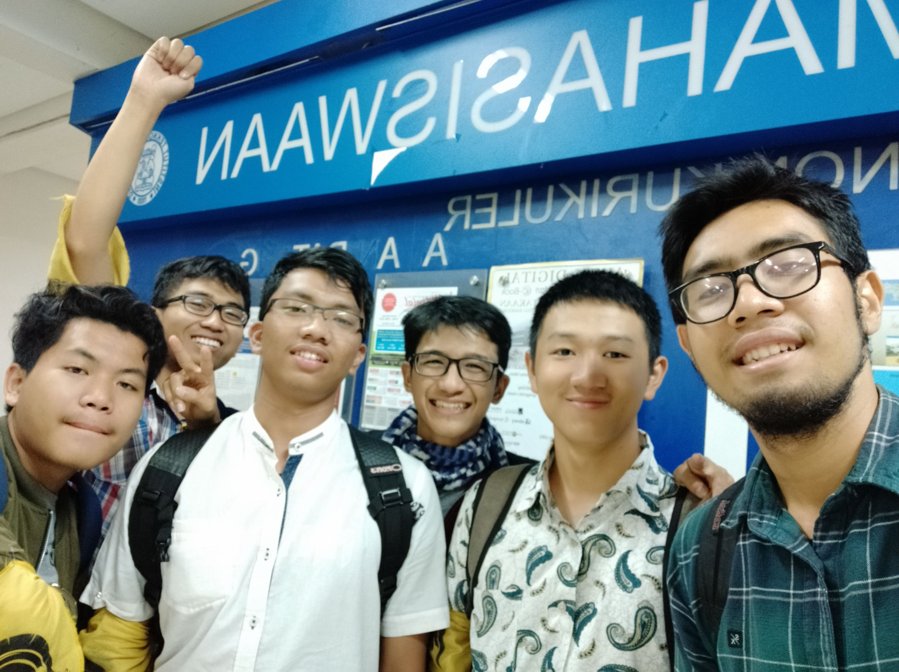

# Kak Rizki Alif Salman Alfarisy a.k.a. playfair
Rabu, 21 Agustus 2019

-  16518183 - Rafi Abbel Mohammad
-  16518214 - Muhamad Ihza Faida Akbar
-  13518056 - Michael Hans
-  13518092 - Izharulhaq
-  16518242 - Naufal Prima Yoriko 

# Tentang Kak Alif
Rizki Alif Salman Alfarisi, atau biasa dipanggil Alif atau Chacha, adalah salah satu kakak tingkat angkatan 2016 yang saat ini sedang memasuki Tingkat Akhir Perkuliahan. Kak Alif ini berasal dari Jurusan Teknik Informatika (IF).

## Peran di HMIF
Di dalam Himpunan Mahasiswa Informatika (HMIF), Kak Alif menjabat sebagai Ketua Divisi Aksara dari Departemen Internal. Kak Alif memilih jabatan tersebut karena Kak Alif ini suka merangkum materi-materi bersama-sama dengan teman-temannya. Selain itu, Kak Alif lebih suka membantu menjurus ke dalam hal akademik.  Alasan lainnya, dari dua pesaing lainnya yang akan menjadi kadiv aksara, satunya sering sakit dan satunya lagi tidak begitu disukai Unix. Sebagai ketua Aksara, Kak Alif mempunyai tanggung jawab terhadap kesejahteraan dan akademik dari 600 orang di HMIF yang meliputi tiga angkatan dari IF dan STI.

Terdapat beberapa program kerja dari divisi Aksara ini, yaitu :
1.	Share beasiswa atau informasi
2.	Tutorial dari asisten lab
3.	Drive akademik perkuliahan
4.	Open House Lab untuk merecruit asisten lab
5.	Kumpul asisten
6.	Workshop GIT
7.	Sharing Tugas Akhir (TA)
8.	Advokasi untuk kesejahteraan

# Pertanyaan Bebas
Latar belakang Kak Alif masuk ITB karena dekat dari rumahnya yang di Bandung. Lalu memilih STEI karena dianggap fakultas yang selow. Dan kemudian memutuskan melanjutkan ke IF karena tidak suka elektro (berdasar PAR), lalu tidak menyukai bisnis, jadi tidak mau STI, dan menganggap lingkungan telekomunikasi ga baik.

Hal yang paling kak Alif ingat saat di IF adalah saat smt 6. Karena pada semester itu ada Proyek Perangkat Lunak atau PPL.  Waktu itu kak Alif menerima proyek untuk membuat apps yang bisa tracking dokumen. Saat mengerjakan apps proyek PPL, kak Alif bahkan tiga hari tidak pulang ke rumah, sampai katanya berasa mau mati.

Kakak Alif memiliki tanggapan terhadap kegiatan berorganisasi dan akademik di HMIF. Tanggapan. Tentu akan adanya kekhawatiran akibat sibuknya perkuliahan akademik untuk tidak sempat berorganisasi. Menurut Kak Alif, mahasiswa IF/STI akan sempat untuk berorganisasi dalam himpunan. Untuk jadwal sibuknya sendiri, jadwal IF-STI cenderung bergelombang dalam hal kesibukan. Akan ada saatnya sangat sibuk atau chaos seperti menjelang ujian, dan akan ada saatnya santai juga, yakni dalam perkuliahannya.

Kakak Alif sendiri juga sempat merasa terbebani dengan mengambil jabatan sebagai Ketua Aksara. Namun Kak Alif mengingat kembali motivasinya untuk menjabat sebagai Ketua Aksara tersebut. Kak Alif mengingat akan amal-amal yang akan diperolehnya, mengingat semua yang dilakukan untuk kesejahteraan mahasiswa IF/STI, dan mengingat bahwa segala sesuatu yang dilakukan akan bermanfaat dan berguna untuk orang lain di sekitarnya. Dua hal inilah yang menjadi dorongan bagi Kak Alif agar setia memegang amanah tanggung jawab sebagai Ketua Aksara tersebut.

Kakak Alif juga mempunyai saran-saran tersendiri untuk adik-adik tingkat seperti DECRYPT 2018 ini. Kak Alif menyarankan kami untuk mengikuti lomba dan melakukan internship. Dua hal ini bisa menjadi pengalaman yang berharga buat ke depannya karena waktu awal memasuki perkuliahan Informatika merupakan saat yang tepat untuk mengeksplorasi dan berbuat salah-salah dalam hal perlombaan maupun ketika internship pertama kali itu.

Kami menanyakan reaksi kak alfa mengenai suatu postingan di website Q&A mengenai seseorang yang mengatakan kalau Osjur HMIF tidak berguna. Dan reaksinya adalah katanya dulu memang aneh osjur nya, sampai sampai disuruh yang aneh aneh. Untung saja osjur saat kami tidak aneh aneh dan semuanya ada esensinya. 

Kak Alif ini di keilmuan informatika sebenernya masih belum menemukan spesialisasinya, tapi ia cukup tertarik dengan bidang CTF (Capture The Flag) dan organisasi komputer, selain dua hal tersebut, ia juga cukup tertarik ke bidang AI (Artificial Intelligence).

Nah, lalu kak Alif ini juga pada dulunya aktif di unit UKJ (Unit Kebudayaan Jepang) ITB, disana ia juga pernah memasuki divisi BRT (Badan Rumah Tangga), hal tersebut juga pernah mendasari ia untuk masuk ke BRT HMIF ITB, tetapi karena satu dan lain hal yang berada di HMIF ITB pada saat ia mau intern di BRT, ada sebuah cerita menarik yang mungkin sedikit sensitif yang membuat ia tidak ingin masuk ke BRT HMIF ITB saat itu. Kak Alif ini asik orangnya, kami sangat enjoy saat mengobrol dengan dia.

Pengalaman yang berkesan bagi kak Alif selama kuliah praktek di Traveloka adalah ketika farewell ia dibuatkan buku yang berisi kesan pesan tentang dirinya dari rekan kerjanya

Kesan kak Alif selama menjabat di HMIF adalah cukup melelahkan, akan tetapi ada rasa sense of accomplishment yang ia rasakan. Selain itu, kak Alif merasa senang karena mendapat banyak teman

# Kesan
Kesan kami selama wawancara dengan Kak Alif atau Chacha ini orangnya asik banget, terus juga suka inisiatif menceritakan banyak hal. Jadi kami bisa tahu berbagai hal bahkan belum kami tanyakan.

# Foto

