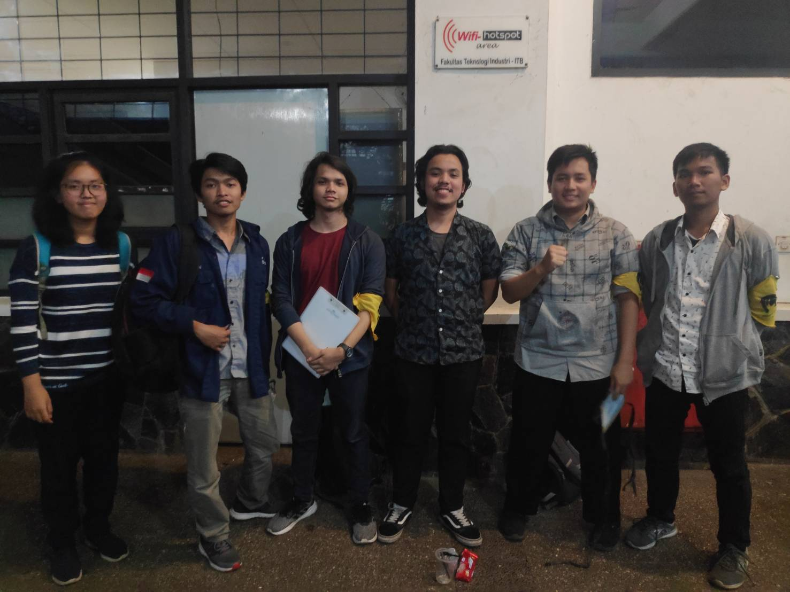

# Wawancara Daemon 'periodic table'

Pada hari Selasa, 27 Agustus 2019 pukul 18.00, kami,
- 16518160 - Naufal Dean A,
- 16518177 - Aufa Fadhlurohman,
- 16518304 - Tifany Angelia,
- 16518353 - Dimas Wahyu Langkawi,
- 16518368 - Bambang Haryo Pramudio Bagus Anggito,

mewawancarai kak Bernard yang menggunakan nama sandi 'periodic table'.

# Summary

## Biodata Singkat
Rahmat Nur Ibrahim Santosa atau yang biasa dipanggil Bernard. Beliau berada di Teknik Informatika, kak Bernard sebenarnya tidak terlalu suka ngoding, tapi saat mau masuk ITB masih bingung mau masuk fakultas mana dan menaruh STEI sebagai pilihan pertama dan akhirnya keterima di STEI, saat tpb kak bernard masih bingung mau masuk jurusan mana karena yang kak Bernard benar benar minati adalah matematika maka pilihan terdekatnya adalah IF. Di HMIF kak Bernard berperan sebagai Vice President of Internal Affair. Secara umum program kerja yang dibawahinya adalah Dies Natalis HMIF. Alasan kakak yang satu ini mengambil bagian dalam internal karena senang mengobrol dengan orang lain dan berkeinginan untuk dapat membantu dan berkontribusi bagi HMIF. Kak Bernard memiliki prinsip unutk selalu bisa bermanfaat dan memberi dampak pada sekitar kita. Sedangkan pada Arkavidia kak Bernarn berperan sebagai bagian MSDM karena ketika forsos MSDM diceritakan sebagai divisi yang gabut tapi hura-hura kerjanya. Sedangkan pada Arkavidia selanjutnya kak Bernard berperan dalam bidang lomba Arkalogika karena ditarik kadivnya.

## Pertanyaan Bebas
### Hobi
Kak Bernard suka main musik dan instrumen favoritnya yaitu keyboard atau piano. Karena alasan ini pula kak Bernard sempat mencoba masuk ke itb jazz.

### Unit
Pada masa TPB kak Bernard semoat mendaftar 3 unit yaitu UBV, ITB Jazz, dan LSS namun pada awal awal TPB kak Bernard mendrop UBV, dan juga mendrop ITB Jazz pada semester 2. Lalu pada tingkat 2 kak Bernard mencoba masuk unit LFM dan akhirnya lantik dan menjadi kru sampai sekarang.

### Dean: Tubes paling susah?
Kata kak Bernard tubes paling susah itu pas bikin OS. Secara umum semua tubes tu bikin sering begadang, seringnya sih begadang di ayam-ayaman. Namun, sebenarnya bisa aja cepat selesai kalau bisa manage waktunya.

### Dean: Makanan favorit?
Awalnya sih jawabnya pasta, tapi terlalu mewah katanya. Akhirnya, ganti jadi pempek atau sushi (padahal sushi mahal juga).

## Hal-Hal yang Berkesan tentang Kak Bernard
Kak Bernard orangnya santai dan humoris, tapi jago orangnya.
