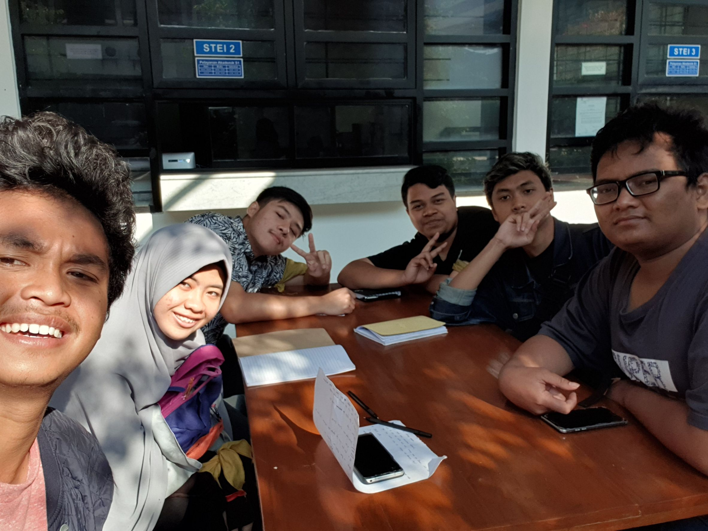

# Wawancara Daemon

## Wildan Dicky Alnatara

Pewawancara :

- Fikra Hadi Ramadhan - 16518071
- Dimas Lucky Mahendra - 16518324
- Fabianus Harry Setiawan - 16518339
- David Gozaly - 16518358
- Khairunnisa Rifdah - 16518399

## Deskripsi

Pada hari Jumat, tanggal 23 Agustus 2019, pukul 7 pagi, kami berlima mendapat kesempatan mewawancarai kak Wildan Dicky Alnatara, atau yang biasa akrab dipanggil dengan sebutan Wildan. Kak Wildan adalah ketua Departemen Inkubator IT HMIF dari Jurusan Teknik Informatika angkatan 2016. Departemen Inkubator IT sendiri memiliki satu proker besar yang dijalankan, yaitu IIT Day, yang bertujuan untuk melatih anak marketing IIT. Kak Wildan awalnya menjadi ketua departemen Inkubator IT karena udah punya pengalaman di bidang tersebut dan juga karena diminta sendiri secara langsung oleh Ketua Himpunan HMIF, yaitu Kak Abbay, karena sebelumnya memang berasal dari IIT, dan ingin belajar bagaimana cara memanajemen orang dan proyek, serta melobi klien.

## Pertanyaan

Salah satu pekerjaan yang ada di departemen Inkubator IT adalah menjadi Project Manager. Kami pun menanyakan bagaimana cara memilih Project Manager dari Suatu Proyek yang masuk ke Inkubator IT. Kak Wildan menjelaskan bahwa biasanya project manager diambil dari orang-orang yang magang ataupun staff divisi, namun apabila demand untuk Project Manager tinggi karena banyaknya proyek yang masuk ke dalam Inkubator IT, biasanya akan dilakukan Close Recruitment.

Sebagai orang yang sudah menjalani kehidupan di ITB selama 3 tahun lebih dan sudah banyak mengambil pengalaman kerja, kami pun bertanya kepada kak wildan bagaimana relevansi materi di kuliah dengan kenyataan yang akan kami hadapi di dunia kerja. Kak wildan pun menjawab bahwa teori yang didapat pada saat belajar materi di kuliah tidak akan terlalu banyak dipakai, namun tugas-tugas besar dan praktek dalam pembuatan program mungkin relevansinya lebih besar karena mendapatkan pengalaman langsung cara membuat suatu program dan biasanya kita kadang dihadapkan dengan tantangan yang sejenis.

Selain itu, dari pengalaman kak Wildan slama berkuliah di ITB, menurut kak Wildan kelebihan IF ITB dibandingkan dengan universitas lain, misalnya Fasilkom adalah dari segi Akademik ITB lebih unggul (skill teknis mahasiswa ITB lebih baik, serta dosen-dosen ITB lebih terkenal sehingga bagus untuk meminta surat rekomendasi). Namun, kelebihan universitas lain adalah management orang-orang di universitas lain lebih baik, sehingga dapat menghasilkan karya-karya yang terlihat lebih bagus seperti misalnya website-website lomba.

Menurut kak Wildan, magang adalah sarana bagi mahasiswa untuk menrasakan pengalaman bekerja, karena yang akan kita hadapi di dunia kerja pastinya berbeda dari pengalaman selama kuliah. Sedangkan mengikuti lomba adalah sarana untuk latihan menerima feedback dari juri, dan merupakan hal yang tidak bisa dilatih di kehidupan sehari-hari. Lomba juga bisa untuk melatih dan menguji ide-ide kita. 

Di ITB ada 3 kali wisuda dalam setahun, Wisuda Juli, Wisuda April, dan Wisuda Oktober. Menurut kak Wildan, kultur HMIF itu wisudanya rame saat Wisuda Juli dan juga Wisuda Oktober. Alasan utamanya adalah karena di dua batch wisuda itu, wisudawannya paling banyak. Selain itu, saat Wisuda Juli bakal ada banyak anggota SPARTA HMIF yang ikut bantu meramaikan dan mengarak para wisudawan di Wisuda Juli.

Sepengalaman kak Wildan, kak Wildan ga pernah mengalami lowest point yang benar-benar rendah selama dia kuliah di ITB. Contoh klasik lowest point seperti merasa salah jurusan, dia gak pernah mengalami itu. Tapi, meskipun dia sekarang di Teknik Informatika, tadinya dia pengen masuk Teknik Elektro. 

Kebetulan, kemarin Kak Wildan KP di Microsoft Indonesia sebagai software engineer. Kak Wildan membagikan cerita paling mengesankan saat KP adalah diajak jalan-jalan ke Bali. Karena sistem di Microsoft itu tutup tahun saat summer (Juli-Agustus), jadi sebagai perayaan akhir tahun diadakan acara jalan-jalan ke Bali. Dan menurut Kak Wildan ini merupakan kesempatan yang sangat berharga karena tidak semua orang bisa merasakan jalan-jalan ketika KP. 

Kak Wildan juga menceritakan pengalaman menjadi panitia Arkavidia. Kak Wildan mengambil peran sebagai staf bagian IT Festival, yaitu bagian yang mengurusi IT Festival saat hari H acara. Tugasnya itu menghubungi startup yang akan mengisi stand juga pihak-pihak yang akan mengisi stand makanan saat IT Festival. Saat hari H pun pekerjaannya sangat fun kalau kata Kak Wildan karena tugasnya itu panggilin startup untuk naik ke panggung, membagikan souvenir untuk pengunjung yang mengumpulkan poin, dan memegang bagian pendaftaran. Kak Wildan juga berpesan agar mendaftar menjadi panitia Arkavidia karena seru, terutama bagian IT Festival.

