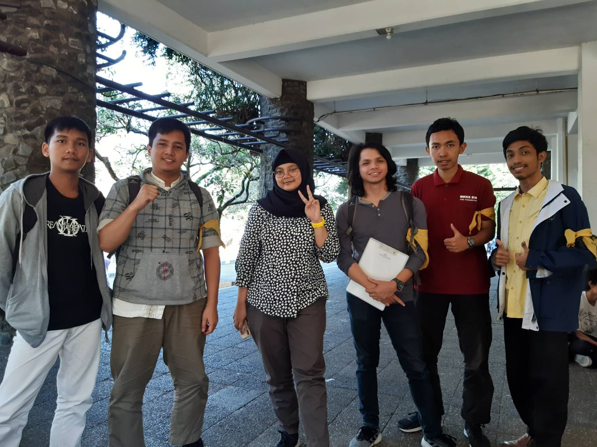

# SUMMARY
Pada hari Jumat, 23 Agustus 2019, kami berkesempatan mewawancarai salah satu Daemon HMIF yang bernama lengkap Azka Nabilah Mumtaz. Kakak yang biasa disapa kak Azka ini merupakan kepala Divisi Badan Rumah Tangga, Bidang Internal. Motivasi kakak asal Surabaya ini mengambil jabatan tersebut karena diawali dari keresahannya yang melihat sekre HMIF kurang rapih, sedangkan dirinya suka dengan kerapihan. Sedangkan saat menjalankan Arkavidia kak Azka berperan sebagai Sekretaris 1 dan dipilih karena senang dan rapih dalam melakukan arsip. Kak Azka berada di jurusan Teknik Informatika. Alasan beliau masuk IF karena suka hitung-hitungan matematika, sebelumnya kak Azka tertarik masuk FK tapi ternyata kurang suka menghafal.

Divisi yang merupakan tanggung jawab kak Azka yaitu Badan Rumah Tangga (BRT) memiliki beberapa program kerja. Secara umum terdapat enam program kerja yang namanya diambil dari nama makanan seluruhnya. Pertama adalah Martabak (Mari Kita Bereskan), sesuai namanya proker ini berfokus pada penataan sekre dalam bentuk revitalisai dan pengubahan layout. Kedua yaitu Kantin Jasuke (Jajanan Selingan dan Kue Kue) yang berfungsi sebagai penyedia asupan makanan ringan di sekretariat. Yang ketiga Permen Asem yang merupakan program piket departemen dan lembaga yang sifatnya mingguan dan dibagi menjadi piket sekre 1 dan sekre 2. Sedangkan sisanya yaitu Kare, Rendang, dan Jasjus yang merupakan program pendataan barang sekre, rekapitulasi, dan jalan santai ke sekre himpunan lain.

### Asal Nama s-box
Asal usul nama s-box itu ternyata nama-nama tersebut sudah disediakan, dan kakak-kakaknya hanya tinggal memilih namanya yang mana. Nah, Kak Azka memilih nama "s-box" itu karena nama itu beda sendiri dari yang lainnya, karena nama itu satu-satunya yang ada symbol stripnya ('-').

### Unit Kegiatan
Kak Azka mengikuti dua unit kegiatan mahasiswa di ITB. Pertama yaitu Liga Film Mahasiswa atau LFM. Di unit ini kak Azka senang dengan teman-temannya yang selalu menyambut dia. Sedangkan yang kedua adalah ISO dan di unit tersebut kak Azka memegang alat musik gitar. Dari sini terlihat kak Azka cukup menyukai musik.

### Kerja Praktek
Pada kerja praktek kemarin, kak Azka berkesempatan untuk bekerja di Tokopedia. Pada awalnya ia bertugas di bagian front-end. Namun pada kenyataannya ia menjadi full stack developer. Lingkungan kerja di Tokopedia cenderung santai. Fasilitas di kantor sangat lengkap, bahkan di dalam kantor yang besar itu terdapat ruang tidur untuk istirahat serta tempat bermain konsol game. Namun dirinya yang masih sebagai internship belum dapat memakai fasilitas secara full. Lingkungan kerja yamg didominasi pemuda juga membuat lingkungan yang asyik dan seru.

### Magang
Sebelum kerja praktek di Tokopedia, kak Azka juga pernah magang di perusahaan Nusantech. Pada perusahaan tersebut kak Azka lebih merasa bekerja secara penuh karena perusahaan yang sifatnya sedang dibangun. Banyak pelajaran yang dapat diambil dari sana. Magang ini dilakukan pada tahun lalu saat liburan.

