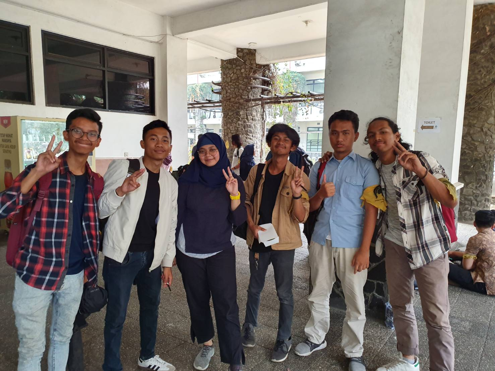

# Summary Wawancara dengan Kak Azka (s-box) 22/08/19 13.00

## Pengenalan

Pada hari Kamis, 22 Agustus 2019 pukul 13.00, kami,
- 16518063 - Yahya
- 16518250 -
- 16518166 - Ahadi Ihsan Rasyidin
- 16518202 - Hafshy Yazid Albisthami
- 16518372 - Radhinansyah Hemsa Ghaida

mewawancarai kak Azka yang menggunakan nama sandi 's-box'.

## Pertanyaan-pertanyaan formal

**Nama lengkapnya siapa Kak?**

Azka Nabilah Mumtaz

**Jurusannya apa?**

Teknik Informatika

**Perannya di DE / DPP / Senator / Arkavidia apa?**

Ketua Badan Rumah Tangga (BRT) DE HMIF ITB
Di Arkavidia : 1. Staff Public Relation
               2. Sekretaris 1

**Kenapa mau memegang peran tersebut?**

Ngambil jadi Ketua Divisi BRT karena diajak kahimnya waktu itu dan dinilai Kak Azka adalah orang yang rapi.
Jadi Staff PR di Arkavidia karena pengen punya relasi keluar.
Jadi Sektretaris 1 di Arkavidia karena dipilih sekjen waktu itu dan Kak Azka katanya suka aja ngerekap.

**Proker apa yang dijalani di peran tersebut?**

Proker yang Kak Azka jalani saat menjabat sebagai Ketua BRT yaitu ada proker yang namanya Martabak. Martabak ini adalah proker bersih-bersih sekre secara besar-besaran serta revitalisasi yang melibatkan seluruh massa HMIF. Lalu ada Kantin Jasuke, yaitu di sekre ada kantin yang nyediain kue-kue serta jajanan kecil lainnya.

## Pertanyaan-pertanyaan bebas

**Planning setelah lulus apa kak?**
Kak Azka setelah lulus berkeinginan untuk bekerja dulu, ingin merasakan bagaimana dibutuhkan dunia. Setelah itu baru menentukan sebenarnya apa yang dunia butuhkan lalu membangun perusahaan sendiri berdasarkan pandangan tersebut. Untuk jangka pendeknya kak Azka ingin bekerja di Tokopedia,

**Kalau punya pasangan sama-sama sibuk tapi nuntut perhatian gimana kak?**
Kak Azka bercerita pengalamannya. Menurutnya putus adalah keputusan yang bijak. Dulu kak Azka punya pacar. Di awal masuk jurusan pastinya kan masih adaptasi sama kesibukan. Saat itu kak Azka jadi jarang membalas pesan dari pacarnya. Melihat kak Azka bersikap demikian pacarnya marah dan selalu menuduh kak Azka macam-macam. Jadi dia memilih untuk putus tetapi bukan karena tidak menyukai pacarnya lagi, melainkan untuk berbenah mempersiapkan masa depan.

**Suami Idaman Kakak itu yang kaya gimana?**
Kak Azka pengennya sama orang yang nyaman, saling melengkapi, saling mendukung dan orangnya harus bisa toleransi. Selain itu ingin punya suami yang sevisi dan semisi. Kalau fisiknya pengen yang tinggi, ganteng dan sifatnya ingin yang humoris.

**Kalau Honeymoon pengen kemana?**
Pengen ke Eropa, lebih spesifiknya ke Paris. Pengen kesana karena bagus buat belanja - belanja.

**Apa yang kakak rasa masih kurang di HMIF dan perlu diperbaiki?**
Sekre HMIF masih berantakan. Di sekre juga masih banyak barang-barang yang tidak terpakai tapi masih ada di sekre. Tapi sekarang sudah dibuang.

**Kalau jadi hewan mau jadi apa?**
Jadi kucing peliharaan. Karena disayang, udah disediain makan, diperhatiin, dan sangat diurus.

**Apakah aktif di HMIF saja sudah cukup?**
Untuk masalah berorganisasi sudah cukup, namun untuk masalah keprofesian masih belum cukup, harus cari lagi kegiatan yang menunjang keilmuan dan keprofesian di luar HMIF.

**Kenapa dulu memilih jurusan Teknik Informatika?**
Sebenarnya dulu ingin masuk jurusan kedokteran, namun merasa kemampuan hafalannya kurang, jadi lebih memilih jurusan teknik informatika.

## Hal-hal lain yang dibahas saat wawancara

Kalau udah dilantik jangan ilang-ilangan ya temen-temen

## Hal-hal yang berkesan

Kesan wawancara dengan Kak Azka yaitu Kak Azka orangnya rame banget dan sangat terbuka jadi selama wawancara itu sama sekali tidak canggung dan banyak ketawanya. Kalau dikasih pertanyaan yang lucu juga jawabannya lucu.

## Foto bersama

Foto kami bersama Kak Azka Kiri ke Kanan : Radhin, Yahya, Kak Azka, Hafshy, Ahadi, Rakha
