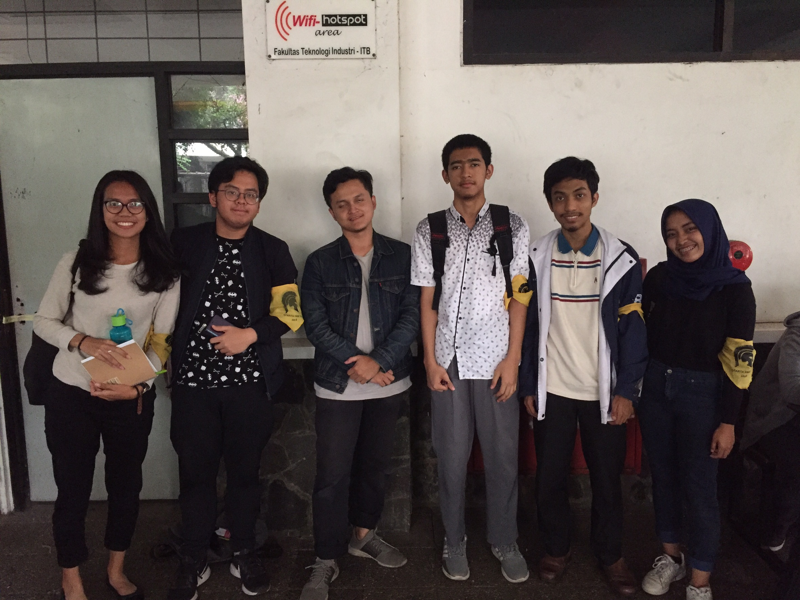

# Wawancara Daemon Kak Adylan Roaffa Ilmy
Wawancara oleh:
1. Moch. Nafkhan Alzamzami (16518001)
2. Kanisius Sosrodimardito (16518292)
3. Dhafin Rayhan Ahmad     (16518332)
4. Inka Anindya Riyadi     (16518344)
5. Mutiara Arifazzahra     (16518384)

Pada hari Kamis 22 Agustus 2019, tepatnya pukul 14.00 WIB di selasar timur Labtek V, Kami berlima melakukan wawancara bersama Kak Adylan Roaffa Ilmy dari Informatika 2016, yang di HMIF menjabat sebagai ketua Tech & Career Issues di Departemen Teknologi.

## Jabatan di HMIF
Di HMIF, Kak Adylan menjabat sebagai ketua Tech & Career Issues (TCI) yang termasuk dalam Departemen Teknologi. Alasan Kak Adylan masuk dalam Departemen Teknologi karena ia suka dengan hal-hal keprofesian. Sebagai ketua divisi TCI, Kak Adyla membuat Medium yang berisi tentang teknologi-teknologi terbaru. Awalnya pembuatan konten untuk Medium dilakukan oleh anak-anak TCI. Namun, seiring berjalannya waktu, ada pihak-pihak luar yang membantu tim TCI untuk membuat onten. Kegiatan lain pada TCI yaitu adanya Sharing Internship untuk membagi hal-hal yang berkaitan tentang magang ke mahasiswa. Pada semester lalu, acara ini berhasil mendatangkan 30 orang dan adanya partisipasi dari mahasiswa angkatan 2018. Kegiatan lainnya yaitu Internship Workshop. Pada kegiatan ini, mahasiswa diberikan materi mengenai bagaimana cara membuat curriculum vitae (CV) yang benar dan bagaimana interview yang baik ketika apply ke sebuah perusahaan.

## Pengalaman Intern
Selama hidupnya Kak Adylan pernah magang di Tokopedia, Jojonomic (Part-Time), DekoRuma (Kerja Praktek). Menurut pengalamannya itu, dalam hal mengapply suatu internship itu tidak ada yang salah ("Nothing to lose") karena jika pengajuan kita diterima maka kita akan mendapat pengalaman dan bila pengajuannya tidak diterima maka kita setidkanya mendapat pelajaran/pengalaman untuk kedepannya nanti.

## Fokus
Di perkuliahan ini, fokus Kak Adylan terdapat pada dunia keprofesian, karena menurutnya, hal itu dapat berdampak secara long term. Di samping itu, bidang keinformatikaan juga sedang booming sehingga terdapat banyak peluang yang tersedia. Ia juga bercerita bahwa ia sempat mencoba aktif di terpusat, tapi ia merasa bukan di sanalah tempat ternyamannya.

## Seputar SPARTA dan HMIF
Kak Adylan mengeluarkan statement bahwa orang-orang yang ia lihat aktif di SPARTA (pada tahunnya) belum tentu saat sudah di himpunan masih aktif. Ia juga berkata bahwa alasan ia tetap stay di HMIF ITB adalah karena ia tidak ingin meraih kesuksesan sendiri, tetapi ia juga ingin orang lain turut sukses. Singkatnya, ia ingin menjadi orang yang "give impact" kepada sesamanya. Kak Adylan juga senang mendapat kenalan baik berupa kakak tingkat ataupun adik tingkat. Mengenai SPARTA yang sedang berlangsung, ia berpendapat bahwa sistemnya sudah lebih baik karena imbang dengan keprofesiannya. Ia juga masih berpikir apakah sistem diteriaki itu benar-benar dibutuhkan atau tidak, walau sebenarnya pemberian tekanan itu juga perlu. Tetapi ia pun ingin tahu bagaimana hasilnya jika sistem diteriaki itu tidak diterapkan, apakah tetap bisa berjalan dengan lancar atau tidak.

## Penyesalan
Kami sempat menanyakan penyesalan apa yang Kak Adylan rasakan selama berkuliah di ITB. Kak Adylan menjawab ada dua hal. Hal pertama adalah ia sempat mendaftar beasiswa dan tidak berhasil mendapatkannya. Saat itu ia sempat merasa down walaupun tidak berlarut-larut. Hal yang kedua ialah Kak Adylan sempat merasa menyesal pada saat menjadi panitia OSKM ITB, ia tidak memilih divisi medik.

## Lomba dan Kesibukan
Kak Adylan sudah beberapa kali mengikuti Hackathon. Kesibukan yang ia jalani sekarang adalah mengurusi divisinya, part-time, tugas akhir, dan asistensi Laboratorium Basis Data.

## Tips bisa survive kuliah di informatika
Kalau ada tubes itu kita harus memanfaatkan itu dalam melatih kita untuk memanage tim, jadi setidak-tidaknya jangan skip tubes. Kita juga tidak boleh menghindari / tidak menghiraukan judge orang lain, tapi harus dihadapi dengan mengubah diri kita atau berargumen jika judge tersebut salah. Kak Adylan juga menyebutkan beberapa mata kuliah yang harus sangat dipahami agar memudahkan perkuliahan ke depannya, yakni Algoritma Struktur Data, Object Oriented Programming, Probabilitas Statistika--yang dapat berguna dalam dunia data science, dan Matematika Distkrit--walaupun agak terlalu teoritik.

## Cita-cita
Kak Adylan bercerita bahwa ia menginginkan menjadi seorang software engineer atau seorang PM (Project Manager).

## Foto

