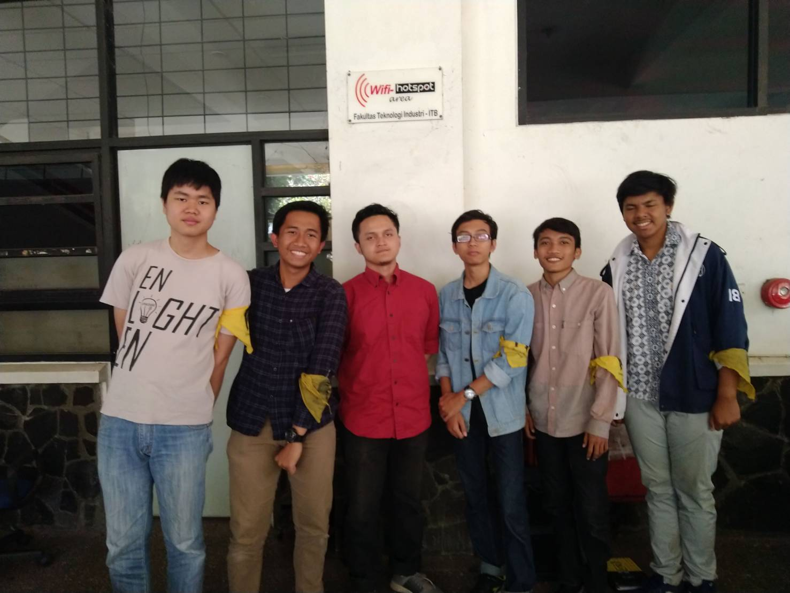

# Wawancara Daemon Kak Adylan Roaffa Ilmy
Wawancara oleh :
1. Arif Rahman Amrul Ghani 				- 16518033
2. Aditias Alif Mardiano 	- 16518044
3. Filbert Wijaya			- 16518048
4. Syarifuddin Fakhri 		- 16518074
5. Ryan Daniel				- 16518142

## Biodata
Pada 21 Agustus 2019, kami telah mewawancarai kak Adylan. Kak Adylan memiliki nama lengkap : Adylan Roaffa Ilmy. Kak Adylan memiliki code name yaitu Caesar. Jurusannya kak Adylan adalah Teknik Informatika. Kak Adylan memegang jabatan sebagai Ketua Divisi Tech Career and Issues. Alasannya karena ingin membangun semangat anggota HMIF untuk ikut lomba dan internship, namun lebih condong ke internship makanya banyak proker kak Adylan yang lebih mengarah ke internship. Ada 4 proker yang dijalankan oleh kak Adylan. Pertama, sharing KP. Sharing yang dilakukan oleh orang-orang yang KP tentang perusahaan yang dituju. Kedua, Medium. Tulisan anak HMIF yang bertujuan untuk menumbuhkan semangat menulis. Ketiga, Internship workshop. Berfungsi untuk mempersiapkan anggota HMIF untuk apply kerja/magang. Terakhir, tech talks. Di sini ada sharing perusahaan tentang tekonologi dan mengadakan workshop.

## Pertanyaan Bebas
### Ryan - Bagaimana pendapat kakak terhadap Decrypt 2018 saat memimpin forum daemon?
Menurut kak Adylan, Decrypt 2018 sudah cukup lumayan aktif namun karena hanya ikut dalam satu forum dan belum kenalan/ sering ketemu jadi belum terlalu kenal. Menurutnya, bisa aja di luar kelihatan solid namun sebenarnya di dalamnya tidak. Jadi pertemuan saat forum kemarin sebenarnya belum terlalu menggambarkan.

### Ryan - Apa yang didapatkan saat kuliah dan berguna saat magang?
Menurut kak Adylan, yang paling utama didapatkan adalah manajemen waktu karena di Teknik Informatika akan sangat banyak kesibukan, contohnya tubes yang sekali keluar banyak. Selain itu, banyak juga tugas yang belum pernah diajari di kelas sebelumnya jadi harus meluangkan waktu untuk eksplor sendiri. Mental untuk tidak menyerah juga didapatkan pada kuliah. Mata kuliah sebenarnya juga bermanfaat tapi itu bukan yang utama karena bisa dieksplor sendiri. Untuk magang, yang penting mau coba aja. Mungkin awalnya ngerasa tidak bisa, tapi pasti seiring waktu bakal bisa ngejar ketertinggalan.

### Adit - Kesibukkan apa yang dirasakan sekarang?
Kak Adylan menjawan bahwa sebenarnya iya memiliki kesibukkan lain selain perihal akademik. Kesibukkan ini umumnya juga dirasakan oleh mahasiswa IF maupun STI pada umumnya. Ya, beliau sedang sibuk melakukan part time dan mencari lomba-lomba yang ada seputar keinformatikaan untuk mencari pengalaman maupun untuk mengisi waktu-waktunya selagi mengerjakan tugas akhir. Kak Adylan sendiri bekerja di Lab Basis Data GDP sebagai Software Engineer dengan kerja secara remote

### Adit - Keresahan yang dimiliki selama di ITB?
Kak Adylan memaparkan keresahan atau goals yang ia miliki, tetapi belum tercapai. Ia menjawab, keresahannya adalah terlihat bahwa banyak anak IF terpisahkan antara yang aktif kemahasiswaan dan akademis, istilahnya berat hanya di salah satu. Padahal, kedua hal tersebut bisa tidak saling lepas, bahkan hal berdua itu bisa dijasikan satu kesatuan, tapi masih ada gap di mahasiswa yang saling pride menjatuhkan antar keaktifan mereka masing-masing
