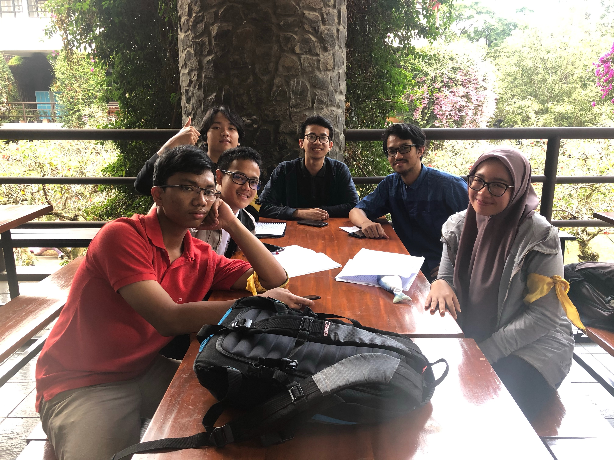

&nbsp;&nbsp;&nbsp;&nbsp;&nbsp;&nbsp;Kali ini, kami berkesempatan untuk mewawancarai kaka tingkat kami angkatan 16 yang bernama **Muhammad Nurraihan Naufal**. Beliau sejurusan dengan kami yaitu teknik informatika (*IF*). Saat ini, beliau menjadi seorang Kadiv Intrakampus. Keputusan menjadi kadiv bukan tidak ada alasan. Ia mengaku ingin merapihkan system. Hal ini terbukti dengan adanya proker-prokernya, antara lain:
1. HMIF Goes to HMJ
2. [Lanjutin]

&nbsp;&nbsp;&nbsp;&nbsp;&nbsp;&nbsp;Saat lulus nanti, Ia mengaku belum pasti ingin melanjutkan kemana. Akan tetapi ada kemungkinan ke bidang *software engineering*. Hal ini dibuktikan dengan adanya internship yang ia ikuti salah satunya di GDP Labs.

&nbsp;&nbsp;&nbsp;&nbsp;&nbsp;&nbsp;Bercerita mengenai kegiatan saat dikelas, Kaka yang satu ini adalah orang yang suka memperhatikan dosen. Akan tetapi, saat tidak mengerti beliau memiliki untuk main hp. Begitu juga dengan teman-temannya, masing-masing memiliki keunikan lainnya. 
