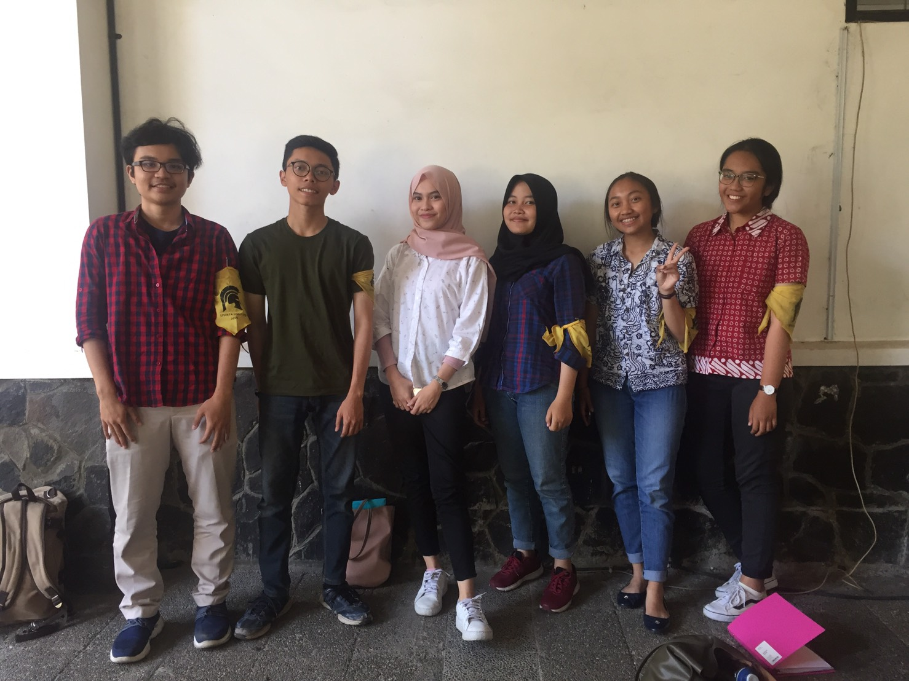

Pada hari Rabu, 21 Agustus 2019 pukul 12:00, kami pewawancara:
1. 16518021 - Raras Pradnya P.
2. 16518046 - Annisa Ayu Pramesti
3. 16518056 - Farras Mohammad Hibban
4. 16518159 - Cynthia Athena Mahadewi S.
5. 16518239 - Farid Lazuarda
mewawancari Kak Nira Rizki Ramadhani di selasar Labtek 5

# Summary
Kak Nira Rizki Ramadhani atau yang biasa dipanggil Nira adalah mahasiswa Teknik Informatika 2016. Saat ini, ia menjabat menjadi
Ketua Bidang Fundraising di Arkavidia 6.0. 

## Mengapa ingin menjadi Kabid Fundraising Arkavidia?
Kak Nira merasa ia ingin mencoba hal baru. [bantu isi lagi dong aku ganulis selanjutnya knp]

## Apa saja jobdesc Kabid Fundraising?
Kabid Fundraising membawahi 2 kadiv, yakni sponsorship dan entrepreneurship. Pada intinya, tujuan fundraising adalah mengumpulkan
dana sehingga kebutuhan dana Arkavidia tercukupi. Untuk sponsorship hingga saat ini sudah me-list perusahaan mana saja yang
dijadikan target serta telah membuat paket-paket sponsor yang akan ditawarkan. Sedangkan untuk enterpreneurship, sudah mengadakan
PO pulpen kokoro dan danus ekado

## Apakah pernah merasa demotivasi di jurusan? Hal apa yang bisa bikin semangat lagi?
Kak Nira selalu merasa demotivasi paling tidak sekali selama satu semester. Kak Nira merasa down jika dekat-dekat dengan masa 
ujian karena ujian tidak seperti TPB yang selang satu minggu per ujiannya, tetapi seperti pas jaman SMA yang setiap hari ada. 
Sehingga, saat masa-masa ujian tersebut pasti ada materi yang tidak terkejar atau tidak dipelajari. Menurut Kak Nira, hal yang
bisa bikin semangat lagi adalah teman. Kak Nira menyarankan agar kita untuk mencari teman yang supportive, agar saat kita
butuh dukungan ada yang memberikan semangat, bukan teman yang kompetitif. 

## Bagaimana pandangan mengenai diri sendiri di 5 tahun mendatang?
Kak Nira berharap dalam 5 tahun mendatang sudah mendapatkan pengalaman pekerjaan. Ia memilih untuk bekerja dan menikah terlebih
dahulu, baru menjalankan pendidikan selanjutnya yakni S2.
