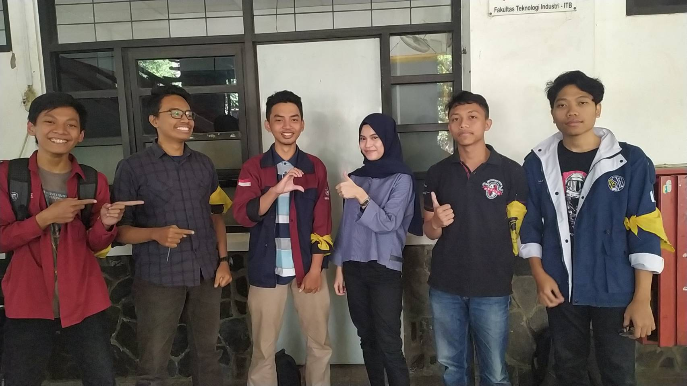

TUGAS WAWANCARA DAEMON 

Nama    : Nira Rizki Ramadhani
NIM     : 13516018  
Tanggal : 23 Agustus 2019  
Tempat  : Selasar Labtek V ITB  

RINGKASAN

&nbsp;&nbsp;&nbsp;&nbsp;&nbsp;&nbsp; Pada Hari Jum'at, tanggal 23 Agustus 2019, kami berlima menemui Kak **Nira Rizki Ramadhani**, biasanya dipanggil Kak **Nira** dan melakukan wawancara di selasar Labtek V. Kak Nira adalah seorang mahasiswi dari program studi Teknik Informatika angkatan 2016. Di **HMIF** dia berada di Divisi **People & Culture** pada bagian **Culture**. Tugasnya adalah mengevaluasi setiap anggota biasa HMIF dan melakukan transfer anggota. Dia memilih bagian ini karena dia ingin mengurus anggota dan divisi ini merupakan perkembangan dari divisi PSDA yang dia ikuti pada keperiodean sebelumnya. Selain itu, dia juga bertugas dalam pembuatan rapor anggota. Sementara di **Arkavidia 6.0**, Kak Nira mengabdikan dirinya sebagai **Kepala Bidang Fundraising**. Sebagai Kabid Fundraising, dia bertugas untuk mengorganisir dan memastikan kadiv yang menjadi bawahannya (Sponsorship & Enrterpreneur) untuk menjalankan tugasnya.

&nbsp;&nbsp;&nbsp;&nbsp;&nbsp;&nbsp; Berbicara tentang pekerjaan Kak Nira di divisi **Culture**, salah satu yang menarik adalah pembuatan rapor masing-masing anggota yang merupakan penilaian keaktifan anggota dalam keorganisasian **HMIF** maupun dalam acara-acara yang diadakan oleh **HMIF**. Setelah berbincang-bincang dengan Kak Nira mengenai rapor ini, ada beberapa hal yang sepertinya bisa dimanfaatkan / ditingkatkan. Rapor anggota ini ternyata adalah hal baru dan belum ada penggunaan secara pastinya. Melihat kekurangan pemanfaatan dari rapor ini, sepertinya dengan rapor ini **HMIF** dapat menggunakannya dalam mempertimbangkan orang-orang yang akan memegang tanggungjawab.

&nbsp;&nbsp;&nbsp;&nbsp;&nbsp;&nbsp; Selama kuliah di ITB, Kak Nira ini merupakan tipe mahasiswi yang baik-baik karena dia jarang sekali mempunyai masalah dengan dosen. Selama menjadi mahasiswi, dia hanya pernah ditegur disebabkan minum di kelas dan dimarahi saat diketahui sedang naik lift oleh dosen yang memang tidak suka melihat mahasiswa menggunakan sarana lift.

&nbsp;&nbsp;&nbsp;&nbsp;&nbsp;&nbsp; Selama di Bandung Kak Nira paling menyukai jalan-jalan ke Mall dibanding pergi ke tempat lainnya. Selain itu, Ketika banyak tugas, Kak Nira juga suka pergi ke tempat-tempat orang yang berkumpul untuk belajar bersama. Alasannya karena beberapa tugas tidak bisa ia atasi sendiri dan membutuhkan bantuan dari teman-temannya. Salah satu tempat yang paling sering dia kunjungi adalah ayam-ayaman disebabkan disana banyak anak prodi Teknik Informatika. Jadi, ketika mengalami kebuntuan dalam mengerjakan tugas, banyak orang yang lebih hebat yang dapat mengatasi dan membantunya.

&nbsp;&nbsp;&nbsp;&nbsp;&nbsp;&nbsp; Kak Nira megaku sedang dekat sama cowok sefakultas tapi tidak sejurusan. Mereka berdua tidak memiliki hubungan yang jelas namu sangat dekat bagaikan kekasih yang sedang berpacaran. Sering nonton berdua, makan berdua, bahkan suka jalan-jalan berdua di Lembang. Mereka pertama kenal di STEI tapi mulai deket saat sudah masuk jurusan yaitu saat tingkat dua.

&nbsp;&nbsp;&nbsp;&nbsp;&nbsp;&nbsp; Lalu saat saya bertanya Kak Nira ingin nikah saat umur berapa dia bingung menjawab karena tidak tau siap untuk nikahnya kapan. Tetapi Kak Nira mengatakan dengan yakin jika ingin nikah maksimal umur 25 tahun. Lalu dia bingung saat ditanya ingin memiliki anak berapa tapi ia mengatakan tergantung rejekinya berapa tapi pingin maksimal 3. Kak Nira tidak mempermasalahkan umur lelaki yang penting dewasa.

&nbsp;&nbsp;&nbsp;&nbsp;&nbsp;&nbsp; Setiap orang dalam hidupnya pasti pernah melakukan suatu kelasalah atau bahkan bisa lebih dari satu keselahan. Setiap setelah melakukan kesalahan pasti akan timbul rasa penyesalan pada diri suatu orang dan penyesalan tersebut ada yang selalu dipikirin terus atau bisa langsung dilupakan. Sama seperti yang dialami kak Nira yaitu mempunyai sebuah kesalahan dan suatu penyeselan yang sampai sekarang masih dipikirkannya yaitu bermalas-malasan ketika TPB yang menyebabkan nilai TPBnya kurang memuaskan. Yang disesalkan kak Nira adalah seharunya nilai tpbnya bisa lebih bagus daripada hasil yang didapatkannya. Setelah masuk jurusan niali yang didapatkan kak Nira ketika tpb tidak membuatnya dia tidak aktif di himounan HMIF. Akibat keaktifannya di himpunan, kak Nira pun diangkaat menjadi Daemon. Hal tersbut dikarenakan sistem pelantikan pada tahun kak Nira berganti yaitu dengan dilihat dari kontirbusinya di himpunan ketika menjabat.

&nbsp;&nbsp;&nbsp;&nbsp;&nbsp;&nbsp; Bicara soal fundrising, biasanya pada event event atau kepanitiaan pasti ditentukan pembagian komisi untuk para anggota. Hal tersebut untuk apresisasi kepada para anggota yang telah susah susah mencari dana. Karena Kak Nira kadiv Fundrising, saya bertanya tentang pembagian komisi di fundrising arkavidia. Sebagai Kadiv, kak Nira sendiri belum menentukan dan kedepannya akan didiskusikan lagi dengan yang lain.

&nbsp;&nbsp;&nbsp;&nbsp;&nbsp;&nbsp; Bicara soal masadepan, dan dunia pekerjaan, setiap orang di rumpun informatika pasti terfikirkan akan mengambil spesialisasi untuk pekerjaan yang akan digeluti. Jika ditanya soal spesialisasi, Kak Nira sendiri belom menentukan ingin mengambil apa, kak Nira juga belum mengambil topik TA yang akan diambil. 

&nbsp;&nbsp;&nbsp;&nbsp;&nbsp;&nbsp; Setelah berbincang-bincang cukup serius, Kami menanyakan Kak Nira mengenai superpower apa yang ingin Kak Nira miliki jika diberikan kesempatan memilih? setelah menanyakan itu, kami pun memberikan beberapa pilihan kepada Kak Nira. Kak Nira pun memilih untuk memiliki kemampuan untuk menghilangkan tubuh(*Invisibility*) dengan alasan, karena bisa menghilang kapan saja saat melakukan apa saja (mau kabur dari nubes mungkin D:).

&nbsp;&nbsp;&nbsp;&nbsp;&nbsp;&nbsp; Kesan kami pada Kak Nira adalah orangnya **cantik**, asik dan tidak sombong. Dia sangat terbuka pada kami sehingga kami tidak canggung bertanya pada dia. Dia juga sering tertawa mendengar bercandaan kami yang kadang lucu dan kadang garing, sehingga semakin membuat kami nyaman berwawancara dengan dia. Semoga harapan dia **lulus** di bulan Juli nanti bisa tercapai.
