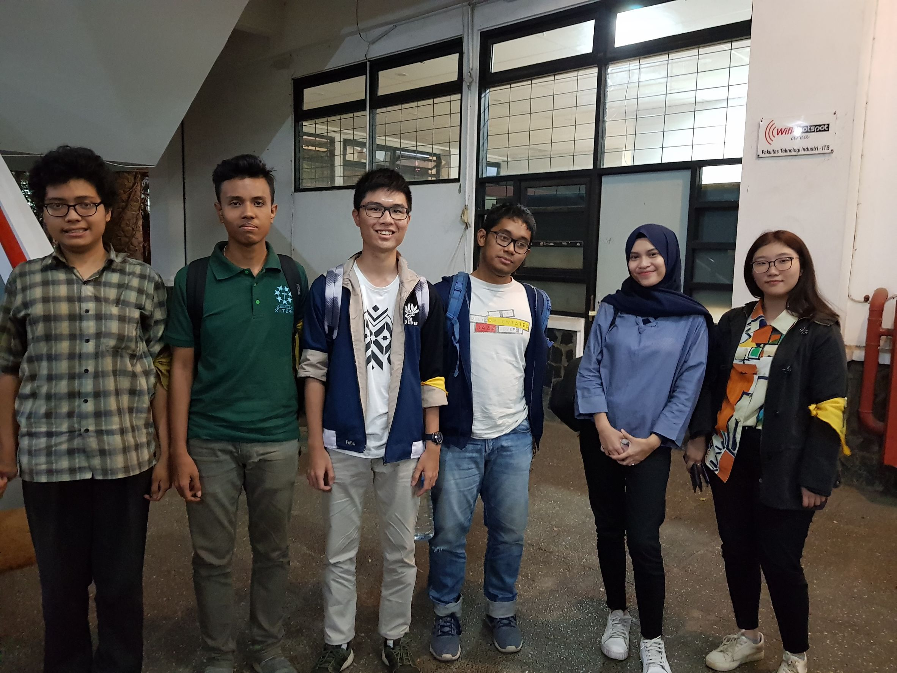

# Wawancara Daemon 
Pada hari Jumat, 23 Agustus 2019, kami pewawancara yaitu:
Felicia Gojali (16518097), Samuel (16518098), Felix Setiawan (16518293), Vincent Hasiholan (16518313), Rizkin Geordany (16518408) mewawancarai kak Nira di selasar Labtek 5.

# Summary
## Biodata Singkat
Nama lengkap kak Nira adalah Nira Rizki Ramadhani dan kak Nira ini jurusannya adalah teknik informatika 2016. Saat ini, kak Nira sedang menjabat sebagai Kepala Bidang Fundraising di Arkavidia. Pada acara-acara sebelumnya, biasanya kak Nira mengambil di divisi publikasi dan dokumentasi, tetapi di Arkavidia katanya butuh orang di Fundraising dan kebetulan kak Nira juga lagi ingin mencoba hal yang baru makanya kak Nira mencoba menjadi kabid Fundraising di Arkavidia ini. Di Fundraising, prokernya ya mencari dana, di situ ada dua divisi yaitu sponsorship dan entrepreneurship. Sponsorship mencari dana dari luar sedangkan entrepreneurship mencari dana dari dalam, misalnya danusan, garage sale, mengambil proyekan, dll.
  

## Pertanyaan Bebas
### 16518097
Kendala apa selama menjadi kabid Fundraising? Sebenarnya udah dari semester lalu terpilih kadiv-kabidnya dan dari liburan kemarin udah pada mulai cari dana, jadi sebenarnya fine-fine aja, hanya saja kendalanya itu, pertama, kabid fundraising terpilihnya telat, karena orang-orang pada tidak mau ditambah kak Nira agak mikir-mikir dulu sebelum menerima jabatan tersebut. Kedua, mencari kadiv-kadivnya juga susah karena kabid pada tidak mau, kadivnya juga tapi untungnya akhirnya terpilih. Ketiga, sampai saat ini, untuk sponsor belum nyebarin proposal gitu, baru dibikin cuma belum disebar. Tapi udah mulai jualan-jualan dalam ITB juga sebenarnya dan harapan kak Nira ke depannya itu setidakya RAB miskinnya ke cover.

Pernah ga berpikir menyesal masuk STEI/IF? Kak Nira dari SMA itu udah mau masuk IF-ITB, dulu juga pas psikotes disarananinnya ke informatika, jadi masuklah kak Nira ke STEI ITB, dan masuk STEI itu ga ngerti coding sama sekali, baru pas TPB belajar, terus karena TPB masih belajar matematika, fisika, kimia kayak SMA, sempet nyesel masuk STEI tapi kak Nira pikir kan belum masuk IF, belum merasakan juga IFnya gimana jadi lanjut-lanjut aja. Setelah masuk Teknik Informatika, kak Nira lebih bahagia karena lebih cocok ke passionnya gitu.

### 16518098
Kak Nira sering menemukan kesulitan selama masa perkuliahan sebagai seorang mahasiswa Teknik Informatika ITB. Tugas besar maupun kecil yang diberikan membutuhkan kompetensi yang baik untuk dapat menyelesaikannya. Kak Nira sangat sering merasa ingin ~menangis~ menyerah saja saat melihat tugas-tugas ini. Namun, ia merasa sangat beruntung karena memiliki teman-teman di HMIF yang selalu menjadi *support system* dia. Saat Kak Nira menemukan kesulitan dan meminta bantuan temannya, baik itu di ruang sekretariat maupun di tempat lain, Kak Nira dapat merasa bebannya terangkat karena teman-teman yang setia membantu dan menjadi pendukung dari belakang. Tut Wuri Handayani sangat diterapkan di kehidupan Kak Nira.

Bagi seorang mahasiswa yang harus pergi kuliah sangat pagi, yaitu jam 7.00, kesempatan untuk bisa memakan sarapan menjadi sebuah hal yang cukup mewah dan eksklusif. Namun, hal ini tidak berlaku bagi Kak Nira. Kak Nira memang berasal dari Tangerang. Namun, ia memiliki sanak saudara di Bandung. Oleh karena itu, di sini, ia tinggal bersama dengan tantenya. Jadi, Kak Nira dapat menikmati keindahan dan kenikmatan sarapan setiap pagi tanpa ada kekhawatiran. Bahkan, jika ia begadang sekalipun untuk mengerjakan tubes dan harus bangun agak terlambat, ia masih tetap dapat menikmati sarapan meskipun hanya sekadar roti dan susu. Inilah kenikmatan duniawi yang dapat dicicipi oleh Kak Nira dibandingkan mahasiswa-mahasiswa lainnya.
> TL;DR Kak Nira memiliki *privilege* dari tinggal bersama tantenya, yaitu dapat menikmati sarapan setiap pagi

### 16518408
"Setelah lulus, terbayang ga mau melakukan pengabdian masyarakat seperti apa?" Kak Nira sih agak kebingungan mau menjawab apa. Setelah lulus kuliah, Kak Nira bilang kalau dia mau kerja di perusahaan dulu. Kak Nira bilang kalau pengabdian masyarakat yang akan dia lakukan berupa mencerdaskan masyarakat dalam penggunaan dan pemanfaatan IT, tapi kalau bentuk pastinya sih dia tidak tahu persis. Menurutnya, bentuk pasti dari pengabdian masyarakat yang akan dia lakukan akan bergantung pada apa yang dilakukan oleh perusahaan tempat dia bekerja - termasuk apakah perusahaannya akan mengadakan pengabdian masyarakat atau tidak.

