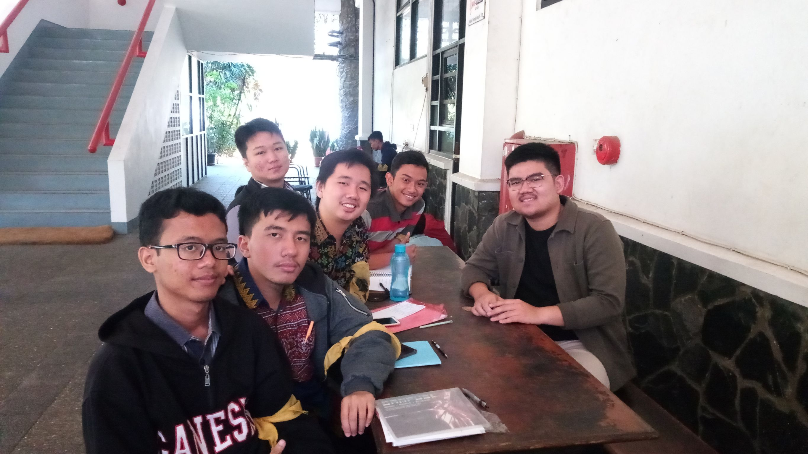

# WAWANCARA DAEMON ALBERT

Pewawancara
- Hanif Muhamad Gana      / 16518094
- Muhammad Daffa Dinaya   / 16518113
- Kevin Austin Stefano    / 16518114
- Stefanus Gusega Gunawan / 16518225
- Lionnarta Savirandy     / 16518240

## Biodata
Nama lengkap Daemon yang sedang kami wawancarai adalah Albert Shala Theodore dari jurusan Teknik Informatika. Adapun peran Ka Albert di HMIF adalah sebagai Head Of marketing Inkubator IT. Alasan memilih jabatan tersebut karena senang mengenai hal-hal yang baru dan tidak berbau keinformatikaaan. Selain itu di jabatan yang ini, Ka Albert juga lebih bias untuk mempelajari hal baru dan membantu banyak orang. Hal-hal yang dilakukan ka Albert sebagai Head of Marketing Inkubator IT adalah berupa kunjungan ke himpunan-himpunan, mencari solusi IT untuk intrakampus, kunjungan ke perusahaan, membuat portofolio, dan masih banyak lagi.

## Pertanyaan Pribadi
Kak Alberth memang memiliki wawasan yang cukup luas dalam lomba dan kerja tim. Maka kami meminta beberapa wejangan dalam mencari peer yang baik untuk lomba. Kak Alberth menjawab jika ingin membuat tim yang baik maka cari orang yang lebih jago. Bisa cari teman yang memang kelihatan jago atau jika belum kenal, lihat di daftar ranking lomba di HMIF terus asal ajak saja. Lalu setelah terbentuk tim, coba aja lomba. Mungkin dengan lomba jadi bisa terbayang gimana kerjasama tim nantinya atau jika tim tersebut belum ada spesialisasi yang jelas jadi lebih bisa tahu apa bidang yang akan diambil.

Meskipun Kak Alberth memberi tips untuk lomba dengan serius, tetapi dia memberi saran jika kuliah tetap dibawa santai. Lalu dia menjelaskan cara membawa santai suasana kuliah meskipun banyak hal seperti tugas, ujian, dan lain-lain. Selama kuliah, kita perlu fokus untuk apa sebenarnya kuliah, apakah untuk nilai atau mungkin nilai edit value yang lebih seperti magang, lomba, dan lain-lain. Jadi ketika sudah menetapkan tujuan kita di awal, kita dapat santai meskipun kondisi kuliah memang berat.

Pertanyaan selanjutnya adalah untuk apa sebenarnya pembelajaran di ITB ini. Ka Albert menjelaskan bahwa ITB ini terdiri dari banyak orang pintar. Manfaatkan lingkungan yang ada karena di ITB ini lingkungannya kompetitif. Lingkungan yang kompetitif terwujud karena ITB merupakan tempat berkumpulnuya putra putri terbaik bangsa. Tambahan tips dari Ka Albert adalah jika ingin menimba ilmu, jangan terlalu berharap di IF. Karena IF hanya sebagai bekal dasar saja sedangkan hal-hal lain harus kita kembangkan dan explore sendiri.

Lalu bagaimana sih cara explore yang baik menururt kak Alberth? jadi menurut kak Alberth sendiri explore itu sebaiknya mencari yang dibutuhkan saja menurut pembagian prioritas masing-masing. Jika dekat dengan lomba maka explore materi-materi lomba itu, jika membutuhkan hal lainnya maka explore hal lain tersebut. Kak Alberth sendiri mengatakan bahwa untuk memulai sesuatu itu sangat sulit, sehingga explore sendiri seringkali membutuhkan keterpaksaan, baik dari internal maupun eksternal.

Pertanyaan selanjutnya  adalah bagaimana cara kita mencapai goals yang sudah kita pasang dari awal. Ka Albert menjelaskan bahwa untuk mencapai goals kita maka kita harus tau possibility atau kemungkinan-kemungkinan yang ada. Dengan banyaknya kemungkinan tersebut, maka kita bias membuat  persiapan yang matang dari jauh-jauh hari. Selain itu focus sama satu tujuan jangan terbagi-bagi menjadi banyak hal. Dalami satu hal kemudian kembangkan. Jangan pernah stress dan kembangkan step-step kecil untuk melangkah yang lebih besar. Selain itu tips yang diberikan kak Alberth dalam menentukan goals adalah kenali kemampuan dan kemauan pribadi masing-masing. Setelah itu tentukan goalsnya lalu tarik kebelakang apa saja yang dibutuhkan untuk mencapai goals tersebut sehingga kita bisa fokus dalam mencapainya.

Kak Alberth adalah mahasiswa Teknik Informatika yang suka mencoba hal-hal lain di luar Teknik Informatika. Menurut saya, hal-hal yang disukai Kak Albert ini lebih ke arah Jurusan STI, karena lebih suka berhubungan dengan orang-orang baru. Lantas, muncul pertanyaan, mengapa kakak tidak memilih Sistem dan Teknologi Informasi sebagai pilihan pertama? STI memiliki kelebihan dan kekurangan selama keberjalanan perkuliahan. Kelebihannya adalah untuk mencari nilai mudah, effort/usaha yang dibutuhkan untuk berada di atas kecil. Hal itu dikarenakan STI adalah jurusan yang relatif masih baru. Untuk kekurangannya, STI itu jurusannya kurang kompetitif, karena merupakan "buangan" dari Teknik Informatika. Tapi, jika dilihat, sebenarnya sama saja, kembali ke minat dan bakat masing-masing orang. Supaya bisa survive dan jago, harus mau untuk eskplor sendiri dan melihat celah-celah pada saat perkuliahan. DI ITB JANGAN KULIAH DOANG! WORK SMART! Di ITB, lingkungannya sudah terbentuk yaitu lingkungan yang enak dan kompetitif.

Meskipun Kak Alberth memberi tips untuk lomba dengan serius, tetapi dia memberi saran jika kuliah tetap dibawa santai. Lalu dia menjelaskan cara membawa santai suasana kuliah meskipun banyak hal seperti tugas, ujian, dan lain-lain. Selama kuliah, kita perlu fokus untuk apa sebenarnya kuliah, apakah untuk nilai atau mungkin nilai edit value yang lebih seperti magang, lomba, dan lain-lain. Jadi ketika sudah menetapkan tujuan kita di awal, kita dapat santai meskipun kondisi kuliah memang berat.

Kalau mau belajar buat lomba, namun sudah mentok tidak bisa, mending ditinggal saja?
Untuk pertanyaan ini, Kak Albert menjawab kalau sebenarnya jangan ditinggal begitu saja. Dicoba saja terlebih dahulu. Kalau sudah mentok tidak bisa, langsung cari bidang lain yang sekiranya bisa ditekuni. Akan tetapi, kalau masih mau diperdalam dan ditelusuri lagi hal yang mentok tidak bisa itu lebih baik. Akan tetapi, fokus saja terhadap satu bidang, jangan membagi fokus ke berebagai bidang. Karena, lebih baik spesialis di satu bidang, daripada hanya dapat dasar-dasar dari bidang lain. Pada intinya, fokuslah terhadap tujuan kamu, jangan idealis.

Tugas Besar yang paling berkesan buat kakak apa, kak?
Awalnya Kak Albert mengaku bahwa dia jarang memikirkan Tugas Besar setelah dikerjakan karena dibawa *chill* aja. Akan tetapi, jika untuk Tugas Besar yang paling berkesan kak Albert berpendapat Tugas Besar tentang *development* web dan pembuatan *game* adalah Tugas Besar paling berkesan baginya karena lebih aplikatif dan lebih bagus untuk memenuhi portofolio dibanding tugas-tugas besar yang lain.

Kak Albert sempat bercerita bahwa ada temannya yang ingin KP di Google Singapura tapi tidak diterima ITB karena berbeda cara penilaian dan Kak Abert sempat terlihat cukup tidak menyukai hal tersebut. Dari hal tersebut terpikir pertanyaan cara menengahi ingin KP di tempat yang bagus dan diminati tapi tidak disetujui ITB. Jadi, cari tempat KP yang enak tapi dianggap ITB bagaimana kak?
Menurut Kak Albert jika tempat KP yang ingin kita masuki tidak dianggap ITB karena beda cara penilaiannya, jangan dipedulikan! Apabila kita memang ingin dan bisa KP di sana karena menganggap tempatnya bagus, ambil saja karena kita yang tahu tempat yang terbaik buat kita dan masalah nilai KP bisa diselesaikan nanti.

Selama berwawancara kami juga banyak membicarakan kehidupan perkuliahan di Teknik Informatika ITB dan dari pembicaraan kami kami jadi lebih mengetahui bahwa kuliah di Teknik Informatika ITB bisa dibawa *chill* dan jika ingin ilmu yang lebih aplikatif dan tidak teoritis kami masih harus banyak melakukan eksplorasi di luar perkuliahan.

