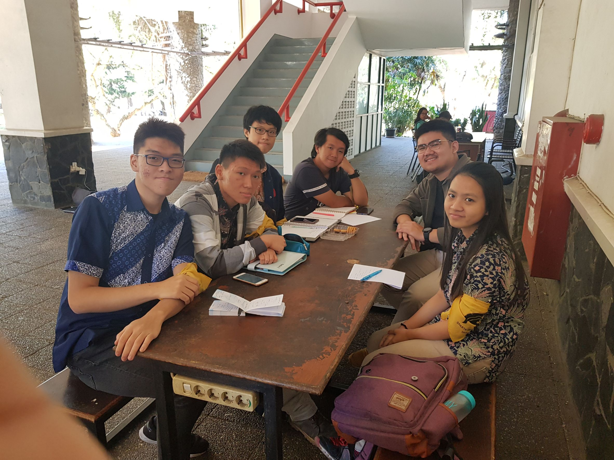

# Wawancara Skip

Selasar Timur LabTek V jam 09.00 hari Rabu, 21 Agustus 2019
- 16518118 - Yonatan Viody
- 16518223 - Anna Elvira H.
- 16518245 - Faris Rizki E.
- 16518316 - Steve B. I. G
- 16518377 - Rifaldy A. K.

# Summary
## Biodata Singkat
Kami mewawancarai Daemon yang bernama Albert Sahala Theodore, yang biasa dipanggil Kak Albert. Kak Albert berjurusan teknik informatika. Sekarang dia memegang peran sebagai Chief Marketing Officer IIT (Inkubator IT) di DE (Dewan Eksekutif) HMIF ITB. Alasan Kak Albert mengambil peran tersebut adalah karena ketertarikannya dengan IIT yang membuat dia mampu bertemu dengan banyak klien secara langsung, bertemu dengan banyak klien yang unik. Lalu proker dari peran yang diambil Kak Albert adalah kunjungan ke himpunan-himpunan (bekerja sama dengan Divisi Intrakampus), kunjungan ke perusahaan-perusahaan, dan pembuatan portofolio digital.

## Pertanyaan bebas
Kak Albert sempat berhasil memenangkan juara 1 untuk kompetisi internasional Hackathon L'Oreal Brandstorm Global dan banyak juara lain di bidang yang sama. Kami menanyakan mengapa Kak Albert menyukai dan mau mendalami bidang ini.
Kak Albert menjawab bahwa ia ingin mencari sesuatu yang bisa dijadikan kelebihan dibanding competitornya, dalam hal ini mahasiswa lain. Beberapa mahasiswa berorientasi pada bidang kemahasiswaan, ada juga yang mengejar nilai akademis. Kak Albert sempat mencoba lomba-lomba dan tertarik pada lomba IT Case dan Hackathon, Kak Albert juga banyak memenangkan lomba-lomba bidang tsb. Tapi menurutnya, lomba jangan dijadikan beban, orientasinya refreshing dan jalan-jalan jika menang sampai final, sebagai tambahan, jika menang di lomba yang diadakan perusahaan, biasanya uang yang didapat lumayan besar. Kak Albert juga menceritakan sedikit pengalamannya saat mengikuti lomba internasional Hackathon L'Oreal Brainstorm Global. Awalnya Kak Albert dan 2 orang temannya sebagai satu tim awalnya hanya iseng-iseng mencoba ikut lomba tersebut bahkan sampai submit J-6 deadline untuk babak awal. Ternyata dari iseng-iseng tersebut bisa menang juara nasional, dikirim lomba internasional ke Paris, dan menang juara 1 internasional.

Kami juga sempat bertanya bagaimana tips-tips menghadapi kuliah. Menurut Kak Albert, kuliah jangan sekedar kuliah, jangan hanya go with the flow. Orientasinya pada apa yang kita harapkan setelah kuliah, dan ambil langkah-langkah yang sesuai untuk mencapai harapan tersebut. Cari sesuatu keunikan atau nilai jual, misalnya unggul dalam lomba bidang tertentu. Belajar hal-hal diluar bahan kuliah sangat diperlukan, dan jangan terlalu stress dengan kuliah, santai saja.

> *"Chill Bro"* - Albert Sahala Theodore, IF '16

 Kami bertanya kepada Kak Albert mengenai source pembelajaran. Kak Albert bilang sebenernya depends sama orangnya juga. Kata Kak Albert sebenarnya bagi dia belajar dari Youtube cukup karena kalau udemy course gitu, suka mager buat nerusin. Selain itu Ka Albert juga mengatakan bahwa sebenarnya source di Google itu banyak sekali untuk belajar dan memang harus belajar dari situ juga harus banyak eksplor sendiri gitu karena dia bilang di dunia kerja itu ilmu yang diajarkan selama kuliah akan jauh berbeda ( cukup berbeda).

 Kak Albert menganggap bahwa dirinya berlomba bukanlah suatu fokus utamanya, melainkan hanya sebagai refreshing. Dari berlomba, dia bisa jalan-jalan ke berbagai tempat dan makan dengan gratis! Justru kalau ketika kita berlomba itu terlalu fokus, kita jadi kesulitan karena dihadapi dengan pressure dari diri kita sendiri. Makanya saran dari Kak Albert kalau ikut lomba itu dibawa santai aja, kalau menang untung kalau kalah ya *nothing to lose*.
 
 Ada beberapa tips juga nih buat temen-temen yang mau berkecimpung di dunia perlombaan. Salah satu kesulitan ketika kita mulai memasuki dunia perlombaan itu adalah mencari tim. Menurut Kak Albert, memilih tim itu adalah proses *Trial and Error*. Coba dulu sama orang yang sama 3-4x, lalu lihat hasilnya. Kalau menang ya lanjut, tapi kalau kalah lebih baik cari lagi yang lain yang lebih klop. Jangan takut aja untuk berpindah-pindah tim kayak gitu. Kemudian, Kak Albert juga menyarankan kalau mau terjun ke dunia lomba lebih baik fokus ke satu bidang lomba aja agar lebih mendalam belajar dan eksplorasinya, serta timnya juga jadi lebih enak ga gonta-ganti cari baru lagi.

## Kesan dan Pesan
Kesan kami saat mewawancarai Kak Albert, ia orangnya keliatan sans banget, bener-bener ga mengganggap sesuatu itu sebagai beban. Orangnya juga kerenlah down to the earth banget, walaupun dia sudah menang juara 1 lomba internasional, tapi tetap rendah hati dan banyak cerita-cerita keuntungan lain kalau ikut lomba. Banyak sih yang bisa kami pelajari dari tips-tips yang Kak Albert kasih. Sukses terus, Kak!
