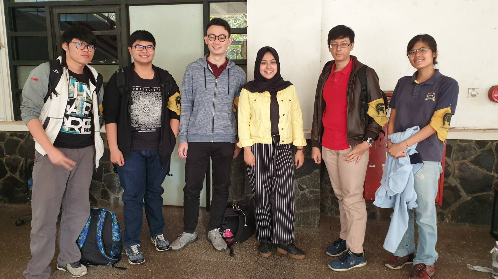

# Wawancara Daemon 'affine'
Pada hari Kamis, 22 Agustus 2019 pukul 8.00, kami,
- 16518004 - Hansel Grady Daniel Thamrin,
- 16518042 - Stefanus Stanley Yoga Setiawan,
- 16518121 - Michel Fang,
- 16518286 - Arthur Edgar Yunanto,
- 16518303 - Michelle Theresia,

mewawancarai kak Shinta yang menggunakan nama sandi 'affine'.

# Summary
## Biodata Singkat
  Nama lengkap kakak yang cantik ini adalah Shinta Ayu Chandra Kemala. Biasanya dipanggil kak Shinta. Jurusannya kak Shinta adalah Teknik Informatika '16. Kak Shinta ini orang asli Bandung. Kak Shinta di HMIF itu punya jabatan di DPP tepatnya sebagai koordinator DPP. Kak Shinta mau jadi koordinator DPP soalnya pengen coba mengubah AD/ART. Awalnya itu sebenernya cuma magang di DPP terus ngerasa ada yang salah sama AD/ART kayak ancur banget gitu. Lalu Kak Shinta coba ajuin jadi koordinator karena lebih mudah dijalani buat dicapai impiannya. Ide dari kak Shinta buat di DPP adalah mengubah birokrasi HMIF karena antar lembaganya masih dirasa gak ada kerja sama malah yang ada saling sikut (tidak mengdukung).

## Pertanyaan Bebas

### Arthur - Kalo udah lulus, rencananya mau ngapain ?
  Awalnya berencana mau langsung kerja aja tapi jadinya pilih ikutan fast track (harus sama jurusannya). Soalnya Orang tua maunya sampe S2 jadinya ikut fast track itu. Terus awalnya mikir kalo S2 pilih ke luar negeri aja cuma sama Orang Tua disuruh buat stay di Indonesia aja and akhirnya pas tingkat tiga mikir mendingan pilih fast track aja biar cepet selesai S2nya.
  
### Arthur - Ada pengalaman Intern gak ?
  Intern baru akhir-akhir ini KP jadi software engineering di GDP Labs. Nah GDP Labs ini yang buat situs olympia.id. Sisanya palingan cuma ikut bootcamp gitu di blibli.
  
### Fang - Kriteria cowo idaman?
  Jadi kata ka Shinta kriteria cowo idaman itu yang paling utama adalah harus nyambung ama kakanya, istilahnya itu **satu frekuensi** kalo ngomong. Kriteria selanjutnya adalah harus nyaman(mengayomi) dan kalo bisa lebih tinggi dari kakaknya.
  
### Fang - Pengalaman paling berkesan di ITB?
  Pengalaman paling berkesan ka Shinta sejauh ini adalah saat ngerjain tugas besar. Jadi ada deadline 3 mata kuliah pada satu minggu, dan deadlinenya itu berdekatan. Ka Shinta akhirnya bawa mobil berisi baju ganti ke ITB, nginap selama 3 hari dan mandi di Masjid Salman.  Saking _chaos_ nya ka Shinta jatuh sakit dan harus rawat inap.
## Hal-Hal yang Berkesan tentang Kak Shinta
  [dinarasikan]
