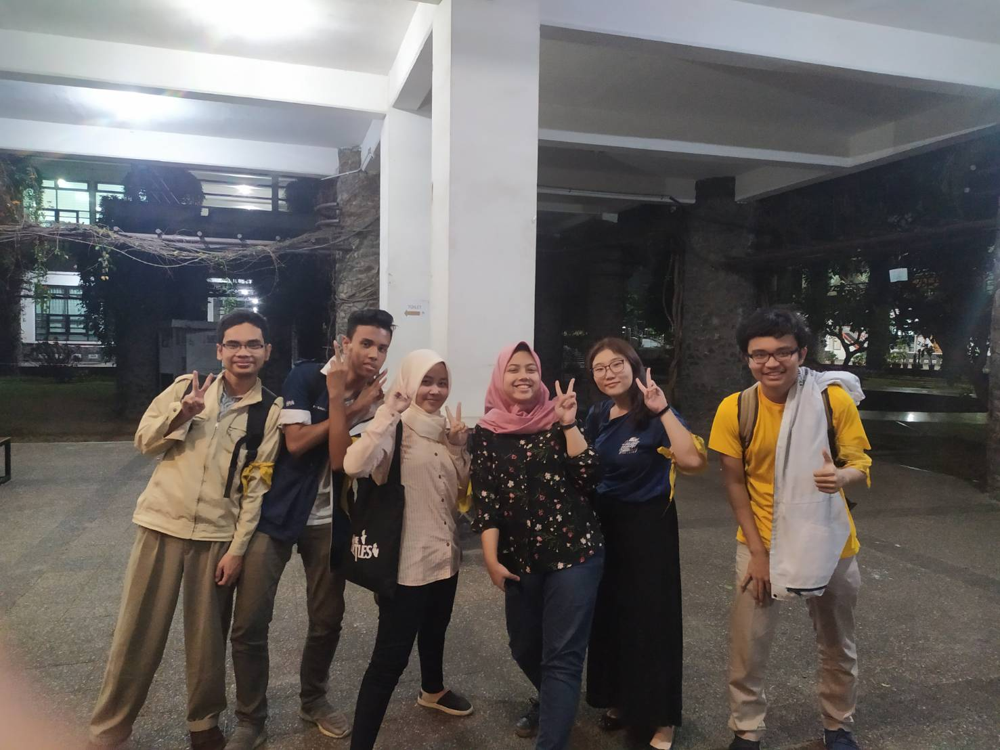

# Wawancara Daemon 'affine'
Pada hari Senin, 26 Agustus 2019, kami :
- Annisa Ayu Pramesti - 16518046
- Farras Mohammad Hibban Faddila - 16518056
- Felicia Gojali - 16518097
- Samuel - 16518098
- Arya Beri Argya Rasidi - 16518299

mewawancarai Kak Shinta
# Summary
## Biodata Singkat
Daemon ini bernama lengkap Shinta Ayu Chandra Kemala. Dia kerap dipanggil dengan sebutan Shinta. Kak Shinta merupakan seorang mahasiswa ITB di jurusan Teknik Informatika angkatan 2016. Saat ini, Kak Shinta memiliki tanggung jawab yaitu sebagai Koordinator Dewan Perwakilan dan Pengawasan (DPP) di HMIF ITB. Awalnya, sewaktu sebelum magang, Kak Shinta ingin masuk ke People and Culture. Bahkan, dia sudah sampai mendekati kating yang ada di situ (pedekate) dan membangun relasi di sana. Namun, saat itu, kuota DPP belum terpenuhi. Oleh karena itu, Kak Shinta ~dengan sukarela~ ditarik untuk menjadi anggota DPP. Awalnya, Kak Shinta agak *reluctant* ikut DPP dan menganggap pekerjaan DPP itu membosankan. Namun, setelah ia berkecimpung di sana, ia menemukan bahwa mengkritisi, mengkaji dan mengamandemen AD/ART itu merupakan hal yang menarik. Selain itu, DPP juga masih memiliki *image* yang jelek di mata massa dan pengurus HMIF sehingga Kak Shinta ingin mengubah pandangan orang terhadap DPP. Menurut dia, seorang Koordinator DPP memiliki tugas dan tanggung jawab untuk memantau, mengawasi, dan berkoordinasi dengan lembaga-lembaga lain yang ada di HMIF. Namun, ia sebagai anggota DPP juga ikut terlibat dalam tugas dan tanggung jawab DPP, yaitu mengumpulkan aspirasi massa HMIF, membuat arahan kerja bagi DE, dan menyusun LPJ-AT di akhir masa kepengurusan.

## Pertanyaan Bebas
### 16518097
Kak Shinta pas tingkat 2 dosen orkomnnya itu Pak Imam, enak banget, auto A, bahkan pas ga ngerti apapun paing rendah dikasi AB, terus saat semester 5 ketemu Pak Imam lagi, Pak Imam sampai ngomong "kok kalian ga tau, kan sudah saya kasih A kemarin",mantap. TBFO dulu sempet bikin kak Shinta masuk rumah sakit, sebenarnya TBFO + LogIF, TBFO belajarnya apa tiba-tiba tubes disuruh membuat compiler Pascal, ya chaos. Terus LogIF tubesnya yang carry kak Shinta sendiri sampai akhirnya pusing, ke rumah sakit malah disuruh dirawat. Dulu kak Shinta juga K2 sering nimbrung kelas K1nya.

Pas SPARTA dulu, banyak yang cinlok, misalnya ketua SPARTA 2017 sama pesertanya. Menurut Kak Shinta, pas SPARTA itu masa-masa cinlok dan PDKT paling enak, bisa main bareng di basecamp, ngobrol bareng, kalau pas jurusan tinggal dijadiin aja. Codenamenya kak Shinta itu affine karena DAEMON itu disuruh ambil codename yang berhubungan sama DECRYPT, akhirnya daripada pilih yang aneh-aneh mending pilih affine soalnya masih kayak cewek gitu daripada base62 dkk.

### 16518098
Kak Shinta memiliki sebuah pengalaman **"berkesan"** saat dia mengikuti SPARTA 2016. Di hari itu, SPARTA sudah berlangsung hingga malam sekitar pukul tujuh. Kak Shinta sudah mengalami kebosanan yang memuncak. Bukan hanya kebosanan saja yang memuncak, asam lambung Kak Shinta juga memuncak. Oleh karena itu, dia membuat "drama" di hari itu dengan harapan acara hari tersebut dapat dibubarkan--sayangnya, kami tidak diberi tahu mengenai detailnya karena kami masih mengikuti rangkaian acara SPARTA. Hal ini ternyata terbukti benar karena dalam selang beberapa menit, sesi tersebut selesai.
> TL;DR Kak Shinta adalah seorang ***drama queen***

Menurut Kak Shinta, selama masa perkuliahan sebagai seorang mahasiswa Teknik Informatika, semester yang paling menarik dan menyenangkan adalah semester lima. Di semester ini, kegiatan perkuliahan masih santai. Ia masih bisa jalan-jalan, nonton, dan melakukan hal-hal lainnya. Materi yang diberikan di semester ini juga sudah cukup relevan dengan dunia kerja. Materi sudah mulai bersifat *practical*. Namun, hal ini membawa sebuah kekurangan, yaitu beberapa dosen lebih sering cerita mengenai proyeknya karena ke-*practical*-an ini. Sayangnya, hal ini hanya berlaku hingga UTS. Setelah UTS, semua hal di atas sudah menjadi *invalid*.

### 16518056
#### Kenapa Masuk IF?
Awalnya banget Kak Shinta mau masuk hukum UGM. Bahkan udah terpasang poster besar-besar di kamar yang bertuliskan 'Bismillah, Hukum UGM!'. Sayangnya, keinginan Kak Shinta tidak disetujui oleh sang ayah. Kak Shinta pun berganti haluan menuju ekonomi UI. Lagi-lagi hal ini ditentang oleh sang ayah. Usut punya usut, ternyata hal yang diinginkan oleh sang ayah adalah Kak Shinta tidak mengambil jurusan soshum saat kuliah. Muncullah dua kandidat baru, yakni STI ITB serta MRI ITB (keduanya adalah jurusan yang berbau manajemen-manajemen gitu). Tapi, menurut Kak Shinta, MRI masih banyak fisikanya (sekip banget). Sehingga, targetnya terkunci: STI ITB.

Saat TPB di STEI, Kak Shinta berhadapan dengan daspro. 'Kok gampang', begitu pikirnya (Baru ngoding pertama kali saat kuliah). 

Akhirnya, setelah berdiskusi dengan kating juga, menimbang pekerjaan-pekerjaan di IF duitnya banyak dan bisa kerja *remote*, Kak Shinta pun memilih IF. *The End* :D

#### Massa HMIF Terfavorit??
Cowo: Kak Yonas Adiel Wiguna

Kenapa? Kak Yonas itu pinter banget, ngodingnya sangat OP sekali. Komunikasi dengannya enak, karena bicaranya lancar, santai, dan kritis juga orangnya. Selain itu, kalau nggak ngerti sesuatu dan minta diajari Kak Yonas, dia ngajarinnya enak banget. Pertama, ditanya mulai dari dasar, diikuti dengan pertanyaan-pertanyaan selanjutnya, di mana pertanyaan-pertanyaannya tersebut mengarahkan dan menuntun pelajarannya ke arah yang benar dan membuat akhirnya ngerti serta tercerahkan. 

Cewe: *"Bingung sih, karena udah pada tau kekurangan-kekurangan cewek-cewek di HMIF hahaha."* Akhirnya jawabannya adalah Kak Haifa.

Kalau menurut Kak Shinta, massa HMIF cewek terfavorit adalah Kak Haifa. Orangnya sabar dan tenang. Walaupun tidak terlalu aktif di HMIF, tapi tetap berkontribusi. 

### 16518046
Kak Shinta ini dulu waktu masuk ITB masih punya pacar, tp kandas saat menempuh masa perkuliahan di ITB. Katanya SPARTA HMIF sama waktu nubes adalah waktu-waktu yang paling ideal buat nyari gebetan:) tapi sejauh ini cuma deket-deket saja, belum sampai ada yang jadian. Kita punya kesamaan *nih* yaitu sama-sama suka kalau lagi lihat ada bibit-bibit cinta antar anggota HMIF karena lucu dan seru buat diledekin.

Kak Shinta dulu pernah mengambil mata kuliah wajib Astronomi Lingkungan. Ia bercerita kalau indeks yang didapatnya untuk matkul ini adalah BC. Kak Shinta sangat kecewa karena dia sampai sekarang bahkan masih hafal dengan materi Asling yang berkaitan dengan bentuk-bentuk lampu dan sebagainya. Ada kemungkinan ia mendapat BC karena di kelasnya, karena kebanyakan anak informatika, banyak yang membuka laptop saat kelas padahal sudah dilarang. Jadi, pada kelas itu banyak yang mendapat BC walau tahun sebelumnya dosen tersebut terkenal auto A.

Fun fact tentang Kak Shinta yaitu dia orangnya kidal tapi kalau nilis memakai tangan kanan. Jadi hal ini ada *back story*-nya yaitu dulu waktu kelas 1 SD, ada guru yang tidk suka kalau ada yang menulis menggunakan tangan kiri. Guru tersebut beranggapan bahwa tangan kiri adalah tangan jelek. Kak Shinta akhirnya mulai belajar menulis menggunakan tangan kanan sehingga saat ini Kak Shinta tidak bisa jika diminta menulis menggunakan tangan kiri karena sudah tidak terlatih.

### Hal yang berkesan dan dapat dipelajari dari Kak Shinta!
Kak Shinta keren, kerjaannya ngerocos terus, kita jadi tahu banyak deh hahaha. Selain itu, ada satu teknik ampuh mengenai masalah absensi di kelas nih guys, yang bisa dipelajari dari kak Shinta. Kunci untuk menguasai teknik ini adalah, dekati ketua kelasnya. Lalu, japri si ketua kelas tersebut seusai kelas. Terakhir, beraksi sebelum absensi dikumpul ke TU. Kelar deh :D

