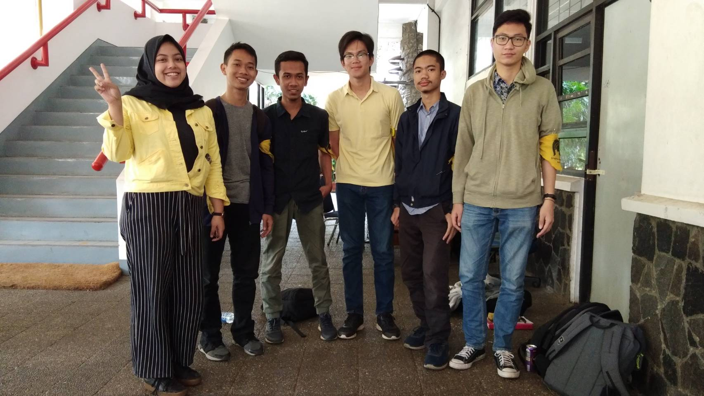

# Nama Pewawancara
- 16518196/Hengky Surya A
- 16518230/M Naufal Fakhrizal
- 16518088/Vincentius Lienardo
- 16518238/Taufiq Husada D
- 16518194/M Raihan Iqbal

# Summary
Daemon yang kami wawancarai ini adalah Shinta Ayu Chandra Kemala. Biasanya dipanggil Shinta. Jurusan Kak Shinta adalah Teknik Informatika. Kak Shinta berasal dari Bandung, Jawa Barat. Di DPP, Kak Shinta berperan sebagai Koordinator DPP. Ia bertugas mengawasi DPP dan mengawasi lembaga-lembaga lain. 

# Kenapa mau masuk stei?
Karena bebas daei biologi dan materi kimianya gampang. Awalnya kak Shinta mau masuk STI karena "lebih IPS" dan matkul daspro menyenangkan, ternyata di STI ada elektronya.

# Keluh kesah selama semester 3 dan 4
Kalau semester 3 itu teoritis, tugasnya abstrak, dalam 1 minggu 3 tubes sekaligus jadinya chaos, tapi kak Shinta juga aktif di unit. Sedangkan pas semester 4 itu sudah bisa beradaptasi, lebih chaos daripada semester 3, ada banyak tubes dan tucil. Kak Shinta juga menjalani tugas di DE, kata kak Shinta rasanya kayak mau meninggal tapi tetap harus dijalani. Teman-teman kak Shinta yang lain santai-santai aja karena mungkin pintar, jam 8 malam aja sudah ada yang tidur, ada yang malah main DOTA karena sudah selesai tugasnya.

# Apa tips untuk angkatan 2018?
Kalau di IF tuh harus perdalam teori maupun praktiknya dan sungguh-sungguh mengerjakan tubesnya. Mending yang kurang pintar tapi ingin berusaha daripada pintar tapi hilang-hilangan. Jangan pilih-pilih teman, kalau ada teman yang kurang pintar atau kurang bisa mendingan dibantu aja biar sekalian nambah ilmunya. Terus kalau dapat teman yang pintar jangan mengandalkan mereka, nanti malah nggak kerja dan nggak dapat ilmu apa-apa, mending sama-sama bagi tugas dan tanggung jawabnya masing-masing. Biasanya sih tucil satu kelompok isinya dua orang dan tubes satu kelompok isinya tiga orang.

# Kemarin KP di mana?
Kak Shinta kerja praktek sebagai software engineer di GDP labs, anak perusahaan Djarum yang buat kaskus dan olympia. Keuntungan KP dan magang di GDP labs itu ada snacknya, kantornya enak, tesnya gampang, dan gajinya lumayan.

# Impian dalam jangka waktu dekat?
Impian Kak Shinta dalam waktu dekat adalah lulus kuliah. Setelah lulus, Kak Shinta ingin keliling dunia terlebih dahulu. Kak Shinta ingin liburan terlebih dahulu karena Kak Shinta mengikuti program fast track sehingga mau refreshing terlebih dahulu. Program S2 yang Kak Shinta ambil adalah business intelligence. 

# Nilai yang didapatkan dari HMIF?
Di HMIF, Kak Shinta dapat kenal dengan banyak orang. Kak Shinta dapat bertemu dengan orang yang lebih jago dan lebih aktif sehingga memacu dirinya. Selain itu, Kak Shinta mengibaratkan HMIF sebagai lapangan yang kosong. Di lapangan tersebut setiap orang dapat membuat karya sehingga dapat mengembangkan diri ataupun dapat membuat lubang dan jatuh.
