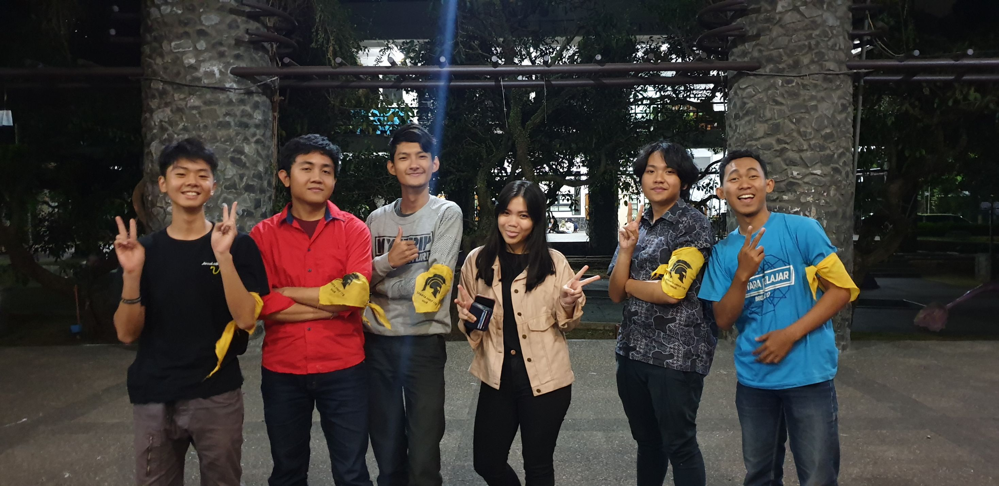

<table>
  <tr>
    <td><b>Nama</b></td>
    <td>Yuly Haruka Berliana Gunawan</td>
  </tr>
  <tr>
    <td><b>NIM</b></td>
    <td>13516031</td>
  </tr>
  <tr>
    <td><b>Tanggal</b></td>
    <td>Jumat, 21 Agustus 2019</td>
  </tr>
  <tr>
    <td><b>Tempat</b></td>
    <td>Selasar Timur Labtek V ITB</td>
  </tr>
</table>

___

&nbsp;&nbsp;&nbsp;&nbsp;&nbsp;&nbsp;Pada tanggal 21 Agustus 2019, kami berlima melakukan wawancara kepada Kak **Yuly Haruka Berliana Gunawan** atau biasa dipanggil Kak Yuly. Kakak ini jurusan informatika dan berasal dari angkatan 2016. Di HMIF, kakak ini memiliki peran yang sangat penting yakni sebagai Director of People and Culture Team. Ia masuk ke divisi tersebut karena ajakan dari kakak tingkat. Namun, sebelum menerima ajakannya, ia berkonsultasi dengan beberapa orang yang menurutnya penting seperti keluarga, teman dekat, dan juga kakak tingkat yang lebih berpengalaman. Setelah masuk menjadi Director of PnC, ia bertugas dan berkewajiban untuk mengikuti rapat yang diadakan oleh masing-masing team yang ada di PnC. Ia juga mengontrol keberjalanan setiap program kerja yang dirancangkan oleh PnC ini. Bahkan, ia juga sangat sering membelikan makanan bagi anggota-anggota yang berada di PnC.

&nbsp;&nbsp;&nbsp;&nbsp;&nbsp;&nbsp;Tahun lalu, ia berkesempatan menjadi ketua SPARTA HMIF. Lalu, saat ditanya mengenai kegunaan SPARTA pada masanya, ia mengatakan bahwa SPARTA itu bisa sangat berguna dan juga tidak. Menurutnya, SPARTA membuatnya menemukan banyak teman sejati yang senantiasa menemaninya  hingga dua tahun di jurusan. Hal tersebut tentu sangat penting adanya karena kekeluargaan sangat diperlukan dalam keberjalanan kuliah, apalagi saat mengerjakan tugas kelompok dengan anggota yang beragam. Selain itu, melalui SPARTA, ia tahu bahwa sangat banyak pendapat yang dapat diutarakan saat forum dilaksanakan. Oleh karena forum yang begitu banyak, ia belajar bagaimana cara menghargai pendapat orang lain. Selain itu, ia juga belajar bagaimana cara melakukan public sepaking dan juga cara bersosialisasi yang baik dengan lingkungan yang beragam. Namun, SPARTA yang dilakukan pada angkatannya memiliki kekurangannya juga. Menurutnya, ilmu keinformatikaan yang sesuai dengan bidang keilmuan kita kurang dikembangkan. Hal tersebut dibuktikan dengan seringnya penggunaan kertas dibanding dengan mengetik melalui komputer.

&nbsp;&nbsp;&nbsp;&nbsp;&nbsp;&nbsp;Saat ditanya mengenai kenyamanan himpunan, ia mengatakan bahwa berada di dalam HMIF adalah zona nyamannya. Bahkan, ia tidak ingin memasuki himpunan lain lagi bila diberi kesempatan ulang memilih himpunan. Lalu, saat membahas mengenai jurusan, Kak Yuly memberi jawaban yang cukup mengejutkan. Awalnya, ia ingin mendaftar di SITH-R jurusan biotek. Namun, akhirnya ia diterima di STEI karena merupakan pilihan pertamanya. Mendengar pilihannya ingin memasuki jurusan biotek, kami pun bertanya mengapa tidak masuk ke jurusan biomedis. Menurutnya, ia tidak mau membahas dan mengakaji lebih dalam mengenai manusia dan isinya. Ia lebih tertarik mengenai tumbuhan dan hewan dibanding meneliti manusia. Hal tersebut yang menjadi alasan utamanya tidak mau memasuki jurusan biomedis.

&nbsp;&nbsp;&nbsp;&nbsp;&nbsp;&nbsp;Saat Arkavidia 2017, Kak Yuly menjabat bagian Expo. Di sana, ia mengurus stand start up dan stand makanan. Saat Arkavidia 2018, Kak Yuly menjabat bagian Public Relation. Di sana, ia menjadi penghubung universitas-universitas, tapi bukan yang mau daftar lomba, melainkan yang memiliki radio di kampusnya, tidak lain adalah untuk pengiklanan Arkavidia. Hal yang menarik dari kedua kepanitiaan ini adalah ternyata Kak Yuly memilih divisi Expo dan PR karena menurutnya keduanya memiliki nama yang keren (bahasa Inggris gitu).

&nbsp;&nbsp;&nbsp;&nbsp;&nbsp;&nbsp; Kak Yuly sempat menceritakan masa lalunya juga kepada kami. Seperti pada nama lengkapnya, Haruka, yang berartikan musim semi dalam bahasa jepang. Nama tersebut diambil karena saat itu, ayahnya sedang beasiswa di Jepang dan ibunya masih di Indonesia. Saat itu Jepang sedang bermekaran bunga sakura sehingga Kak Yuly dilengkapi nama Haruka. Kak Yuly terlihat sangat menyayangi kedua orang tuanya karena saat ditanya apa yang akan dilakukan jika esok kiamat, jawabannya hanya ingin membahagiakan orang tua saja.

&nbsp;&nbsp;&nbsp;&nbsp;&nbsp;&nbsp; Kami menanyakan saat itu, apa saja yang Kak Yuly lakukan jika sedang *dating* bersama Kak Jeremy hehehe. Katanya, Kak Yuly ini sering nonton ke Braga berdua, mungkin karena dulu ditembak sama Kak Jeremy di tempat itu. Kalau lagi punya uang, Kak Yuly sering ke cafe-cafe, tapi makannya di ITB dulu biar murah. Kak Yuly sering beli es krim juga terus makannya di pinggir jalannya sambil ngobrol sama Kak Jeremy. Sekarang sudah berhubungan hampir satu tahun lamanya.

&nbsp;&nbsp;&nbsp;&nbsp;&nbsp;&nbsp; Awal kak Yuly kenal Jeremy waktu dulu SMP karena satu SMP. Lalu saat SMA mereka ngga pernah berkomunikasi sama sekali. Mereka bertemu lagi saat Kak Yuly mengajarkan SPARTA 2017. Saat wawancara panitia Jeremy bertanya, "masih kenal gw ngga? Gw dulu satu SMP sama lu". Lalu pada suatu saat ketika Kak Yuly sedang nginep di Villa dengan teman - temannya lalu tiba-tiba temennya ngasih tau Jeremy kalo Yuly lagi nginep, lalu temannya berbohong kalau Yuly sedang ngomongin Jeremy. Nah mulai lah mereka dekat. Awalnya saat kak Jeremy ngechat dijawab dengan balasan yang tidak bisa dibalas. Chat khas cewek yang bikin cowok pusing haha.

&nbsp;&nbsp;&nbsp;&nbsp;&nbsp;&nbsp; Awalnya Jeremy malu mau ngajak kak Yuly jalan. Jeremy paling berani hanya ngajak berangkat bareng ke gereja. Kak Yuly dengan teman-temannya terus dan Jeremy sendiri ngga sama temannya yang lain. Pada suatu hari kak Yuly harus berangkat gereja pagi, nah karena ngga da teman maka mereka berdua pergi ke gereja bareng. Mulai saat itulah benih-benih cinta muncul, Kak Yuly merasa nyaman ngobrol sama Jeremy dan akhirnya memutuskan untuk membuka hatinya.

&nbsp;&nbsp;&nbsp;&nbsp;&nbsp;&nbsp;Seperti yang kita tahu, Kak Yuly adalah ketua SPARTA 2017. Kisahnya menjadi ketua dimulai dari keinginannya untuk menjadi tim mamet (materi dan metode), karena keinginannya itu, ia menjadi aktif tiap rapat SPARTA. Namun teman-teman Kak Yuly melihat Kak Yuly dapat berperan lebih dari itu, dan kemudian teman-temannya mendorong Kak Yuly untuk mencalonkan diri menjadi ketua SPARTA. Singkat cerita, setelah bertanding di hearing-hearing dan tugas-tugasnya, Kak Yuly akhirnya mendapat amanah sebagai Ketua SPARTA 2017.

&nbsp;&nbsp;&nbsp;&nbsp;&nbsp;&nbsp;Setiap orang tentu memiliki rencana jangka pendek dan jangka panjangnya. Hal ini kemudian kami tanyakan kepada Kak Yuly. Rencana jangka pendek Kak Yuly ialah mendapat dosen TA-nya yang sesuai dengan harapannya. Ia menginginkan Bu Masayu untuk menjadi pembimbing TA-nya, dikarenakan merupakan dosen yang ramah dan sejalan dengan topik yang direncanakan oleh Kak Yuly, yaitu tentang NLP. Untuk rencana jangka panjang, Kak Yuly ingin kuliah S2 di luar negeri dan balik ke Indonesia untuk membangun Indonesia dengan caranya.
