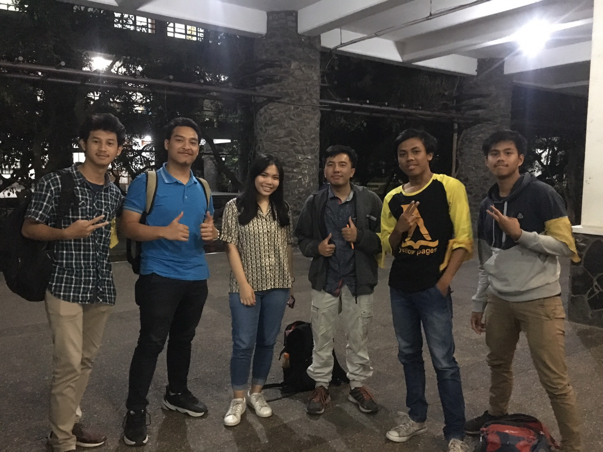

# Wawancara kak Yuly

[Paragraf 1-3 Punya Bagas]

Hmm, berbicara tentang lelaki idaman, kami bahkan sempat nanya ke kak Yuly apakah mau menjadi yang pertama atau yang kedua. Dengan spontan kak Yuly jawab “kalo mau dijadiin yang pertama atau yang kedua berarti gue nya dong yang bego, gak lah gamau, maunya jadi the one and only”. Kami juga memberi pilihan ke kak Yuly tentang lelaki idamannya, anak retro kah, anak “motor sport” kah, atau anak vespa. Kak Yuly milih anak vespa karena kak Yuly ngerasa dirinya pendek jadi susah kalo naik motor sport atau moge, selain itu menurut kak Yuly motor sport terlalu berisik.

Hobi kak Yuly adalah menonton film dan series film. Alasannya kalo film itu seru soalnya tidak harus baca, kaya novel ribet katanya. Genre kesukaannya adalah horror, salah satu filmnya adalah Conjuring 1 karena menurut kak Yuky film itu adalah film paling serem yg pernah dia tonton.

Oh iya hampir lupa, kak Yuly ini anak Informatika dan menjabat sebagai ketua direksi People and Culture di HMIF. Kak Yuly dulu pernah jadi ketua SPARTA 2017 dan punya banyak pengalaman di PSDA sebelum-sebelumnya. Dari banyak pengalaman yang kak Yuly punya, kak Abay nunjuk kak Yuly buat jadi ketua direksi People and Culture di HMIF. Proker kak Yuly sebagai ketua direksi People and Culture cuma ada 1, yaitu Pembekalan kepanitiaan, proker-proker lainnya ada pada divisi People dan divisi Culture masing-masing. Alasan kak Yuly mau jadi ketua direksi People and Culture di HMIF karena kak Yuly ngerasa gemes pengen ngerubah sesuatu yang ada di HMIF dan kak Yuly berpikir kenapa gak kak Yuly aja langsung yang ngerubah hal itu.

Hm, Kak Yuly kan sudah melewati banyak mata kuliah yang berbeda-beda dari Teknik Informatika, mengingat sebagian besar dari kami Teknik Informatika rasanya cukup cocok untuk meminta *spoiler* tugas besar dari mata kuliah-mata kuliah tersebut. Oleh karena itu, kami bertanya kepada Kak Yuly tentang tugas besar paling berkesan baginya. Menurut Kak Yuly Tugas Besar yang paling berkesan adalah Tugas Besar-Tugas Besar dari mata kuliah *Platform Based Development*. Kak Yuly beranggapan *Platform Based Development* memiliki tugas besar paling berkesan karena hampir setiap minggu ada Tugas Besar baru dan berganti platform secara terus menerus mulai dari Android, Unity (Game Engine), dan Arduino, sebelum akhirnya harus mengintegrasikan ketiganya padahal kuliahnya hanya 2 SKS.

Kak Yuly kan sudah tingkat-tingkat akhir dan biasanya kan mahasiswa tingkat akhir membuat Tugas Akhir. Mengingat kami juga ditanyai oleh Kaprodi ingin membuat tugas akhir apa saat pertemuan Kaprodi sebelum kuliah, kami juga cukup penasaran para pendahulu kami ini tertarik untuk membuat tugas akhir tentang apa. Meskipun sebenarnya sempat sedikit tidak enak menanyakannya, kami akhirnya menayakan kepada Kak Yuly tentang tugas akhirnya ingin membuat apa. Sebagai jawabnnya, Kak Yuly mengaku belum terlalu memikirkan Tugas Akhirnya mau tentang apa. Akan tetapi, Kak Yuly juga mengatakan dirinya tertarik dengan *Natural Languange Processing* dan mungkin akan membuat Tugas Akhir tentangnya. Spesifiknya Kak Yuly ingin membuat Tugas Akhir tentang memproses sebuah teks dalam bahasa menusia menjadi perintah-perintah yang dimengerti komputer dan program-programnya, bukan memproses *speech*.

[Lanjutin Gan]

Foto dari kiri ke kanan : Rafi, Bagas, kak Yuly, Hanif, Fatur, Ilman
