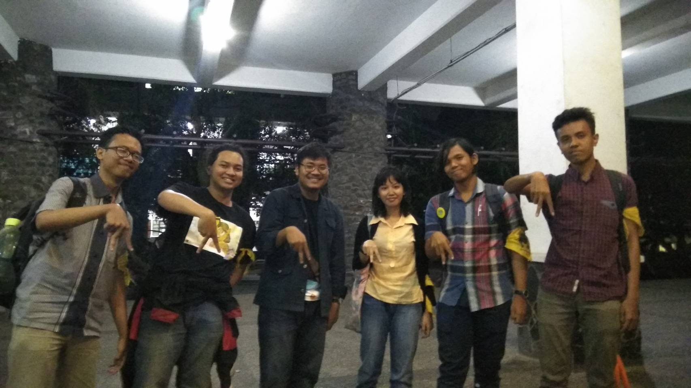

WAWANCARA DAEMON ADHI

Pewawancara
- Samuel                        / 16518098
- Putri Nadia Salsabila         / 16518109
- Muhammad Daffa Dinaya         / 16518113
- Arung Agamani Budi Putera     / 16518208
- Jundullah                     / 16518288

# Summary

## Biodata
Daemon yang satu ini bernama lengkap Muhamad Sulthan Adhipradhana. Kami memanggil ia Kak Adhi. Namun, teman-temannya biasanya memanggil dia dengan sebutan musang. Hal ini disebabkan temannya berpikir bahwa wajah Kak Adhi menyerupai musang. Kak Adhi merupakan mahasiswa ITB dengan jurusan Teknik Informatika dari angkatan 2016. Saat ini, Kak Adhi menjabat sebagai ketua bidang acara di Arkavidia 6.0. Ia memilih untuk menjadi seorang ketua bidang karena ia memiliki pengalaman di Arkavidia 5.0 di bidang acara. Ia merasa acara yang ditawarkan Arkavidia 5.0 masih kurang banyak dan ia ingin membawa ide-ide baru ke Arkavidia 6.0. Selain itu, ada beberapa kandidat ketua bidang acara Arkavidia 6.0 yang terseleksi alam sehingga menyisakan Kak Adhi menjadi **pilihan terakhir**. Progam kerja dari seorang ketua bidang acara adalah merancang dan melaksanakan acara-acara yang ada di Arkavidia 6.0 bersama anggota acara dan anggota panitia Arkavidia 6.0 lainnya.

## Pertanyaan Pribadi

### 16518288

Sebagai kabid acara Arkavidia, Musang me-manage 5 buah mata acara. Mata acara yang pertama yaitu Techno Camp, singkatnya Techno Camp itu Coding Class untuk anak SMA. Yang kedua, ada Arkavidia Academy. Arkavidia Academy sebenarnya hampir sama dengan Techno Camp, namun peserta Arkavidia Academy berasal dari mahasiswa-mahasiswa jurusan lain atau bahkan dari universitas lain. Selanjutnya ada Arkavidia Talk, sebuah seminar yang membahas IT secara umum. Kemudian ada yang namanya IT Fest, seperti namanya, IT Fest adalah sebuah festival di bidang IT, di festival ini ada banyak boot startup yang berkontribusi dan mengadakan berbagai games yang seru dan menyenangkan (penasaran?? Kuy ramein Arkavidia selanjutnya hehehe). Dan yang terakhir ada Gala Dinner, intinya makan-makan bareng sekaligus acara appreciation night untuk semua yang telah berkontribusi.

### 16518113

Ketika ditanya apa harapan Kak Adhi untuk Arkavidia 6.0, dia ingin kalau arkavidia tahun ini lebih baik daripada tahun kemarin (Arkavidia 5.0). Ya karena beberapa hal untuk kemarin mungkin kurang di beberapa hal, mulai dari persiapan yang belum terlalu rapih pada acara dan publikasi yang kurang. Untuk tahun ini optimis menjadi lebih baik karena persiapan lebih matang. Dia juga berharap Arkavidia menjadi pusat event industri IT di Indonesia dan mengalahkan event besar seperti COMPFEST.

Untuk pengalaman kerja kemarin, dia ambil kerja praktik di perusahaan Shopee. Kalau dari pengalaman kerja di sana, mungkin tidak terlalu terpaku pada deadline kantor. Jadi semisal ada target yang tidak selesai di hari itu dan waktu jam kantor sudah selesai, boleh dikerjakan di rumah melalui remote. Lalu untuk pelajaran kuliah untuk kerja praktik,menurutnya tidak terlalu relevan karena waktu di kerja praktik juga belajar hal-hal yang benar-benar baru

### 16518098

Angkatan kami yang bernama Decrypt menjadikan jiwa **nerd** Kak Yonas--ini saya kutip dari Kak Adhi--membara dan menciptakan *list* mengenai berbagai macam jenis kriptografi untuk dijadikan codename Daemon. Saat Kak Adhi melihat-lihat *list* tersebut, awalnya dia tidak begitu terpikir ingin memilih apa. Namun, saat ia melihat ada pilihan nihilist, ia merasa ini merupakan *codename* yang tepat bagi dia. Walaupun saat itu, dia hanya tahu *nihilism* sebagai sebuah ideologi yang tidak percaya Tuhan dan menganggap hidup adalah sebuah kesia-siaan. Ideologi yang tidak umum di Indonesia ini terlihat keren di mata Kak Adhi. Oleh karena itu, dia memilih *codename* ini agar terlihat *edgy*.
> TL;DR Nihilist itu nama yang ***edgy*** sehingga Kak Adhi memakai nama tersebut.

Kak Adhi sangat mencintai *kegabutan*. Ia tidak suka melakukan hal terlalu banyak. Oleh karena itu, saat liburan transisi tingkat dua ke tingkat tiga, Kak Adhi lebih memilih untuk magang daripada mencoba menjadi asisten lab. Menurut dia, tugas yang diberikan untuk menjadi asisten lab cukup banyak dan berat sehingga hal ini mampu memakan waktu Kak Adhi. Selain itu, dia juga berpikir bahwa keuntungan yang didapat saat menjadi seorang asisten lab tidak sebanding dengan pekerjaan asisten lab. Pengalaman dan ilmu yang didapat dari magang jauh lebih banyak dan relevan daripada seorang asisten lab.

### 16518098

Pengalaman creepy Kak Adhi selama di ITB adalah dulu ketika SPARTA saat basecampnya dulu di GMKI. Saat itu pernah ada hari dimana tiba-tiba ada orang yang bilang kalau GMKI bakal dirampok, yang ngomong tuh orangnya kayak dukun. Kak Adhi percaya percaya aja. bareng sama temennya yang lain mereka jaga sampai pagi di depan GMKI.Dan ternyata emang gak ada perampok. Dukunnya cuma ngeramal ngasal.

Terus Kak Adhi ini juga suka korea, baik boyband maupun girlband. Kak Adhi juga suka nonton drama korea. Drama Korea terbaru yang ditonton adalah Sky Castle sama Secretary Kim. Kalau boyband kak Adhi suka Kim Taehyung dari BTS, kalau girlband Jungyeon dari Twice. Kak Adhi juga cerita kalau sekarang di sekre 2 sering diputer MV korea. Jadi gak cuma wibu saja di HMIF, korean lovers juga banyak.

### 16518208

Kak Adhi pernah menjalani Kuliah Praktek di Shopee. Menurut beliau, kuliah praktek itu terasa jauh lebih santai ketimbang kuliah. Adalah suatu hal yang wajar karena pekerjaan magang terbilang cukup fleksibel dengan jadwalnya.

Saya sempat melemparkan beberapa pertanyaan yang terbilang *random* kepada kak Adhi. Salah satunya adalah WC terbaik di ITB. Menurut kak Adhi, WC terbaik berada di CRCS dan di Lab Doping, sementara WC terburuk berada di WC Sunken Court. Pertanyaan-pertanyaan lainnya seperti Genre film favorit juga saya sempat tanyakan. Sama seperti motif beliau memilih nama *nihilist*, genre film yang kak Adhi sukai adalah film-film yang *edgy*. Salah satu film favorit dari kak Adhi adalah Pulp Fiction.

