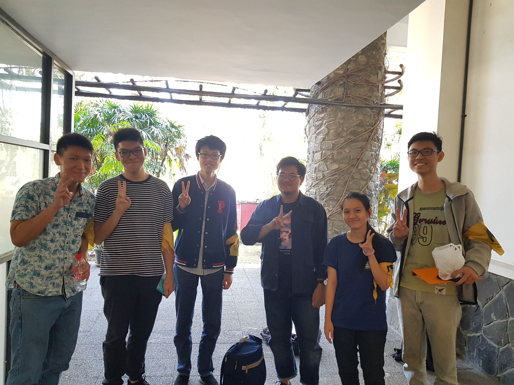

# Wawancara Daemon 'nihilist'
Pada hari Jumat, 23 Agustus 2019 pukul 13.00, kami,
- 16518118 - Yonatan Viody,
- 16518143 - Jonathan Yudi G.,
- 16518223 - Anna Elvira H.,
- 16518316 - Steve B. I. G.,
- 16518377 - Rifaldy A. K.,

mewawancarai Kak Adhi/Musang yang menggunakan nama sandi 'nihilist' di Selasar Timur LabTek V.

# Summary
## Biodata Singkat
&nbsp;&nbsp;&nbsp;&nbsp;&nbsp;&nbsp;Kami mewawancarai Daemon yang bernama Muhammad Sulthan Adhipradhana, yang biasa dipanggil Adhi atau **Musang**. Panggilan musang ini muncul dari orang-orang yang menganggap muka Kak Adhi ini mirip musang. Tetapi panggilan musang inilah yang membuat Kak Adhi merasa unik dan saat berkenalan akan lebih diingat oleh orang-orang. Kak Musang berjurusan teknik informatika dan mempunyai hobi yang sangat unik, yaitu **julid** haha. Sekarang dia memegang peran sebagai **Ketua Divisi Acara di Arkavidia 6.0**. Alasan Kak Musang mengambil peran tersebut karena dulunya dia adalah PJS acara Arkavidia sebelumnya dan sebenarnya ada 3 orang yang jabatannya setara atau lebih tinggi darinya, namun 2 orang sekarang menjadi DE HMIF ITB dan 1 orang lain ingin fokus pada keprofesian. Lalu proker dari peran yang diambil Kak Musang adalah ITFest (boot sponsor dan startup), ArkavidiaTalk (seminar IT), ArkavidiaAcademy (untuk anak kuliah), Technocamp (untuk anak SMA), dan Gala Dinner (apresiasi juara).

## Pertanyaan Bebas
### Kak, kerja praktek semester kemarin gimana?
&nbsp;&nbsp;&nbsp;&nbsp;&nbsp;&nbsp; Kak Musang kerja praktek di Shopee mulai dari bulan November. Awalnya Kak Musang meng-*apply* ke beberapa perusahaan dengan men-*drop* CV-nya dalam Python convention bersama teman-temannya. Setelah beberapa saat, mereka di-email dan ada tes logika serta interview sebelum diterima. Yang aneh di sini, beberapa temannya yang lain yang mendaftar lewat website Kalibrr justru ditolak semua. Saran dari kak Musang sih cepetan aja daftarnya biar dapet kursi.

&nbsp;&nbsp;&nbsp;&nbsp;&nbsp;&nbsp;Pengalaman yang Kak Musang dapatkan di Shopee adalah pengalaman bekerja dalam tim, seperti simulasi kerja nyata karena anak magang akan digabung dalam satu tim dengan orang-orang yang bekerja *full-time*. Kak Musang juga menambahkan bahwa teman-temannya yang kerja praktek di tempat lain tidak semua mendapat pengalaman seperti ini, termasuk tempat magang sebelumnya yaitu Agate.

### Bidang acara ngapain aja sih, Kak?
&nbsp;&nbsp;&nbsp;&nbsp;&nbsp;&nbsp;Kami juga bertanya tentang *jobdesc* spesifik divisi-divisi yang tergabung dalam bidang acara di Arkavidia 6.0. Secara umum anak acara itu kerjanya mengontak pihak-pihak yang diperlukan untuk keberlangsungan acara tersebut, baik peserta, pembicara, maupun perusahan startup. Misalnya untuk acara ITFest, anak acara akan bertugas untuk mengontak startup yang bersedia membuka stand di acara tersebut. Contoh lain untuk acara ArkavAkademik, anak acara akan mencari peserta-peserta (anak SMA) yang berminat mengikuti acara tersebut. Biasanya diadakan rapat sekitar 2 minggu sekali, tapi jika sudah dekat hari-H, rapat akan jadi lebih sering, yaitu seminggu sekali. Nah kalau pengen ngontak dan ketemu sama orang-orang penting atau bos-bos startup bisa banget join divisi-divisi acara Arkavidia 6.0.

&nbsp;&nbsp;&nbsp;&nbsp;&nbsp;&nbsp;Kak Musang dulunya pernah mencoba gamedev, namun akhirnya merasa tidak cocok. Sekarang dia lebih senang pada backend karena keren dan dia tidak terlalu suka frontend atau lebih tepatnya bidang desain. Oleh karena itu dia juga dulu magang di Shopee di bagian backendnya, bagi dia kerja di Shopee itu menyenangkan. Selain mendapatkan pengalaman bekerja di dalam team, dia juga mengaku bahwa pekerjaan yang diberikan tidak terlalu susah, dan juga banyak gabut dan rame.

&nbsp;&nbsp;&nbsp;&nbsp;&nbsp;&nbsp;Kami juga bertanya mengenai dosen-dosen favorit Kak Musang dan alasannya. Ada beberapa nama familiar yang ia sebutkan. Selain itu Kak Musang juga bercerita pengalamannya saat mengambil mata kuliah astronomi lingkungan dan ternyata matkul itu menjatuhkan nilai :( karena materi yang dipelajari untuk UTS/UAS itu sangat banyak dan semuanya berupa hafalan.

### Kira-kira nih, keunikan kakak apa ya?
&nbsp;&nbsp;&nbsp;&nbsp;&nbsp;&nbsp;Selain mukanya yang (kata teman-temannya) mirip musang, Kak Musang ternyata orangnya *koreaboo* (suka hal-hal berbau korea). Katanya sih di sekre HMIF lebih banyak *koreaboo*-nya daripada wibu. Kak Musang juga tidak tergabung dalam unit apapun. Bukannya tidak mendaftar, tapi dia men-*drop* beberapa unitnya dengan alasan sudah sibuk di jurusan IF, salah satunya adalah LFM.

## Kesan dan Pesan
&nbsp;&nbsp;&nbsp;&nbsp;&nbsp;&nbsp;Kesannya saat mewawancarai Kak Musang, rame banget! Yang paling berkesan itu waktu forsos Arkavidia tanggal 22 agustus kemarin, Kak Musang kelihatan awkward banget waktu presentasi, tapi dia orangnya kocak sihh. Waktu wawancara dengan kami, dia orangnya sans dan bisa ngobrol banyak hal (dan ngejulid juga hehe). Sukses terus, Kak!
