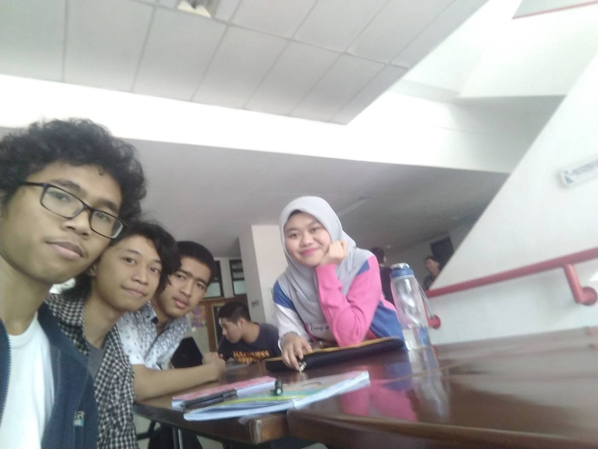

# Summary Wawancara Daemon Kak Ilma alias 'Polybius'
# Foto

![Dari kiri ke kanan: Kevin, Falah, Dhafin, Kak Ilma]

Pada hari Kamis, 22 Agustus 2019 pukul 10.00, kami,
- 16518059 - Mohamad Falah Sutawindaya,
- 16518331 - Kevin Rizki Mohammad,
- 16518332 - Dhafin Rayhan Ahmad

mewawancarai Kak Ilma yang menggunakan nama sandi 'polybius'.

# Summary
## Biodata Singkat
Kami mewawancarai Daemon yang bernama Ilma Alifia Mahardika, yang biasa dipanggil Kak Ilma. Kak Ilma berjurusan Teknik Informatika. Sekarang dia memegang peran sebagai Kepala Bidang Eksternal di HMIF ITB. Alasan Kak Ilma memilih jabatan ini adalah karena hobinya yang suka mengurus acara. Sebelumnya di Arkavidia 5.0 Kak Ilma menjabat sebagai Ketua Divisi delegasi.

## Peran Sebagai Kepala Bidang Eksternal
Peran Kak Ilma seorang Kepala Bidang intinya ada dua nih. Di bidang Eksternal itu kan ada dua divisi, Delegasi dan Public Relation. Tugas Kabid yang pertama ialah menjebatani divisi-divisi yang ada di Eksternal atau sebagai pengisi gap diantara divisi-divisi tersebut. Tugas kedua yaitu mengawasi keberjalanan divisi-divisi tersebut.

## Pertanyaan Bebas

### Hobi kakak apa?
Menulis, dan mendengarkan musik. Kayak biasa gitu sih tapi yah mau gimana lagi (kata Kak Ilma).

### Asal Kakak darimana Kak?
Kak Ilma ini asal tinggalnya dari Nganjuk Jawa Timur, tapi waktu SMA di Tangerang Selatan. Kenapa bisa jauh karena katanya untuk dapet beasiswa gitu.

### Hal paling berkesan selama kuliah?
Saat nugas, karena sekre jadi ramai. Pengalaman Kak Ilma paling berkesan ketiga nugas ialah pernah begadang mengerjakan tugas di sekre hingga pagi.

### Kemarin Kerja Praktek dimana Kak?
Kemarin KP di salah satu startup yaitu tiket.com sebagai data engineer. Durasi kerja Kak Ilma sekitar dari jam 9 pagi hingga jam 6 sore (kalo gak salah) selama lima hari perminggu. Pekerjaan kak Ilma ini digaji yang dihitung secara harian sebesar 150 ribu perhari. Oh iya sedikit cerita Kak Ilma ini waktu KP di tiket.com ini hanya sendirian aja nih diantara temen-temennya padahal waktu daftar ada beberapa orang gitu.

### Kak sebenarnya Data Engineer itu kerjanya bagaimana dan bedanya dengan data scientist itu seperti apa?
Dari penjelasan Kak Ilma, Data Engineer itu kerjanya ialah mengumpulkan data dan mengolahnya supaya dapat di analisis oleh Data Scientist. Pekerjaan Data Engineer itu seperti menyiapkan bahan-bahan mentah dan mengolahnya supaya ketika ada seseorang yang ingin membangun dengan bahan tersebut sudah siap pakai.

### Tingkat 2 ambil matkul tambahan apa aja?
Pokoknya semua yang wajib kayak Agama dan Etika Islam, Kewarganegaraan, dan Lingkungan itu semua diambil di tingkat 2,tapi lupa matkul-matkul tersebut di semester III atau IV.

### Rencana Kakak setelah lulus dari ITB apa?
Kak Ilma berencana ingin langsung kerja setelah lulus dari ITB. Tapi Kak Ilma juga punya keinginan untuk melanjutkan S2 namun setelah beberapa tahun kerja terlebih dahulu. Rencananya sih Kak Ilma inginnya S2 di luar negeri.

### Masalah di Dunia ini yang kakak harap bisa diatasi?
Setelah berpikir sekitar 30 detik, Kak Ilma menjawab bahwa masalah yang sangat ingin diatasi adalah masalah-masalah yang ada di dunia pendidikan. Karena menurut Kak Ilma, tidak semua orang bisa menerima pendidikan yang baik seperti yang Kak Ilma rasakan hingga saat ini.

## Kesan tentang Kak Ilma
Kesan kami setelah berbincang Kak Ilma ini Kak Ilma ini orangnya berani, karena dari ceritanya ketika mengambil tanggung jawab yang besar sebagai Kepala Bidang Eksternal. Kak Ilma juga ramah banget dan berpesan agar kalo ketemu lagi suruh sapa aja karena Kak Ilma sering lupa gitu.