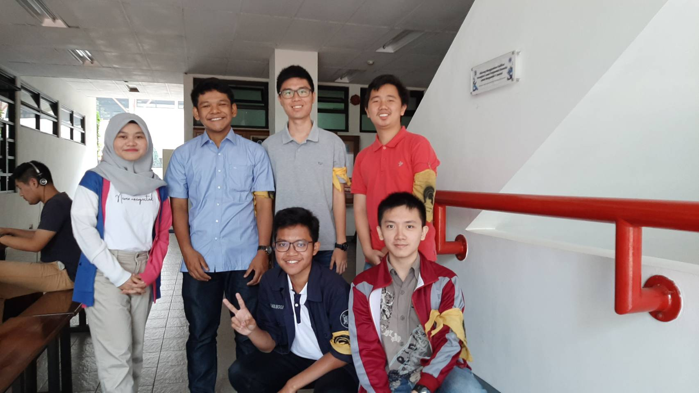

WAWANCARA DAEMON ILMA

  

----BAGIAN EDO----

Saat ini, Kak Ilma sedang memegang jabatan sebagai kepala bidang eksternal di Arkavidia 6.0. Bidang eksternal ini mengurus masalah yang berhubungan dengan orang-orang dan dunia luar, sekaligus membawahi 2 divisi, yakni delegasi dan public relation. Divisi delegasi bertugas untuk mencari peserta-peserta yang ingin ikut dalam rangkaian acara di Arkavidia 6.0, seperti lomba atau talkshow. Sedangkan divisi public relation bertugas untuk mencari vendor yang mau untuk menyebarkan informasi dari Arkavidia ini. Kenapa mau memegang jabatan ini ? Kak Ilma minat dan suka dengan hubungan dunia luar. Terbukti saat berada di tingkat 2 & 3, Kak Ilma menjadi divisi Ekstrakampus di struktur HMIF. Selain itu di Arkavidia 5.0, Kak Ilma menjadi kepala divisi delegasi, sehingga ketika ditawarkan jabatan kabid eksternal, Kak Ilma dengan senang hati tidak menolaknya.

Apakah sebelum masuk IF, pernah punya skill ngoding atau sebagainya ?
Kak Ilma tidak punya background IF sebelumnya, termasuk ngoding. Kak Ilma ini suka cari hal baru. Justru itu, Kak Ilma jadi minat dan suka di Informatika. Karena sebelumnya belum punya background ke-IF-an, jadi waktu di jurusan, benar-benar belajar hal baru. Semuanya baru. Apalagi saat TPB pernah ketemu Pengantar Analisis Rangkaian (PAR), jadi semakin yakin untuk masuk Informatika.

Gimana caranya mengatasi tubes-tubes yang banyak di IF ?
Menurut Kak Ilma, untuk mengatasi hal-hal yang bersangkutan dengan tubes, adalah cari teman sekelompok tubes yang enak. Enak di sini maksudnya bukan bisa meng-carry semua tugasnya, tetapi yang bisa diajak kerjasama. Kak Ilma ini orangnya ingin semua orang bisa kerja secara imbang, bukan hanya dikerjakan satu orang saja, sehingga ada chemistry-nya antar anggota kelompok. Kalau chemistry sudah ada, maka dalam keadaan se-chaos apapun, mengerjakan tubes sampai malam pun masih enak.

Bagaimana prosesnya ketika akan ada pentas yang diadakan Studi Teater Mahasiswa?
Kata Kak Ilma, setiap akan ada pentas, STEMA akan ada open recruitment untuk pemain perannya. Kak Ilma sendiri sangat ingin menjadi pemeran utama. Tetapi, sampai saat ini, Kak Ilma belum pernah mendapatkan peran yang menjadi pusat cerita. Selama beberapa kali pentas, Kak Ilma hanya menjadi peran sampingan. Mungkin karena terlalu tidak berkesan, Kak Ilma sudah lupa karakter yang pernah ia perankan di pentas-pentas tersebut.

Mengapa mendaftar di tiket.com untuk Kerja Praktek?
Kak Ilma sudah tertarik ke bidang data sejak mengambil mata kuliah Ilmu Data dan Penggalian Data. Jadi, Kak Ilma ingin Kerja Praktek di bidang data. Karena tiket.com ada lowongan di bidang data, Kak Ilma daftar di tiket.com. Saat Kerja Praktek di tiket.com, Kak Ilma lebih berfokus ke cleansing data dan memastikan data yang tersedia akurat. Istilahnya adalah Data Engineer. Menurut Kak Ilma, perbedaan data scientist dengan data engineer yaitu, data scientist lebih ke prodi Matematika, mengolah data dan membuat interpretasi dari data-data yang ada, sedangkan data engineer lebih berhubungan dengan informatika dan mempersiapkan data-data sebelum dianalisis oleh data scientist. 

Di STEMA, apakah kakak pernah memegang jabatan atau sedang memegang jabatan?
Untuk di STEMA ITB, Kak Ilma merasa sudah tidak seberapa aktif untuk saat ini. Hal ini menandakan bahwa sebelumnya Kak Ilma cukup aktif di Unit Teater ITB ini. Kak Ilma berkata bahwa pada tingkat tiga, dia tidak memegang jabatan apa-apa di STEMA ITB, hanya sebagai anggota biasa. Mundur lagi, pada saat dia berada di tingkat dua, dia memang tidak memegang jabatan apa-apa di STEMA ITB, namun cukup aktif dalam acara-acara yang diadakan oleh unit teater ITB tersebut. Mungkin, dia melakukan hal itu, agar mudah untuk membagi waktu antar kegiatan baik di himpunan dan/atau di unit.

Semester ini ngambil berapa SKS, kak?
Untuk semester ini, Kak Ilma mengambil sebanyak 17 SKS. Kebanyakan dari jumlah SKS tersebut adalah mengambil mata kuliah pilihan Teknik Informatika. Kak Ilma juga bercerita mengenai apa-apa saja yang dia ambil pada waktu tingkat dua dan tingkat tiga. Pada waktu tingkat tiga, dia bercerita pernah mengambil mata kuliah Bahasa Jerman. Dia juga bercerita, bahwasanya ternyata mata kuliah bahasa asing seperti Bahasa Jerman dan Bahasa Perancis adalah mata kuliah yang ramai peminat. Makanya, karena ingin belajar, dia juga ingin mengambil mata kuliah tersebut, walaupun sekarang katanya sudah agak lupa-lupa gitu. Pada waktu tingkat dua, Kak Ilma lebih memprioritaskan untuk menghabiskan mata kuliah umum seperti Agama dan Kewarganegaraan.

Pada waktu magang, Kak Ilma memakai bahasa pemrograman apa ketika jadi Data Engineer?
Pada waktu magang di tiket.com, Kak Ilma menggunakan bahasa Python/Java. Menurut Kak Ilma, untuk magang di situ, kita tidak harus bisa kedua bahasa tersebut (Python dan Java), mengapa? Karena, sebenarnya bahasa pemrograman Python dan Java memiliki fitur-fitur yang berbeda, yang membuat peran kedua bahasa tersebut berbeda. Maka dari itu, tidak harus bisa dua-duanya. Akan tetapi, alangkah baiknya kalau bisa kedua bahasa tersebut sekaligus, karena bisa meng-cover banyak pekerjaan.

