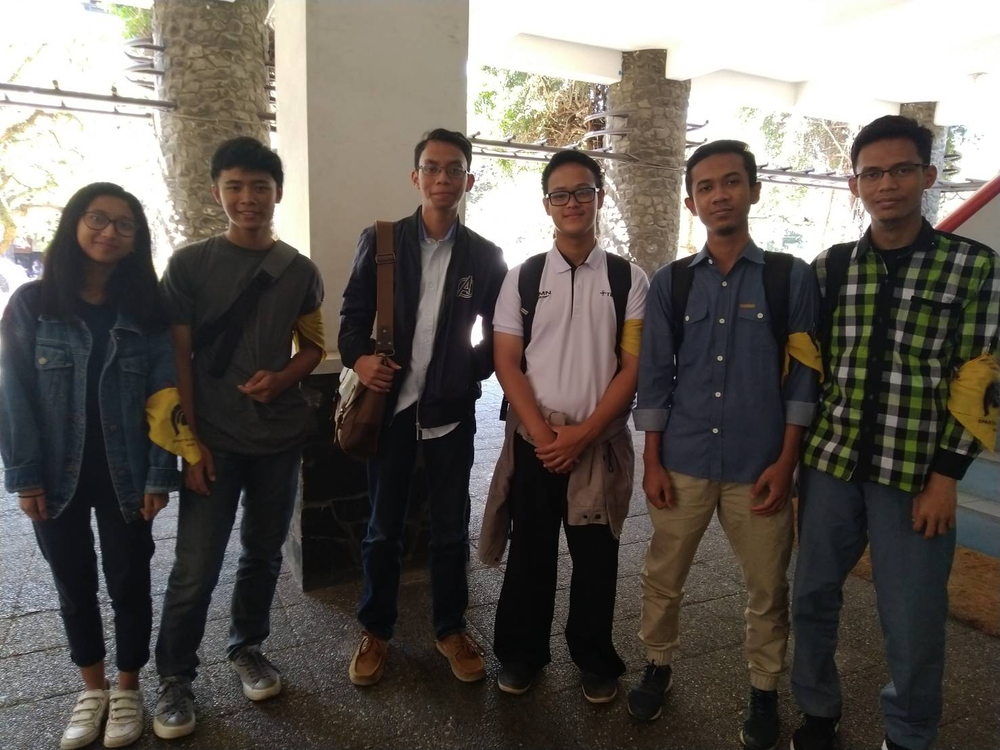

# Wawancara Daemon 'Diffie-Hellman'
Pada hari Jumat, 23 Agustus 2019 pukul 10.00, kami,
* 16518045 - Reyvan Rizky Irsandy
* 16518238 - Taufiq Husada Daryanto
* 16518318 - Ayutari Dian Putri
* 16518405 - Hizbulloh Ash-Shidiqy
* 16518415 - Ade Surya Handika

  mewawancarai kak Dion yang menggunakan kata sandi 'Diffie-Hellman' di lantai dua labtek V.

# Summary
## Biodata Singkat
  Namanya lengkapnya adalah Dionesius Agung Andika Perkasa, biasa dipanggil Dion. Kak Dion adalah mahasiswa teknik informatika (IF) ITB angkatan 2016. Saat ini, Kak Dion menjabat sebagai sebagai ketua komisi aspirasi dewan perwakilan dan pengawasan (DPP) HMIF ITB. Sebenarnya, Kak Dion tidak memilih untuk menjabat ketua komisi aspirasi DPP tersebut, melainkan ditawarkan oleh ketua. Dulu, setelah SPARTA, Kak Dion ditawarkan oleh ketua kepengurusan selanjutnya untuk menjadi sekretaris di DPP. Namun, peran DPP sebagai pengawas dewan eksekutif (DE) pada kepengurusan sebelumnya kurang kuat, sehingga Kak Dion tertarik untuk menerima tawaran tersebut. Tapi, saat itu Kak Dion tidak ingin menjadi ketua karena sudah cukup disibukkan dengan kegiatan lain seperti unit. Kak Dion mengikuti Unit Robotika ITB (URO).
  
## Program Kerja
 Terdapat 3 program kerja komisi aspirasi DPP, yaitu:
  1. Mengumpulkan aspirasi massa. Programnya adalah menampung aspirasi dari seluruh massa. Setiap massa HMIF dapat menyampaikan aspirasinya yang berkorelasi dengan HMIF ke komisi ini, baik secara formal maupun personal.
  2. Laporan pengembangan anggota. Alih-alih membuat laporan anggota dari setiap kepala divisi sehingga anggota bersifat pasif, program ini fokus pada masing-masing anggota dari setiap divisi. Setiap tiga bulan, tiap anggota ditanya mengenai kesan dan pesan selama berada di divisi mereka, apakah mereka dapat berkembang di divisi tersebut, bagaimana kinerja dari kepala divisi mereka, perasaan mereka berada di divisi tersebut, dan lain-lain.
  3. Penyebaran form evaluasi acara. Setiap dewan eksekutif menyelesaikan suatu acara, komisi aspirasi DPP akan menyebarkan form yang akan disebarkan ke panitia dan juga peserta mengenai keberjalanan acara tersebut. 
 
## Pertanyaan Bebas
### Tari – Kak Dion menyebutkan tertarik pada bidang internet of things (IoT), mengapa?
  Awal menyukai bidang IoT ini dari unit robotika. Disana diperkenalkan ke bidang yang menurut Kak Dion menarik. Selain itu, Kak Dion menyukai bidang ini karena ilmu yang dibutuhkan tidak hanya keilmuan komputer murni, tetapi juga dibutuhkan ilmu-ilmu lain seperti keelektroan sehingga Kak Dion merasa bidang ini lebih menantang.

### Tari – Apa rencana topik tugas akhir Kak Dion?
  Karena cukup aktif di Unit Robotika ITB, Kak Dion berencana untuk membuat tugas akhir yang membahas mengenai robotika. Yaitu menggunakan teknologi bernama SLAM untuk mengetahui estimasi posisi suatu robot. Topik ini dipilih karena Kak Dion sudah cukup menguasai bidang ini.

### Reyvan - Apa spesialisasi di IF?
  IoT merupakan spesialisasi kak dion, hal ii dikarenakan kak dion sangat suka dengan robotik yang nyambung ke IoT dia sangat aktif di URO, dan bagi kak dion matkul yang paling asik di IF adalah PBD karena belajar banyak platform, katanya tubesnya asik karena nyambung sama IoT

### Reyvan - Apa yang di dapatkan selama kuliah di IF?
  Hal yang paling kerasa setelah kuliah 3 tahun di IF bagi kak dion adalah dapet kemudahan saat wawancara magang, namun saat magang atau intern tidak semua hal yang dipelajari di IF berguna, akhirnya sering belajar lagi, jadi kak dion sering belajar sendiri ketimbang belajar di IF.

### kesan di HMIF tahun pertama
Pertama kali masuk jurusan, mikir dosennya bakal ga enak. Tapi ternyata dosennya care sama mahasiswanya. Ketika di IF, tugasnya memang banyak, tapi tetep bisa dikerjakan, walaupun kalau ngerjain sambil ngeluh ngeluh

### perkembangan teknologi sangat pesat, bagaimana cara menyikapinya?
Agar bisa tetap mempertahankan posisi di dunia kerja, lebih baik punya expertise di satu bidang spesifik. Dan kalau sudah expert dibidang tersebut (pengalaman banyak), skill sudah tidak terlalu penting, karena orang orang sudah memandang kita sebagai seorang yang expert, sehingga otomatis posisi kita di pekerjaan tetap aman

## Hal-Hal yang Berkesan Mengenai Kak Dion
 
## Foto
  

