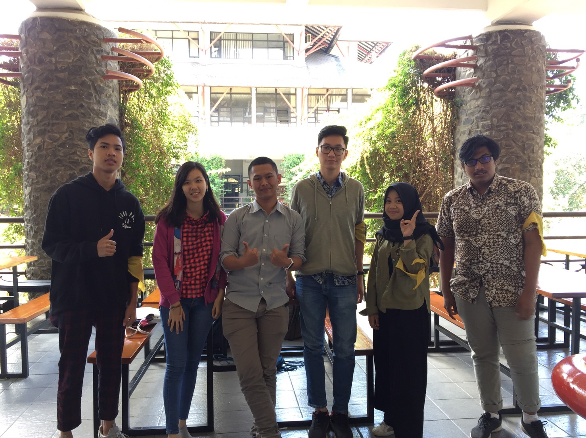

# Tugas Wawancara Daemon

Hi! Jadi hari Rabu tanggal 21 Agustus 2019, kami berlima mewawancarai kak Luthfi.
- 16518002
- 16518029 Florencia Wijaya
- 16518151
- 16518196
- 16518342

# Summary
## Biodata
	Kak Luthfi bernama lengkap Luthfi Ahmad Mujahid Hadiana. Jurusan Kak Luthfi adalah IF. 
	Kakak ini menjabat sebagai Vice President External Departement. Awalnya, Kak Luthfi gak kepikiran mau jadi kadep. Tapi akhirnya ia merasa ingin aktif di HMIF dan ngobrol sama banyak orang, bukan IF aja. 
	Akhirnya, Kak Luthfi merasa banyak belajar dan cinta sama HMIF, akhirnya ngajuin diri. Kak Luthfi dari awal magang sampai sekarang itu selalu divisi ekstrakampus. Kak Luthfi juga pernah jadi ketua Pemilu HMIF.
	
	Proker yang dijalani Kak Luthfi adalah Sekolah Relasi. Kak Abay dan Kak Luthfi ngerasa kalo anak eksternal harus dibuat 1 frame, jadilah dibikin Sekolah Relasi.
	Sekolah Relasi ini isinya semacam mentoring tentang apa saja yang diperlukan untuk menjadi "wajah" HMIF, prokernya apa aja, tentang HMIF, dan SOP. Target dari Sekolah Relasi ini adalah anggota eksternal.
	
## Pertanyaan Bebas

### Floren : Ada pengalaman menarik atau lucu nggak selama di HMIF?
	Hobi Kak Luthfi itu fotoin orang tidur. Pernah lagi fotoin orang tidur, terus fotonya dikirim ke grup HMIF. Karena kakaknya lagi flu, jadi pas di fotonya keliatan meler. Akhirnya, foto itu jadi meme angkatan, deh.
	Kak Luthfi juga pernah di-chat orang yang gak dikenal di LINE yang nanya tentang STEI. Ternyata, orang itu ketemu kak Luthfi di Open House ITB. Terus, ketemu lagi di rapat pleno.
	Lalu, katanya Kak Luthfi juga pertama kali jadi ketua Pemilu itu di HMIF.
	
### Floren : Tips supaya berani tanggung jawab?
	Just do it. Kalau ada kesempatan, diambil aja. Jangan takut akademik gak bisa ke-handle karena akademik tiap orang kan sama.
	Tapi, kalau pas dicoba emang gak sanggup, lain kali jangan ambil lagi. 
