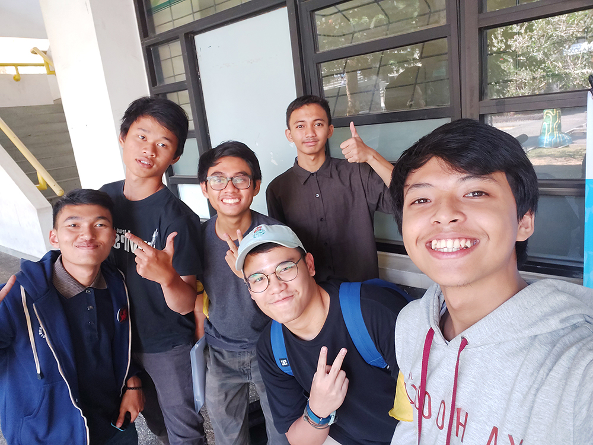

 ## Foto :
 
 
 Pada hari Rabu, 21 Agustus 2019, kami mewawancarai seorang Daemon yang bernama Sinaga Yoko Christoffel Triandy yang biasa dipanggil Yoko. Jurusan Ka Yoko adalah Teknik Informatika angkatan 2016 dan beliau adalah Ketua Divisi Club - Dewan Eksekutif bidang Internal.

## Peranan Kak Yoko di HMIF :

   Ka Yoko ingin memegang peran tersebut karena menurutnya anak-anak IF dan STI kurang bergerak dan beraktivitas di kampus selain di depan laptop/komputer. Kemudian karena kurangnya tersalurkan minat dan bakat di luar keprofesian, serta sedikitnya jumlah club di HMIF pada kepengurusan sebelumnya. Oleh karena itu, beliau ingin mengubahnya dan mewadahi hal tersebut.
    
   Proker, ide atau jobdesc yang dijalankan di divisi Club adalah apresiasi kepada massa HMIF yang berprestasi di luar bidang keinformatikaan (Markipres), lomba home tour yang terdiri dari lima lomba (Markimba), dan maintain club (Markilub).
    

## Pertanyaan Bebas :

 Kak Yoko sempat sedikit menceritakan bagaimana rasanya menjadi salah satu badan pengurus (BP) di himpunan, terutama HMIF. Menurut Kak Yoko, menjadi BP di himpunan tidak susah. Tapi mungkin karena Kak Yoko menjadi ketua divisi club, yang mungkin perkerjaannya tidak terlalu berat, jadi tidak terlalu susah menjadi BP. Kak Yoko tidak terlalu tahu bagaimana BP yang lainnya, namun jika komunikasi yang dijalin antar badan pengurus baik dan punya niat, maka pasti akan mendapat bantuan dari BP lainnya sehingga pekerjaan menajadi mudah.
 
Kak Yoko dulunya tergabung dalam Club voli. Karena menurutnya, dia tidak jago dalam futsal, begitupun juga dengan basket. Sayangnya, wadah pertandingan voli antar himpunan belum ada di KM. Hanya basket dan futsal saja yang diwadahi oleh KM. Sehingga Kak Yoko sendiri belum tahu kompetitor-kompetitor dan lawan yang harus diwaspadai oleh HMIF dalam bidang olahraga.

Sebelum Kak Yoko menjabat sebagai Ketua Divisi Club, dia juga menjabat di US (Unit Softball) di divisi Kekeluargaan. Kak Yoko membuat acara yang merekatkan anggota US dengan cara mengadakan nonton bareng di sekre, dan main olahraga lain dengan sesama anggota US. Hal ini juga yang menjadi alasan mengapa Kak Yoko mau untuk menjabat menjadi Ketua Divisi Club di HMIF sekarang.

  Kami menanyakan mengapa divisi club masih ada meskipun peminatnya sedikit? Beliau menjawab, menurut Ketua HMIF, Ka Abay, meskipun minat dari massa HMIF kurang terhadap club, namun masih ada beberapa anggota yang minat. Oleh karena hal tersebut, menurutnya tetap perlu adanya wadah dan fasilitas. Selain itu, Ka Yoko berpendapat bahwa cara approach massa tidak selalu dari bidang keinformatikaan melainkan bisa juga melalui minat dan bakat.
    
   Ekspektasi Ka Yoko dalam HMIF dulu dan sekarang? 
   Menurutnya, dahulu dia merasa mengikuti SPARTA hanya sekadar basa basi, dan hanya sebatas ingin diarak saat beliau lulus dari ITB (wisuda). Sekarang ini beliau menjabat dalam BP, karena dahulu setelah pelantikan berlangsung, Ka Yoko selalu memprioritaskan Unit Softball dibandingkan HMIF. Selain itu alasan beliau memegang jabatan di BP HMIF, karena sudah mendapat pengalaman dan pelajaran dari BP Unit Softball.

  Apakah kak Yoko suka menonton Anime?
  Menurut kak Yoko, anime itu tidak layak tonton. Hal tersebut karena banyak anime yang secara sengaja menyajikan gambar yang tak layak
untuk ditonton. Selain itu, anime juga kesannya seperti kekanak-kanakan. :'(

  
