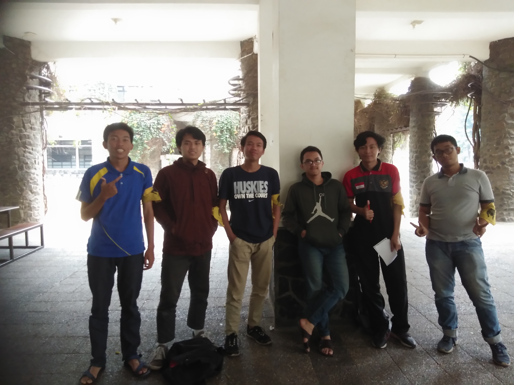

# Wawancara Daemon 'Base64'
Pada hari Minggu, 25 Agustus 2019 jam 15.00, di Selasar Timur Labtek V, kami,
- 16518216 - Wildan Zaim Syaddad
- 16518236 - Fathan Mubina
- 16518237 - Figo Agil Alunjati
- 16518313 - Vincent Hasiholan
- 16518382 - Muh. Muslim Al Mujahid

mewawancarai Kak Ahmad Faiz Sahupala sebagai Daemon.

# Biodata Singkat
Kami mewawancarai kak Faiz. kak Faiz merupakan sekjen di Dewan Eksekutif HMIF ITB, alasan kak Faiz mengambil peran ini adalah karena kak Faiz ingin memberi pengaruh lebih ke HMIF tapi tidak ingin kemnjadi ketua himpunan, katanya jika kahim sebagai orang yang bermimpi, maka sekjen adalah eksekutor untuk mewujudkan mimpi tersebut. Kak Faiz termasuk orang yang kreatif dan tertarik dengan bisnis, bahkan telah memiliki startup bernama eduka, juga dengan menjadi sekjen kak Faiz telah meningkatkan penerapan teknologi dalam melaksanakan kegiatan di HMIF ITB.

# Pertanyaan Bebas
Setelah dari wawancara mengenai biodata kak Faiz, kami menanyakan beberapa pertanyaan bebas. Ada yang menanyakan masalah waktu. Cara yang dilakukan oleh Kak Faiz untuk mengatasi hal itu adalah dengan memanfaatkan <i>framework</i> yang ada dan membersihkan <i>chat</i> pada malam hari. <i>Framework</i> ini berisikan jadwal kegiatan yang hendak dilakukan pada hari itu atau hari kedepannya sehingga mendapat banyangan untuk mengatasi masalah yang akan dihadapi. Pembersihan <i>chat</i> malam dilakukan supaya tidak ada rasa yang tidak enak karena meninggalkan pembicaraan yang mungkin isinya penting.

Kami memberikan sebuah pernyataan bahwa HMIF sebenarnya mampu memiliki dan mengembangkan Startup-nya sendiri karena kak Faiz dan rekan rekannya saja mampu, dan HMIF punya kak Faiz sebagai anggota dari himpunannya dan menanyakan pendapat kak Faiz tentang hal tersebut. Lalu kak manngapi, bahwa sebenarnya HMIF memang memiliki potensi besar, namun hal tersebut akan mengeluarkan HMIF prinsipnya sendiri yaitu organisasi non-Profit. Sebagai gantinya HMIF memiliki IIT sebagai departemen yang memiliki sistem kerja mirip sebuah startup dan banyak menerima projekan sehingga dapat berlatih layaknya profesional.

Kak Faiz memberi pesan kepada kami bahwa maksimalkanlah semester 3 ini. karena semester tiga ini merupakan dasar-dasaar ilmu di semester semester berikutnya. Selain itu sukai juga mata kuliah di semester tiga ini, supaya kelak di mata kuliah di semester depan yang menggunakan dasar ilmu tersebut juga disuka bukan dihindari.

Kak Faiz juga memberi pesan kepada kami untuk jangan suka menghakimi pilihan hidup orang lain karena kita bisa jadi menyakiti hatinya. ada orang yang memang benar benar menginginkan pilihan hidup tersebut maka jangan sampai kita menghakiminya sampai akhirnya pupus dan sakit hati orang tersebut. karena hal ini sering terjadi di stei itb.
