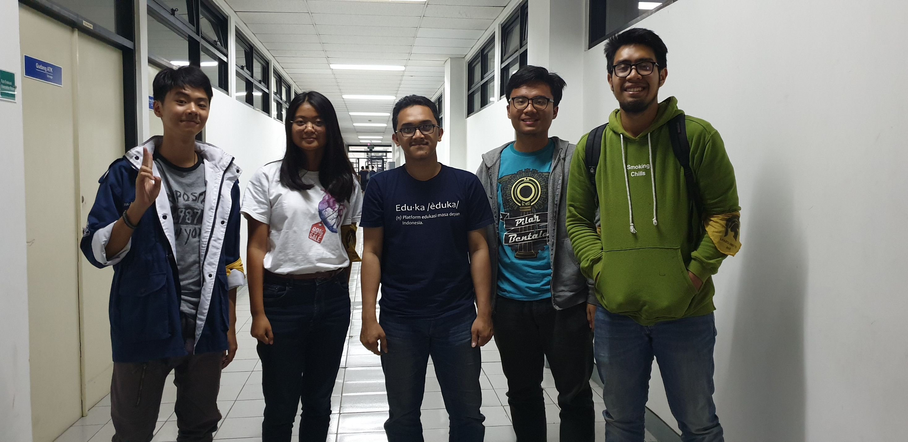

 - 13516065
Sekjen HMIF

# Foto

<table>
  <tr>
    <td><b>Nama</b></td>
    <td>Ahmad Faiz Sahupala</td>
  </tr>
  <tr>
    <td><b>NIM</b></td>
    <td>13516065</td>
  </tr>
  <tr>
    <td><b>Tanggal</b></td>
    <td>Kamis, 22 Agustus 2019</td>
  </tr>
  <tr>
    <td><b>Tempat</b></td>
    <td>Dekat Sekre 2 HMIF</td>
  </tr>
</table>

- kenapa mau jadi sekjen
- bedanya sekjen sama kahim
- tugas paling disukai di sekjen
- proker

  Kak Faiz sendiri memiliki beberapa pengalaman keorganisasian di ITB. Kak Faiz pernah menjadi bagian MedInfo UKIR (ternyata Kak Faiz berasal dari Ambon) saat TPB, lalu menjadi Sekjen UKIR di tingkat 2. Di kabinet, Kak Faiz pernah menjadi dirjen info lomba, dan promotor Kak Royan.
  Kak Faiz juga punya pengalaman magang di GDP Labs. Ia meneliti mengenai automatic video tagging, yaitu menggunakan AI untuk memproses video dan memberikan tag jenis video, entah itu video entertainment, musik, dan sebagainya. Ia magang selama 10 minggu. 
  Sebagai salah satu founder dari Eduka, Kak Faiz berbagi cerita tentang tantangan dari Eduka itu sendiri juga. Kata Kak Faiz, yang menjadi tantangan dari eduka adalah market saham yang ganti setiap tahunnya, serta real time ranking SBMPTN.

  Alasan kak faiz ingin menjadi sekjen adalah karena sekjen tidak harus banyak melakukan kampanye, hearing, dan aktivitas politik lainnya tetapi bisa langsung terjun berkontribusi di HMIF. Kak faiz bilang kalau kahim punya mimpi dan sekjen yang mewujudkannya. Kerjaan sekjen itu menjadi sebuah supporting system bagi kepengurusan dari kahimnya. Untuk proker sendiri, sekjen tidak punya proker karena hal yang dilakukan adalah menjadi supporting system yang dilakukan secara repetitif setiap tahunnya. 

  Salah satu hal yang menjadi topik pembicaraan kami adalah mengenai pentingya personal branding dari seseorang. Kadangkala kita melihat orang lain sibuk di hal hal lain yang menurut kita sesuatu yang kurang baik ataupun aneh, tapi sebenernya mah sah sah aja. Seperti perkataan kak faiz "jangan pernah menjatuhkan pilihan orang lain", hal itu benar mengingat banyak sekali hal yang dapat kita lakukan di kampus ini guys. 
  
  Saat ditanya lebih prefer sekre 1 atau sekre 2, Kak Faiz lebih prefer sekre 2. Alasannya karena sekre 2 punya TV, ada kasur, PW banget, dan tempatnya sangat privasi untuk HMIF sendiri. Lalu kalau bandel bisa nginep diem-diem. Tapi, bagian tidak enaknya adalah ketika mau ke toilet malam-malam harus ke bawah dulu karena pintu untuk ke toilet lantai 4 dikunci.

  
 # Kesan terhadap Daemon
Kak Faiz adalah orang yang sangat memiliki tujuan atau bisa dibilang sangat visioner. Dia orang yang memiliki rasa ingin tahu yang tinggi dan ingin terus mengembangkan dirinya sehingga dapat bermanfaat bagi lingkungan sekitar.
  
