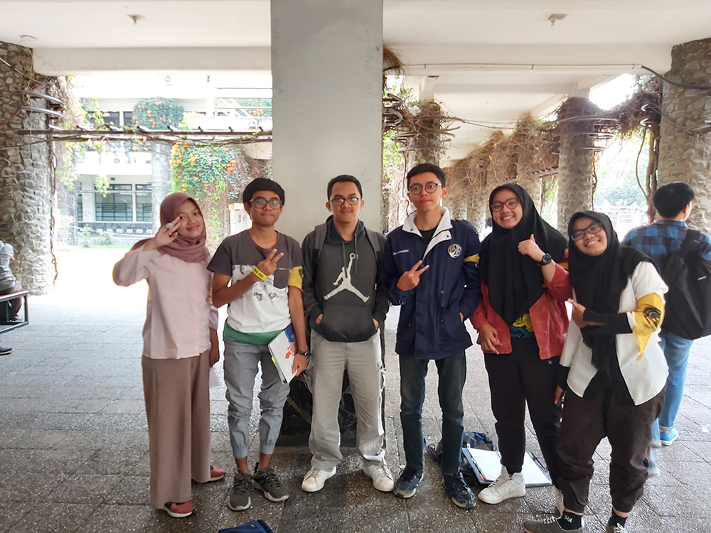

# Wawancara Daemon Kak Faiz
## Foto

## Pewawancara 
1. Muhammad Xavier Rafifsyah Prasetyo - 16518132
2. Pavita Ardhani Sugiharto Putri - 16518206
3. Madiha Ainayya Faizzati - 16518229
4. Muhammad Farid Adilazuarda - 16518239
5. Tafia Alifianty Dinita Putri - 16518255

## Deskripsi

  Pada hari Senin, 26 Agustus 2019 pukul 09.30 di selasar timur labtek v, kami bertemu dengan Kak Ahmad Faiz Sahupala. 
Kakak IF'16 ini biasa dipanggil Kak Faiz. Ia berasal dari Ambon dan pernah bersekolah di SMAN 5 Kota Bekasi. 
Saat ia di-SPARTA, Kak Faiz selalu berada di list hijau. Kami adalah kelompok ke-4 yang mewawancarainya. 

  Selama di HMIF, beliau menjabat sebagai Sekjen HMIF. Menurut Kak Faiz, berbeda dengan departemen-departemen lainnya, sebagai Sekjen, 
ia tidak memiliki proker yang jelas. Namun, 4 divisi di bawahnya yaitu Sekretaris, Bendahara, Media dan Kreatif, serta Data and Archive 
memiliki proker mereka sendiri. Peran Sekjen menurutnya adalah sebagai eksekutor mimpi Kahim. Alasannya menjadi Sekjen adalah karena
ia merasa ada banyak hal yang perlu diubah dari HMIF, dan ia ingin memastikan eksekusi perubahan itu berjalan sebagaimana mestinya.

  Selain sebagai Sekjen, Kak Faiz juga pernah menjabat di Arkavidia. Pada Arkavidia 4.0, ia menjadi anggota divisi Technofashion. Ia
bergabung dengan Technofashion karena memang sering mengikuti lomba aplikasi. Selama di Technofashion, ia menjadi LO dosen, dan ternyata
juga menjadi MC pada hari-H acara. Untuk Arkavidia 5.0, Kak Faiz menjabat sebagai Sekjen. Sebagai Sekjen, ia bertugas untuk internalisasi
dan memastikan jalur komunikasi baik. Ia menjadi Sekjen karena suka dengan visi misi ketua Arkavidia 5.0.

## Pertanyaan 

  Rupanya, ada satu hal yang menurut Kak Faiz sangat bermasalah dari HMIF, yaitu budaya melepas dan tidak mau merangkul orang-orang yang
'skip'. Menurut Kak Faiz, pendekatan yang benar untuk anak-anak yang jarang berkontribusi di tubes adalah dengan menanyai masalah mereka
dan membantu mereka menemukan penyelesaian. Namun yang terjadi, orang-orang tersebut justru dilepas begitu saja sehingga tak jarang, orang-orang'skip' tersebut mengulang mata kuliah. Kak Faiz sendiri pernah bereksperimen selama masa kuliah dengan sengaja berkelompok dengan orang-orang 'skip'. Menurutnya, orang-orang tersebut masih mau bekerja sama dan bisa dihubungi. Ia juga sudah merancang sistem yang mewajibkan orang-orang 'skip' disebar dalam setiap kelompok, sehingga mereka pun merasa dirangkul dan setidaknya bisa lulus mata kuliah tersebut. Sayangnya, banyak yang menolak ide Kak Faiz sehingga rancangan tersebut tidak sampai ke tahap eksekusi.

  Ada pula masalah yang dibahas sewaktu kami wawancara dengan Kak Faiz. Masalahnya adalah tentang anak anak HMIF yang hanya terfokus pada hal hal yang berbau keprofesian dan tidak terlalu mempedulikan apa yang terjadi di luar HMIF seperti KM ITB. Menurut Kak Faiz, hal ini terjadi karena kemudahan akses akademik bidang informatika. Kemudahan belajar dan mendapatkan informasi tentang keinformatikaan hanya menggunakan laptop membuat anak anak HMIF mudah untuk berkembang pada bidang keprofesian dan mudah pula untuk magang. Sangat jarang ada mahasiswa tingkat awal yang dapat mencari magang semudah anak anak HMIF. Hal ini membuat anak anak HMIF lebih memilih untuk berlomba lomba di bidang keprofesian daripada memikirkan hal lainnya. Namun, menurut Kak Faiz ada juga anggota HMIF yang menjadi pejabat kampus seperti PJS K3M sekarang yaitu Kak Royyan dari IF. Walaupun begitu menurut Kak Faiz ketidakpedulian mayoritas anak HMIF tidak baik dan harus diperbaiki

  Tidak melulu soal hal-hal berbau serius, ada satu hal 'aneh' yang ingin Kak Faiz lakukan di Bandung. Hal itu adalah menghadiri pernikahan tanpa diundang. Ternyata saat masih SMA, Kak Faiz sudah pernah melakukan kegiatan aneh ini. Ia dan teman-temannya sengaja membawa baju batik, kemudian masuk ke gedung pernikahan dan ikut makan dari buffet yang disediakan. 

  Di masa depan, Kak Faiz ingin memiliki rumah idaman yang sangat istimewa. Hal ini karena ia lebih memprioritaskan 'rumah' atau tempat kembali berupa istri yang solehah dan baik hati hehehe. Untuk rumah sebagai bangunan, ia tidak memiliki kriteria khusus tentang spesifikasi karena asal dengan uang banyak pun bangunan seperti apa pun akan terwujud juga sehingga bangunan tersebut bersifat dinamis. Ukuran rumah tersebut juga akan menyesuaikan dengan jumlah anggota keluarganya di masa depan sehingga bisa berubah. Untuk lingkungan rumah, ia menginginkan suasana yang tenang, bukannya di dekat jalan raya, memiliki teras yang nyaman untuk bersantai, serta dikelilingi oleh orang-orang RT dan RW yang ramah.
  
  Karena sudah menggeluti dunia start-up, Kak Faiz tentu menyukai idea brainstorming yang diangkat oleh para founder start up. Menurutnya, produk start up dapat dikategorikan menjadi candy yaitu 'pemanis' atau tidak memiliki dampak besar jika tidak digunakan, vitamin yaitu ide yang inovatif dan jarang sehingga lebih baik dari candy, serta pain killer yaitu memiliki dampak besar dan membawa perubahan positif. Adapun contoh inovasi yang menurutnya paling baik ialah Go-Jek karena membawa impact yang sangat baik seperti mengurangi jumlah pengangguran secara drastis. Dalam realisasi ide, saran dari kak Faiz ialah memperhatikan customer validation terlebih dahulu. Hal ini menjadi penting sebab banyak orang berlatar belakang IT langsung membuat MVP sehingga banyak produk yang gagal ketika memasuki market.
  
    Dari pengalaman Kak Faiz magang, aktif himpunan, kerja praktik, bahkan mendirikan start-up, menurut Kak Faiz hal yang paling diperlukan dan diharapkan dari seorang sarjana informatika adalah skill komunikasi dan loyalitas. Karena dari pengalaman Kak Faiz sejauh ini, yang banyak dikeluhkan dari seorang sarjana ITB adalah kurangnya skill komunikasi dan dianggap sering berpindah pindah perusahaan atau menjadi kutu loncat
    
    Salah satu pertanyaan yang kami tanyakan kepada Kak Faiz adalah apa olahraga keskaan Kak Faiz dan alasannya. Kak Faiz menjawab bahwa olahraga kesukaannya adalah basket, karena ia sudah menyukai basket sejak SMA, tetapi waktu kuliah sudah jarang bermain basket lagi padahal pada waktu Kak Faiz masih SMA latihan basket di sekolahnya diadakan lima kali per minggu.
    
    Pertanyaan selanjutnya yang kami tanyakan adalah tempat makan favorit di Bandung. Kak Faiz menjawab tempat makan favoritnya adalah di daerah Cibadak, ia mengatakan jika semua makanan di sana enak. Jenis makanan yang banyak dijumpai di sana antara lain adalah sekoteng dan kobe. Namun, beliau juga mengingatkan kami untuk berhati-hati karena di sana banyak makanan yang mengandung babi. Kak Faiz berkata di sana juga tempatnya sangat bagus untuk foto dan harga makanannya juga cukup bersahabat.

