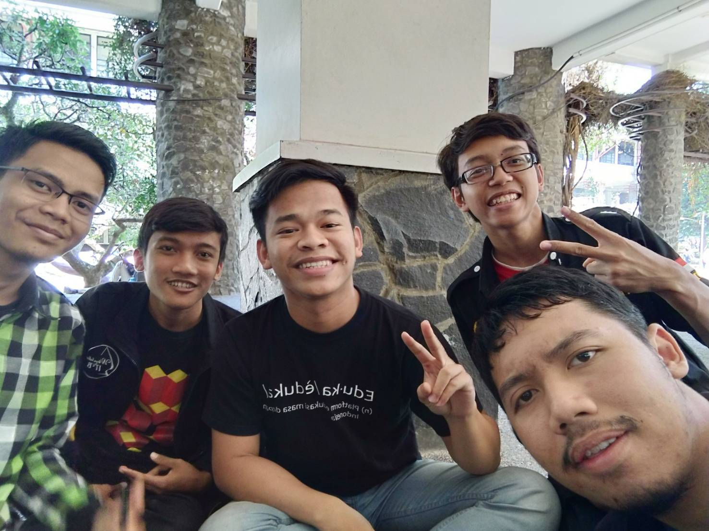

# Wawancara Kak Muhammad Habibi Haidir

Wawancara oleh :

1. Arif Rahman Amrul Ghani (16518033)
2. Syarifuddin Fakhri Al Husaini (16518074)
3. Evan Pradanika (16518333)
4. Ade Surya Handika (16518415)

## Biodata Daemon
Pada Jumat, 23 Agustus 2019 kami mewawancarai kak Muhammad Habibi Haidar, biasa dipanggil Habib dari jurusan teknik informatika angkatan 2016. DI HMIF Kak Habib menjabat di HMIF sebagai staff kekeluargaan HMIF dan Kabid Lomba Arkavidia.
Proker divisi kekeluargaan yaitu wisuda, dies natalis, ucapan HBD anggota HMIF, dan acara keluar HMIF seperti nonton bareng.
Proker lomba Arkavidia yaitu mengadakan lomba-lombanya. Sedangkan sebagai kabid lomba, kak habib bertugas untuk mengurus komunikasi internal antara ketua bagian lomba dan membantu mengeksekusi lomba-lomba yang ada pada arkavidia. Salah satu keunikan dari kak habib yaitu kak habib suka terlihat merapihkan rambut.

## Pengalaman magang gimana?
Kak Habib sudah magang 2 kali selama di HMIF. Di Sirclo dan di GDP Labs. Saat di Sirclo, kak Habib tidak memiliki persiapan yang gimana-gimana. Kak Habib hanya memiliki pengetahuan dan sudah latihan beberapa kali dalam hal Competitive Programming dan soal-soal logika. Di magang Sirclo, kak Habib mempelajari banyak hal tentang coding. Di GDP Labs, kak Habib ingin mempelajari tentang Artificial Intelligence dan bagaimana rasanya magang di company yang sudah besar. Pengalamannya di GDP Labs kak Habib merasa gabut dan lebih banyak belajar dibanding kerja dalam magang tersebut.

## Apa masalah mendirikan Eduka?
Kak Habib membuat bagian Front-end Eduka padahal kak Habib baru mempelajari tentang Front-end sebulan sebelum mulai mengerjakan Eduka. Membagi waktu juga menjadi suatu masalah. Harus ada hal-hal yang dikorbankan agar Eduka bisa berjalan dengan baik. Kak Habib juga bercerita bahwa sempat ada saat-saat dimana kak Habib kurang bersemangat dalam mengerjakan Eduka, tetapi karena ketiga temannya selalu menyemangati, kak Habib pun dapat terus melanjutkan Eduka hingga sekarang sudah sebesar ini. Kak Habib sendiri masih tidak benar-benar percaya bahwa Eduka sudah sebesar sekarang.

## Rencana setelah lulus?
Setelah lulus kak habib berencana untuk melanjutkan kuliah S2nya di luar negeri. Meskipun belum menentukan tujuan pasti akan berkuliah di negera atau universitasnya, kak habib berminat untuk mengambil prodi yang berhubungan dengan machine learning dan data science. Disamping itu, kak habib juga ingin melanjutkan karirnya di Eduka System sebagai Front-End Developer.

##Kenapa di Arkavidia memilih divisi Lomba?
Kak Habib memilih divisi Lomba karena tahun lalu di Arkavidia kak Habib juga masuk ke dalam divisi lomba. Alasannya karena Kak Habib ingin yang berdampak langsung ke masyarakat.

##Alasan Masuk Teknik Informatika
Karena kedua kakak dari Kak Habib sudah lebih dulu masuk ke STEI. Nah, dari situlah muncul keinginan Kak Habib untuk masuk ke ITB juga terutama STEI yang passing grade nya paling tinggi. Setelah bertemu dengan PAR dan Daspro, Kak Habib lebih memilih untuk masuk Informatika. Padahal kedua kakaknya masuk ke STEI dan mengambil jurusan Teknik Elektro.

# Foto

