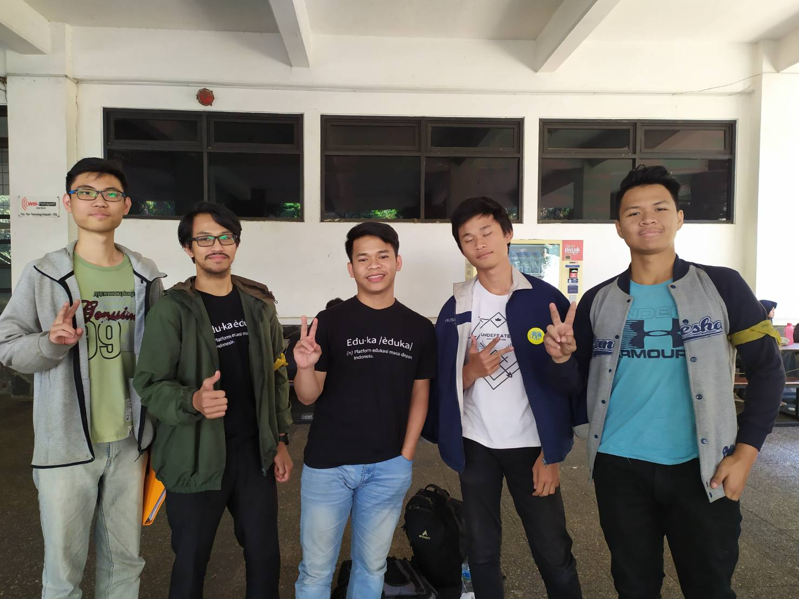

&nbsp;&nbsp;&nbsp;&nbsp;&nbsp;&nbsp;Siang kala itu, kami berkesempatan untuk mewawancarai kaka tingkat kami angkatan 16 yang bernama **Muh Habibi Haidir**. Beliau sejurusan dengan kami yaitu teknik informatika (*IF*). Saat ini, beliau menjadi seorang Kadiv Lomba Arkavidia dan staff kekeluargaan HMIF. Keputusan menjadi kadiv dan staff kekeluargaan bukan tidak ada alasan. Ia mengaku saat akan menjadi staff kekeluargaan diajak temannya dan alasan menjadi kadiv lomba adalah untuk meneruskan tahun lalu dan ia dekat dengan ketua Arkavidia tahun ini. 

### Kelanjutan Setelah Lulus
&nbsp;&nbsp;&nbsp;&nbsp;&nbsp;&nbsp;Saat lulus nanti, Ia ingin melanjutkan pendidikannnya yaitu S2 ke luar negeri. Salah satu negara yang ia tuju adalah Singapura dan Eropa. 

### Kesibukan Saat Kuliah Semester Sekarang
&nbsp;&nbsp;&nbsp;&nbsp;&nbsp;&nbsp;Selain cita-citanya ingin melanjutkan S2, kaka yang satu ini memiliki beberapa kesibukan. Antara lain kesibukan saat liburan kemarin yaitu KP di GDP Labs, dan untuk hari-hari biasa ia memiliki kesibukan dalam mengurusi Arkavidia dan Eduka Systems.