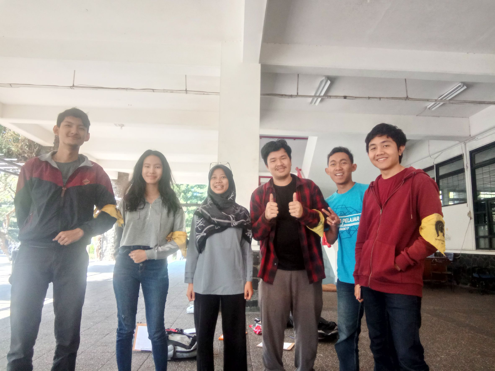

# Tugas Wawancara Daemon
<table>
  <tr>
    <td><b>Nama</b></td>
    <td>Yasya Rusyda Aslina</td>
  </tr>
  <tr>
    <td><b>NIM</b></td>
    <td>13516091</td>
  </tr>
  <tr>
    <td><b>Tanggal</b></td>
    <td>Rabu, 21 Agustus 2019</td>
  </tr>
  <tr>
    <td><b>Tempat</b></td>
    <td>Selasar Timur Labtek V ITB</td>
  </tr>
</table>

___

**Pewawancara:**
* 16518043  Vhydie Gilang Christianto The
* 16518057  Nyoman Kevin Cahyadi Giri
* 16518060  Alexandra Angeline
* 16518103  Hardy Valenthio Amansyah
* 16518217  Naufal Alim Wahib

___

&emsp;Pada tanggal 21 Agustus 2019, kami berlima melakukan wawancara kepada Kak **Yasya Rusyda Aslina** atau biasa dipanggil Kak Yasya. Jurusan yang diambil oleh Kak Yasya adalah jurusan informatika. Kak Yasya berasal dari angkatan 2016. Di HMIF, kakak ini memiliki peran yang sangat penting. Ia menjadi Director dari Social Responsibility Team di kepengurusan saat ini. Ia berpikir bahwa sangat sedikit orang-orang di HMIF yang berminat di bidang tersebut. Dengan adanya kesempatan yang diberikan serta minat pribadinya terhadap departemen ini, ia akhirnya memutuskan untuk menjabat sebagai Director dari Social Responsibility Team ini. Dalam kepengurusannya sendiri, ia sering mengikuti setiap rapat yang ada. Ia juga bertugas sebagai motivator dan selalu menebarkan semangat pengabdian masyarakat kepada anggota HMIF. Bahkan, ia juga berpartisipasi dalam pengadaan pengabdian masyarakat dengan membawa nama HMIF ITB.

&emsp;Selain aktif sebagai Director di salah satu departemen dalam DE (Dewan Eksekutif) HMIF, ia juga aktif dalam kepanitiaan seperti arkavidia. Ia menjadi panitia di event ini sebanyak dua kali. Pertama, ia menjadi panitia MSDM Arkavidia. Ia memasuki divisi tersebut karena memiliki minat di bagian tersebut. Selain itu, ia juga sangat suka dengan kepala divisinya. Di divisi ini, ia bertugas sebagai pengontrol anggota lainnya serta menjaga eksistansi dari setiap anggota yang ada. Secara khusus, ia bertugas untuk mengontrol bagian CTF.

&emsp;Berdasarkan pengalamannya, di HMIF tidak ada sistem jenjang karir dari tahun ke tahun. Namun, menurutnya bila mengikuti jenjang karir selama beberapa tahun, hasil yang didapatkan akan jauh lebih memuaskan. Ia sendiri tidak mengikuti sistem jenjang karir karena pada saat tingkat 2 ia menjadi sekretaris HMIF sedangkan ia menjadi Director Social Responsibility di tahun berikutnya. Oleh karena tidak mengikuti sistem jenjang karir, proses pembelajaran tugas di suatu bidang pasti akan jauh lebih lambat. Saat menjadi sekretaris, ia sering bertanya ke sekretaris periode sebelumnya. Ia juga aktif bertanya ke Sekjen yang menjabat saat itu terkait tugas dan kewajiban yang harus ia jalani. Saat menjabat sebagai Director of Social Responsibility, ia belajar dari kegiatan yang diadakan oleh departemen ini di tahun sebelum kepengurusannya. Ia juga aktif bertanya ke Director dari beberapa tingkat sebelumnya. Menurutnya, dengan banyak bertanya kepada seseorang yang lebih paham, ia mampu menjadi lebih baik dalam bidang tersebut.

&emsp;Dengan banyaknya kegiatan organisasi yang ia jalani, ia tidak lupa memikirkan urusan akademiknya. Ia sangat tertarik untuk mengikuti program Fast Track ITB. Hal tersebut disebabkan oleh hal penting yang diberikan oleh program ini. Bayangkan saja, dengan menempuh waktu 5 tahun saja, seseorang mampu memperoleh gelar sarjana dan magister. Saat ditanyai perihal alasan, ia menjawab bahwa obsesi terbesarnya mengikuti program tersebut ialah karena masih merasa kurang ilmu dan ingin belajar lebih banyak. Apalagi, biasanya orang-orang yang mengikuti beasiswa tersebut tidak mengeluarkan biaya apapun karena mendapatkan beasiswa. Alhasil, ia pun mendaftar program ini dan lulus syarat minimal IPK sebesar 3.0.

&emsp;Pengalamannya di HMIF sudah tidak diragukan lagi. Ketika ditanya soal kepemimpinan HMIF antara Kak Abay dan Kak Fikri, dia pun bisa menjelaskannya dengan jelas dan spesifik. Untuk kepemimpinan Kak Fikri yaitu memiliki prinsip berbagi ke semua apapun itu bentuknya entah ilmu, benda, harta, dan lain sebagainya. Apapun yang dimiliki kita atau HMIF selalu dibagikan ke sesama manusia tetutama ilmu tentang teknologi agar masyarakat siap untuk menghadapi dunia digital ke depannya. Sedangkan Kak Abay lebih fokus untuk empati ke sesama dan fokus untuk memperbaiki cara komunikasi. Kak Abay sangat terasa merangkulnya, mereka sangat terasa fokus bersama dari dalam untuk membangun diri sebagai HMIF yang baik atau dalam kata lain tumbuh dan berkembang bersama.

&emsp;Kehidupan di jurusan berbau informatika tidak menutup kemungkinan Kak Yasya untuk berkarya di luar himpunan. Kak Yasya setidaknya mengikuti 2 unit kegiatan mahasiswa (UKM), yaitu Skhole dan KPA. Dari kedua unit tersebut, Kak Yasya lebih aktif di Skhole, yaitu UKM yang mengajarkan ilmu-ilmu ke sekolah-sekolah yang ada di sekitar ITB. Menurut Kak Yasya, walaupun tidak mendapatkan kepengurusan di salah satu unit kegiatan mahasiswa pengabdian masyarakat tersebut, tetap mendapatkan tanggung jawab dan diberikan _workload_ yang sama beratnya.

&emsp;Stereotype yang ada pada anak-anak IF adalah jam tidurnya yang berkurang drastis. Hal ini kemudian kami diskusikan dengan Kak Yasya. Menurut Kak Yasya, hal itu benar. Sepanjang masa perkuliahannya, Kak Yasya menemui banyak sekali tubes, beberapa diantaranya yang cukup berat ialah tubes OOP, Alstrukdat, WBD, dan PBD. Banyaknya tubes ini mengalihfungsikan kosan Kak Yasya yang semula merupakan tempat beristirahat menjadi tempat untuk mandi saja.

&emsp;Kak Yasya tertarik dengan UX dan Computational Thinking Edu, hal ini mendorongnya untuk merencanakan TA dengan topik tersebut. Kak Yasya lebih prefer dalam Computational Thinking Edu, karena ia ingin mengajar anak-anak kecil tentang berpikir komputasional dan juga karena dosen pembimbingnya juga berada dalam bidang pengajaran dan pernah tergabung pada tim Indonesia Mengajar.

&emsp;Jika Kak Yasya diberikan kesempatan untuk melanjutkan studinya di mancanegara, ia akan memilih Amerika Serikat. Alasannya adalah lingkungannya yang sangat menarik bagi Kak Yasya. Kemudian, jika Kak Yasya ingin berjalan-jalan ke sebuah negara, ia juga akan memilih Amerika Serikat atau Jepang. 

&emsp;Kesan yang DECRYPT dapatkan dari Kak Yasya adalah ia seorang pribadi yang cukup ambisius, sangat menyukai belajar, dan ingin terus mengenyam pendidikan. Ini sangat ditunjukkan dari keinginan Kak Yasya untuk mengambil S2 lagi setelah lulus Fast Track ITB. Tidak hanya akademik, namun Kak Yasya sangat tertarik berorganisasi & ingin berkontribusi kepada organisasi-organisasi tersebut. Hal ini bisa dilihat dari penjelasannya tentang segala pengalaman yang ia dapatkan di HMIF maupun Skhole. 
