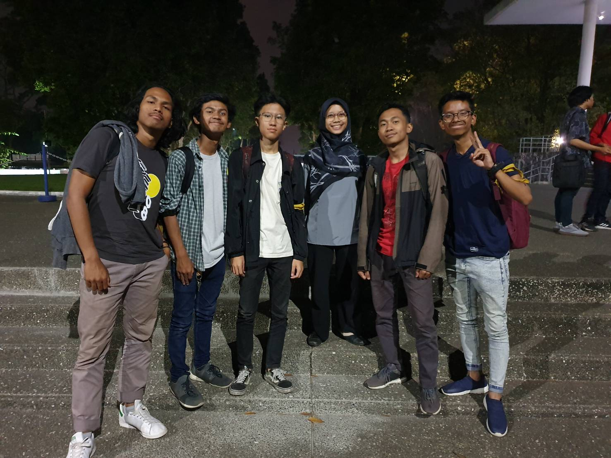

wawancara Kak Yasya Rusyda Aslina pada Tanggal 21 Agustus 2019 di Selasar CC Timur ITB

Pada Rabu, 21 Agustus 2019 malam hari kami mewawancarai Kak Yasya di Selasar CC Timur Institut Teknologi Bandung. Kak Yasya ini memiliki nama lengkapa Yasya Rusyda Aslina dan Kak Yasya biasa dipanggil Yasya. Kak Yasya merupakan mahasiswa Teknik Informatika tahun angkatan 2016. Di HMIF Kak Yasya menjabat sebagai Kepala Direksi Pengabdian Masyarakat, dan pernah menjadi staff MSDM (tahun 2018) dan staff Arkalogika (tahun 2019) di Arkavidia. Kak Yasya mau menjabat sebagai Kepala Direksi Pengabdian Masyarakat karena Kak Yasya ini menyukai bidang pengabdian masyarakat. Di Direksi Pengabdian Masyarakat ini Kak Yasya memimpin rapat, mengobservasi, saat diskusi atau rapat ikut menjadi otak dan berdiskusi bersama. Di Pengmas ini ide untuk pengabdian masyarakatnya adalah lewat pengajaran.

--Pertanyaan Bebas--
**Kalau punya uang tak terbatas, mau ngapain?**
Kak Yasya kalau punya uang tak terbatas, mau buat membantu orang-orang. Seperti direksi yang dipegangnya yaitu pengmas.

**Apa yang dirasa masih kurang dari HMIF?**
Menurut Kak Yasya, di pengmas itu sendiri akan lebih memperbanyak kerja sama dengan orang-orang yang jago untuk membantu masyarakat. Dan juga masih banyaknya orang yang kurang peduli, karena terlalu dengan keprofesian individu.

**Apakah aktif di HMIF saja sudah cukup atau belum**
Aktif di HMIF saja masih belum cukup, perlu juga kegiatan dan orang di luar HMIF. Dibutuhkan juga kegiatan seperti magang atau part-time.

**Pernah ikut kegiatan ekspedisi gitu ga?**
Pernah Ekspedisi Nusantara Jaya, karena pertama kali pergi jauh jadi senang, bisa rasain budaya yang beda jadi lebih merasa hidup.

**Apa yang ingin dirubah dari dunia?**
Kak Yasya ini ingin merubah niat orang - orang gitu. Karena menurutnya kalau semua orang punya niat yang baik, maka pasti dunia juga akan jadi lebih baik.

**Bagaimana suami idamam?**
Intinya itu yang setia dan bekerja keras, beriman, dan yang penting juga harus nyaman dipandang

**Kesan dan pesan buat DECRYPT 2018?**
Semoga internal HMIF bisa dibuat nyaman, impresi dari luar HMIF bagus, dan dekat sama angkatan atas.

Foto kami bersama Kak Yasya Kiri ke Kanan : Rakha, Hafshy, Devin, Kak Yasya, Yahya, Radhin

