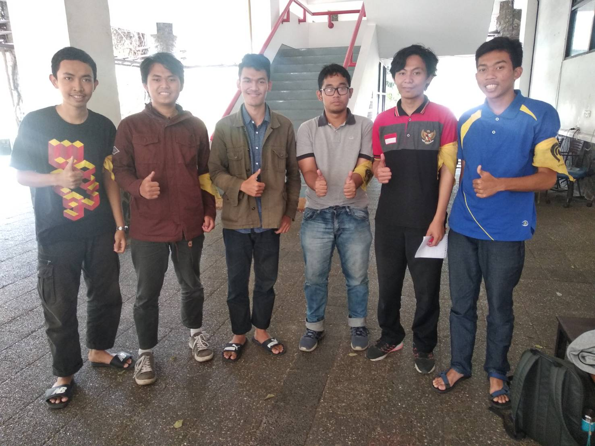

# Wawancara Daemon ''
Pada hari Minggu, 25 Agustus 2019 jam 11:00, di Selasar Timur Labtek V, kami,
- 16518030 - Figo Agil Alunjati
- 16518176 - Okugata Fahmi Nurul Yudho Fauzan
- 16518236 - Fathan Mubina
- 16518313 - Vincent Hasiholan
- 16518382 - Muh. Muslim Al Mujahid

mewawancarai Kak Muhammad Farhan sebagai Daemon.

# Biodata Singkat
Kami mewawancarai kak Muhammad Farhan, atau yang lebih akrab dikenal kak Farhan/Farhun. Kak Farhan sangat suka berorganisai, sejak SMA katanya sudah ikut paskibraka. Lanjut ke bangku kuliah Kak Farhan juga aktif mengikuti acara kepanitiaan seperti OSKM dan lain-lain, bahkan kak Farhan berhasil memegang jabatan sebagai senator di HMIF. Menurut kak Farhan, pada masa itu kepedulian mahasiswa terhadap KM ITB itu kurang, padahal kita juga adalah bagian dari KM ITB itu sendiri, oleh karena itu kak Farhan ingin mengubahnya dan mencalonkan diri sebagai senator di HMIF ITB

# Pertanyaan Bebas

## Kenapa dulu memilih STEI dan memilih jurusan Teknik Informatika?
Ketika kelas 3 SMA, kak Farhan sempat labil untuk memilih melanjutkan sekolah kemana. Papanya menyuruh dia untuk masuk STAN. Karena kak Farhan lebih berminat ke bidang Kimia, dia mendaftarkan dirinya melalui SNMPTN dan memilih Teknik Kimia UI sebagai pilihan pertama. Namun, hasil berkata lain dan dia belum bisa diterima. Kemudian seiring waktu, papanya menyarankan  kak Farhan untuk mengambil jurusan Teknik Informatika yang memiliki prospek yang baik sehingga ketika SBMPTN dia memilih STEI pada pilihan pertama dan Tekkim pada pilihan 2. Akhirnya dia pun diterima di STEI dan ketika akan masuk tingkat 2 dia memilih jurusan Teknik Informatika yang telah disarankan ayahnya sebelumnya.
