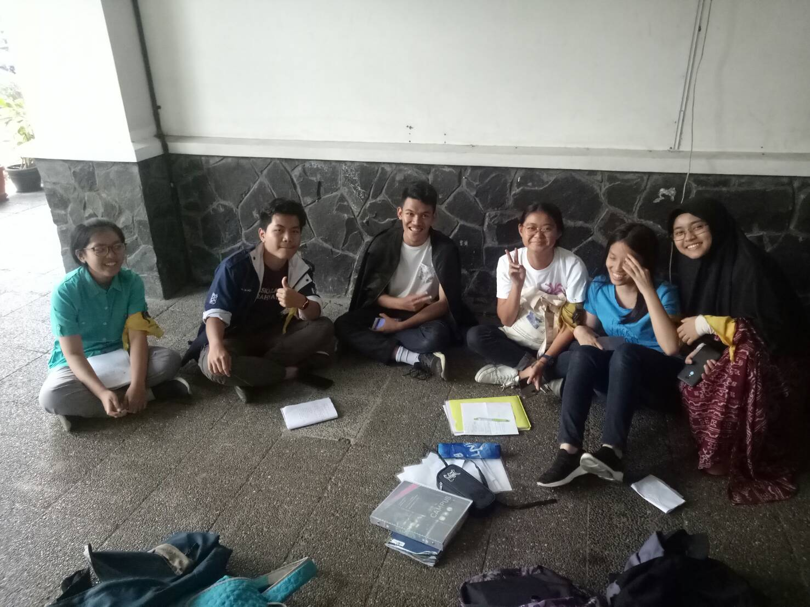

# Kak Muhammad Farhan a.k.a vigenere
Kamis, 22 Agustus 2019
Hollyana Puteri H. - 16518101
Salsabilla Roihanah - 16518158
Cindy Olivia Gunawan - 16518209
Muhamad Ihza Faida A. - 16518214
Tiffany Angelia - 16518304

# Tentang Kak Farhan
Daemon yang satu ini bernama Muhammad Farhan atau biasa dipanggil Kak Farhun. Saat ini, Kak Farhun adalah mahasiswa Teknik Informatika ITB angkatan 2016.
## Peran di HMIF
Kak Farhan aktif di Himpunan Mahasiswa Informatika ITB sebagai Senator. Alasan kak Farhun menjadi senator untuk HMIF, karena sejak TPB dia cukup aktif berkegiatan di pusat (KM ITB). Tapi saat ia berada di HMIF, ia merasa kepedulian terhadap pusat atau KM cukup minim. Oleh karena itu ia ingin menjadi senator yang menghubungkan HMIF dengan KM ITB, karena sebagai mahasiswa ITB, kita harus selalu up-to-date dengan info-info dari pusat.

Sebagai senator, Kak Farhun memiliki beberapa proker, diantaranya post update dari KM di media sosial senator HMIF setiap akhir bulan. Kemudian, tim senator juga masuk ke tiap-tiap kelas IF-STI untuk mensosialisasikan info - info KM secara verbal dan juga apabila ada aspirasi dari warga HMIF yang berkaitan dengan KM ITB, kesenatoran bersiap untuk menampung agar bisa disampaikan langsung ke KM ITB. Selain itu, tim senator juga meminta evaluasi dari massa HMIF terhadap kinerja senator satu kali dalam satu semester.

# Pertanyaan Bebas
Nah, sebagai wakil HMIF di KM ITB, tepatnya beberapa bulan yang lalu pernah ada sebuah kejadian dimana Kongres KM ITB hampir kekurangan anggota, karena Kongres KM ITB minimal diwakili oleh 30 himpunan mahasiswa di ITB, namun saat itu terjadi beberapa konflik di KM ITB, tetapi saat itu kesenatoran HMIF ITB menyatakan untuk tetap berada di bagian Kongres KM ITB, kak Farhan beranggapan bahwa memperbaiki sebuah sistem organisasi tidaklah harus dibubarkan terlebih dahulu, namun seiring berjalannya waktu, kita dapat memperbaiki sistem organisasi tersebut.

Lalu, saat berada di Kongres KM ITB, ia bercerita bahwa tidak pernah sebuah perbedaan pendapat menyebabkan konflik antar anggota hingga kekerasan fisik terjadi, karena semua anggota Kongres KM ITB harus menurunkan kepentingan pribadinya demi terciptanya sebuah keharmonisan di dalam Kongres KM ITB.

# Foto

