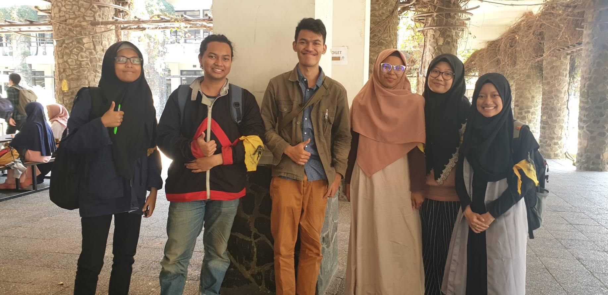

# Wawancara Kak Farhan

Pada hari Jumat, 23 Agustus 2019 pukul 10:00 di Selasar Labtek V nama-nama sebagai berikut:
16518147 Shofura Salma
16518208 Arung Agamani
16518289 Hasna Roihan N.
16518305 Qurrata A'yuni
16518310 Ferdina Wiranti A.
melakukan wawancara dengan salah satu Daemon yaitu Kak Muhammad Farhan atau biasa dipanggil Kak Farhun.

# Biodata Kak Farhun

Nama lengkapnya Muhammad Farhan (13516093), biasa dipanggil Farhan atau Farhun. Jurusannya Teknik Informatika angkatan 2016. Dia adalah seorang senator HMIF ITB. Mengapa Kak Farhun milihnya senator? Katanya agar tetap peduli dengan yang membawahi HMIF. Prokernya di kesenatoran adalah setiap akhir bulan menulis postingan untuk merekap kegiatan di pusat mengenai hal yang terjadi di waktu sebelumnya. Setiap awal semester masuk ke kelas untuk meningkatkan kesadaran mahsiswa bahwa kesenatoran itu ada. Setiap enam bulan sekali ada form untuk mengevaluasi kinerja kesenatoran. Berikutnya ada sekolah kritis untuk memahami suatu masalah dengan berdiskusi di dalamnya. Di Arkavidia 4 dan 5 dia jadi staff LO biar dapat banyak link ke perusahaan gede katanya. 

# Pertanyaan Bebas

Yuni :

Menurut Kak Farhun ITB sebagai kampus terbaik se-Indonesia menurut Ristekdikti wajar aja. Karena dosen-dosennya sendiri memang dosen yang terbaik. Seharusnya dengan tenaga pendidik yang hebat, maka anak didiknya akan lebih hebat lagi. Tetapi saat itu, yang saya tanyakan kenapa yang jadi perhitungan itu dosennya bukan dari mahasiswanya. Bila mahasiswanya hebat maka dosennya pun juga hebat dalam mendidik. Kalau kata Kak Farhun sih, yang dinilai Dikti kan kampusnya bukan manusianya. 'Kalau ga terima sama penilaiannya kamu tanya Ristekdikti aja.'

Kak Farhun ini juga tertarik sama Artificial Intelligents yang akhir-akhir ini lagi ngehits. Katanya kalau mau expert dalam bidang AI memang harus memahami konsep matematikanya. Tapi kalau tidak mau yang terlalu dalam, mungkin bisa bermain-main dengan library yang ada. Tergantung kitanya mau yang mana, ingin ahli atau sekedar ingin tahu saja.

> Note: Cerita paling berkesan selama wawancara Kak Farhun adalah saat dia cerita kalau unit dia Pelita Muda, Skhole, dan Tennis. Dua-duanya merupakan unit yang menumbuhkan rasa kepedulian terhadap sesama.

Arung :

Semasa kak Farhun SPARTA dulu, pengalaman yang cukup meresahkan kak Farhun ialah saat beliau di-pingpong antara mentor OSKM dan juga SPARTA. Saat itu, kak Farhun katanya disuruh oleh panitia SPARTA untuk mengikuti sekolah mentor untuk OSKM saja, dan sempat melewatkan beberapa Day terkait pemaparan materi. Dan saat sampai di sekolah mentor OSKM, malah disuruh balik untuk osjur saja. Pada akhirnya karena sempat *skip* beberapa Day tentang pemaparan materi, saat ujian kak Farhun hasilnya tidak terlalu bagus. Hal ini membuat kak Farhun kesal. Mungkin bisa jadi evaluasi bagi panitia SPARTA kedepannya.

Kak Farhun berpendapat bahwa urgensi untuk melanjutkan pendidikan ke jenjang S2 itu tidak besar. Menurut kak Farhun, bagusnya untuk mencari pengalaman bekerja dulu agar bisa melihat sendiri apa saja masalah yang terdapat di sistem yang berlaku di masyarakat. Hal ini bertujuan agar kita pribadi bisa mendapatkan *sense*-nya, bisa mengidentifikasi masalah-masalah tersebut, dan saat menempuh jenjang S2 bisa lebih fokus terhadap memberi atau meneliti suatu solusi atas permasalahan tersebut.

Ferdina :

Kenapa kak Farhan milih teknik informatika?
Waktu kelas 1 SMA pengennya STAN karena papanya STAN. Waktu kelas 3 SMA jaman-jamannya teknik kimia terus kepengen teknik kimia. Ketika SNMPTN kak Farhan daftar teknik kimia UI tapi gagal. Lalu papanya nyaranin teknik informatika karena prospek kerjanya bagus. Kak Farhan jadi bimbang mau Teknik kimia atau teknik informatika. Akhirnya waktu H-1 SBMPTN pilihan pertamanya STEI, kedua FTI, dan pilihan ketiganya teknik kimia UI. Sempat kepikiran ekonomi karena papanya pengen STAN. Daftar SIMAK UI pilihan pertamanya FE, pilihan keduanya teknik kimia. Kak Farhan keterima di STEI. Waktu mengisi kuesioner penjurusan, di kuesioner pertama kak Farhan milih Teknik informatika. Saat kuesioner kedua kak Farhan milihnya teknik biomedis karena sempat lihat-lihat artikel tentang teknik biomedis terus tertarik. Akhirnya di kuesioner ketiga jadinya milih teknik informatika deh dan sekarang di teknik informatika jadinya. 
 
Apa kak Farhan nanti waktu kerja ingin terjun langsung ke masyarakat?
Sebenarnya ngincar uang dulu, karena menurut kak Farhan kalau mau bangun sesuatu harus punya uang dulu. Kak Farhan ingin kerja dulu di tech company seperti Facebook, Google, Amazon. Setelah kerja disana ingin balik lagi ke Indonesia buat berbagi, dengan cara membuat usaha yang bisa membuka lapangan kerja, bisa bantu banyak orang.

> Note: kak Farhun orangnya peduli dengan sesama dan lingkungan sekitar, terbukti dari unit yang diikutinya, yaitu pelita muda (unit yang membangun desa) dan skhole, juga di HMIF sebagai senator. 

Shofu :

Ka Farhan cerita soal pengalaman KPnya yang lalu. Awalnya, kata Ka Farhan ada list gitu untuk teman-temannya yang mau KP tentang perusahaan mana aja yang buka dan yang bias diapply, kalau udah apply ke perusahaan tersebut, nanti namanya ditulis. Nah, Ka Farhun sendiri pengen nyoba kayak AI atau back-end. Dan setelah melihat ada peluang di situ, lalu dia apply ke perusahaan yang ada, setelah itu Ka Farhan melakukan tes coding, terus interview gitu. Kata Ka Farhan prosesnya itu sebenarnya mudah, tetapi saingannya yang emang banyak.

Sebagai mahasiswa yang banyak mencoba, Ka Farhan itu pengen nyoba ngedalamin bidang untuk data scientist dan machine learning gitu. Tapi kalau sekarang, Ka Farhan lagi ngedalamin tentang signal. Dan ada saran dari Ka Farhan, kalau ada tugas sebaiknya jangan ditunda-tunda, karena ga sehat dan juga coba-cobain aja mini project yang ada di internet gitu, sekalian nambah-nambah pengalaman.

Hasna :

Apa aja kerja senator sengan perannya di pusat?
Di pusat, senator antar jurusan diskusi berdasarkan data dan fakta. Di sini, bisa dapet banyak banget insight dari pandangan-pandangan yang berbeda dari tiap perwakilan jurusan. Di pusat, senator juga mengawasi keberjalanan kabinet dan MWAWM.

Apa plan Kak Farhun setelah kuliah?
Setelah kuliah, Kak Farhun punya rencana untuk kerja di perusahaan teknologi, dan ada keinginan untuk bikin start up, lalu menikah. Ada keinginan untuk melanjutkan ke S2 tapi belum jelas rencananya.
Menurut Kak Farhun, ada baiknya untuk mengambil kerja dulu sebelum kuliah S2 lagi, agar permasalahan-permasalahan yang didapat selama dunia kerja bisa didapat jawabannya di S2

> Kesan setelah wawancara Kak Farhun: Kak Farhun punya pandangan yang luas dan open-mind pada segala kemungkinan yang ada. Asik, punya banyak pengalaman yang kalau dibagi bisa nambah ilmu yang dengernya.

