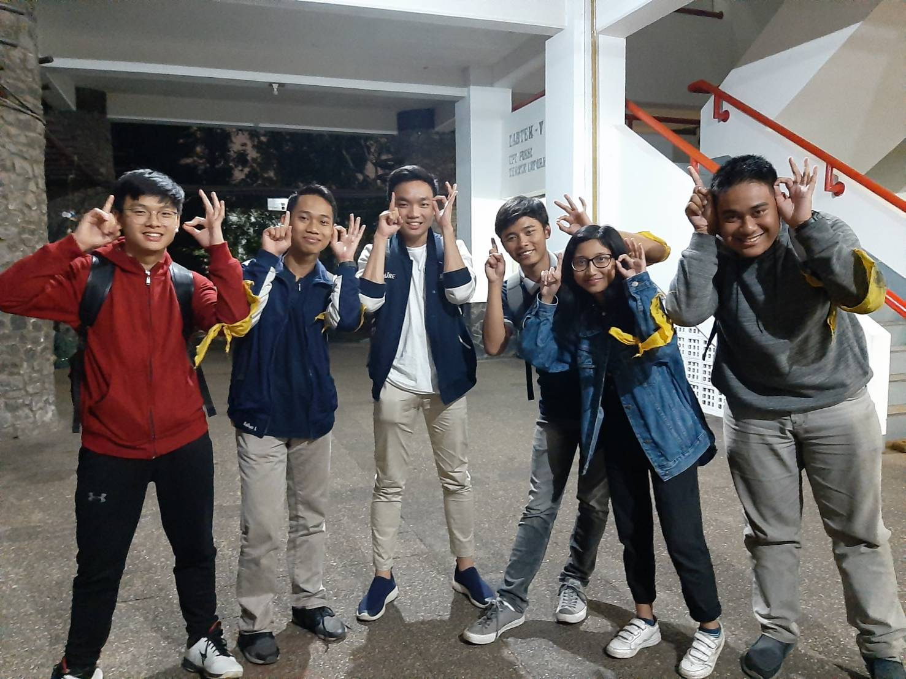

# Wawancara Daemon 'T9'
Pada hari Selasa, 27 Agustus 2019 pukul 18.00, kami,
- 16518045 - Reyvan Rizky Irsandy,
- 16518194 - uhamda Raihan Iqbal,
- 16518283 - Jones Napoleon Autumn,
- 16518318 - Ayutari Dian Putri,
- 16518363 - Rehan Adi Satrya,

mewawancarai kak Ricky yang menggunakan kata sandi 'T9' di lantai 2 labtek V. 

# Summary
## Biodata Singkat

## Program Kerja

## Pertanyaan Bebas

### Reyvan - Apa spesialisasi kak Ricky di IF?
  Kak ricky sekarang sedang berkecimpung di dunia back-end engineering dia memilih back-end engineering karena benci dengan Styling CSS, namun tak hanya itu kak ricky juga suka Machine Learning dan Artificial Intelegence dia mengaku bahwa materi AI dan ML ini sangat telat diberikan karena dia baru tau ada materi semenarik AI dan ML di IF.

### Reyvan - Apa topik TA kak Ricky?
  Kak ricky mempunyai topik TA 'Music Recomendation System' hal ini merujuk pada AI, karena dia suka AI dan sedang menjalani dan mendalami AI dia ingin menciptakan suatu hal yang berguna, kak ricky memilih recomendation system karena dia suka dengerin musik dan ingin buat sistem rekomendasi ala dia sendiri.

## Hal - hal berkesan mengenai kak Ricky

## Foto

