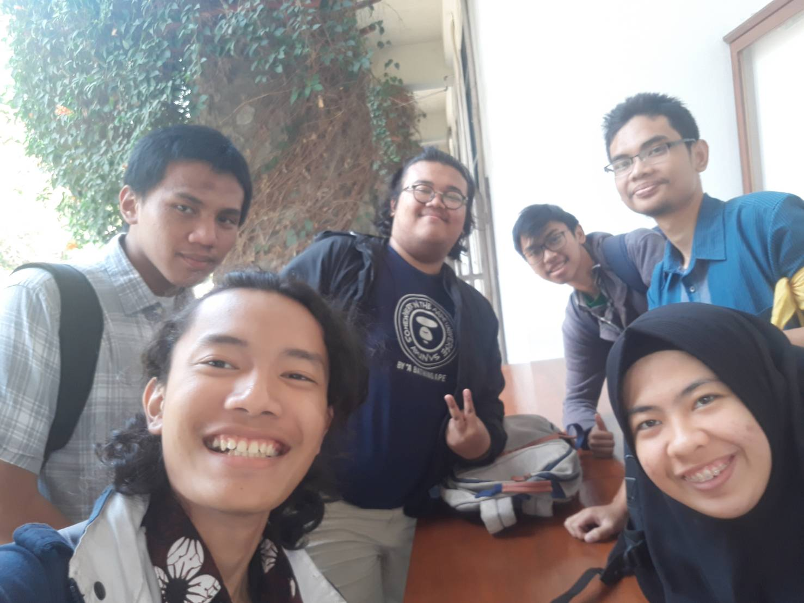

# Wawancara kak Naufal Putra Pamungkas

Wawancara oleh :
1. Muhammad Hasan - 16518012
2. Muhammad Fauzan Al-Ghifari - 16518052
3. Arya Beri A. R. - 16518299
4. Faris Muhammad Kautsar - 16518327
5. Khairunnisa Rifda - 16518399

Pada Kamis 22 Agustus 2019, kami mewawancarai Kak Naufal Putra Pamungkas dari IF'16 biasa dipanggil kak Opal. Di HMIF kak Opal menjabat sebagai kadiv data and archive. Dulu kak Abay menawari poisisi ini kepada kak Opal sehingga dia bisa menjadi kadiv dna

## Tentang data and archive
Dulu divisi ini bernama MSDA prokernya tentang keanggotaan seperti oprecm pencatatan dan post apresiasi, juga ingin membuat website aksarta untuk HMIF menampung database anggotanya sehingga lebih aman dan lebih rapi.

## Cerita saat KP
Cerita yang cukup mengesankan saat kp adalah saat pencarian perusahaan tempat kp karena saat itu kak Opal mencari tempat Kp bersama teman-temannya tetapi saat hampir semua teman-temannya sudah mendapat tempat untuk KP kak Opal belum juga mendapatkan tempat untuk KP. Tetapi akhirnya dia mendapatkan juga tempat KP di perusahaan besar setelah mendaftar di banyak perusahaan

## Tentang perkuliahan
Menurut kak Opal pada dasarnya perkuliahan di IF ITB memang sudah keos dan tergantung sama orangnya juga. Kak Opal paling susah menjalani matkul OS karena tubesnya yang menyulitkan, pokoknya yang sejalur sama orkom dan sister itu susah-susah mata kuliahnya. ditambah waktu mengerjakan tugas besar OS ada anggota kelompok yang ilang-ilangan sehingga menambah beban bagi anggota yang lain

# Foto

