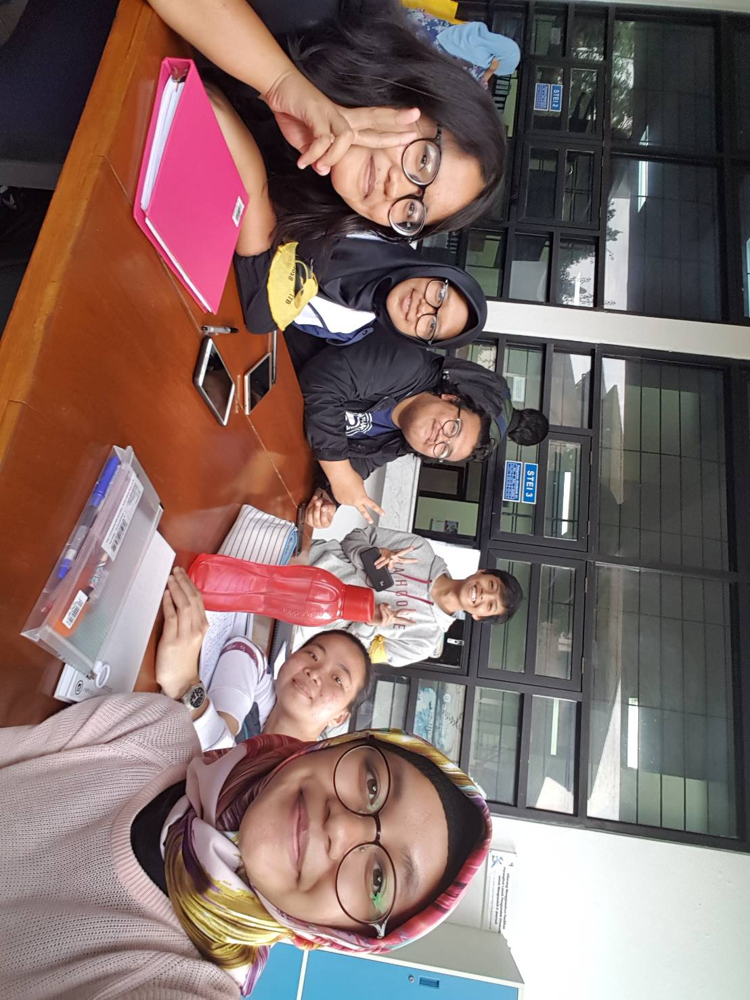

# Kak Naufal Putra Pamungkas a.k.a. tictactoe
Kamis, 22 Agustus 2019

- 16518065 - Naomi Yolanda
- 16518128 - Elisabeth Levana
- 16518181 - Alya Mizani
- 16518190 - Novindra Nurrosyid Al Haqi
- 16518348 - Sulis Tiana

# Tentang Kak Naufal
Nama lengkapnya Naufal Putra Pamungkas dan lebih akrab dipanngil Kak Opal. Asalnya dari Bandung. Kakak yang satu ini merupakan mahasiswa Teknik Informatika*lanjutin ya gengs, ada jurusan, peran, dll.*

## Peran di HMIF
Kak Opal merupakan Kadiv Data and Archive, menurut cerita Kak Opal dia diminta langsung oleh Kak Abay untuk menjadi Kadiv DnA. Kak Opal sebenarnya sudah lama bergelut di bidang human resources dan memiliki keinginan untuk mencoba divisi lain, tetapi karena tidak ada orang lain yang menerima jabatan ini Kak Opal pun akhirnya menerima tawaran Kak Abay.*di sini isi proker dan why ngambil itu peran serah deh, ganti pun issoke*

# Pertanyaan Bebas
Alasan Kak Naufal memilih jurusan Informatika yaitu karena pas SMA kak Naufal suka main game dan akhirnya tertarik sama jurusan yang ada codingnya. Tapi ternyata, setelah masuk jurusan kak Naufal merasa bahwa buat game itu susah. Sebenarnya kak Naufal hampir memilih jurusan STI, tapi akhirnya ga jadi karena ga suka belajar manajemen.

Pas SMA, pelajaran favorit kak Naufal adalah Matematika. Alasan kak Naufal tidak memilih jurusan Matematika Murni adalah karena kak Naufal hanya bisa bayangin akan jadi dosen kalau masuk jurusan tsb. sedangkan kak Naufal sendiri ga pengen jadi dosen.

Menurut Kak Opal, HMIF sudah semakin berkembang. Anggotanya sudah lebih banyak yang aktif dan HMIF sendiri telah menjadi lebih dinamis dan tidak kaku, dapat dilihat dari hal-hal baru yang dilaksanakan oleh HMIF seperti BOOTCAMP dan Arkavidia juga lebih bagus sekarang. HMIF tidak takut akan perubahan, anggota-anggotanya tidak hanya aktif di dalam himpunan tetapi juga pada KM dan berbagai UKM. Walaupun begitu, tetap ada mahasiswa yang masih pasif namun menginginkan agar semua orang di HMIF untuk aktif tentu merupakan hal yang susah. But at least udah better than before.

Stress di HMIF itu inevitable. Kak Opal pada awalnya berusaha satu kelompok dengan orang-orang yang jago ngoding untuk tubesnya tapi kemudian ia sadar bahwa lebih penting dan lebih nyaman jika melakukan tubes dengan teman yang lebih kita kenal karena mutual trust. Kadang di saat berkelompok dengan orang-orang jago, kita mungkin sempat merasa worthless terus overthink sehingga jadinya malah makin stress padahal niatnya mau sekelompok untuk meminimalisasikan stressnya. Namun, bukan berarti kita mesti menjauhi orang-orang pintar tersebut karena kebanyakan orang di IF walaupun kadang kesulitan dalam teamwork sebenarnya ingin membantu kita untuk.

Sebelum menjadi kadiv DnA, Kak Opal berada di divisi MSDA. Track record Kak Opal untuk bidang Human Resources memang sudah cukup panjang. Salah satunya juga, Kak Opal merupakan Kadiv MSDM SPARTA 2017. Seperti yang sudah disebutkan di atas, Kak Opal sebenarnya ingin mencoba hal baru selain bidang Human Resources. Tapi keadaan mendorong Kak Opal untuk kembali menggeluti bidang keanggotaan melalui Data and Archive.

Sewaktu menjabat kadiv MSDM SPARTA 2017, tentunya ada beberapa kejadian unik yang dapat diingat Kak Opal sampai sekarang. Contohnya, bukti foto untuk izin yang salah, ada spartan yang ngirim bukti foto berupa foto kamar sebagai penyerta izin pernikahan keluarga. Atau ada pula spartan yang yakin akan tanggal lantik, sehingga pada suatu hari SPARTA beberapa orang membuat izin meninggalkan Day di jam-jam yang tidak masuk akal, seperti jam 3 pagi.

Dulu Kak Opal magang di HMIF di divisi MSDA, dan ternyata kegiatan magang di HMIF merupakan bagian dari SPARTA 2016. Kak Opal mendapatkan tugas mengerjakan Social Network saaat magang. Karena hanya magang, Kak Opal hanya mengincip pekerjaan yang terdapat di divisi MSDA saja. 

Di kampus ITB Ganesha ini terdapat aturan bahwa mahasiswa dilarang untuk berada di kampus diatas pukul 23.00 WIB. Menurutnya, aturan ini memang harus diberlakukan untuk menanggulangi adanya kejahatan begal akan mahasiswa ITB dan agar kampus lebih aman. Kak Opal menyarankan agar dimundurkan sedikit menjadi pukul 24.00 karena bertepatan dengan deadline-deadline tubes juga. Ketika Kak Opal diusir oleh satpam kampus saat ada deadline tubes, biasanya Kak Opal mengungsi ke KKP atau jika masih mengerjakan tubes, Kak Opal dkk menuju ke rumah Kak Opal untuk melanjutkan tubes.

Berbincang tentang MSDA/D&A, enaknya masuk divisi ini tuh karena lebih teknikal, dan kak Opal suka sesuatu yang lebih teknikal, kegiatannya itu kan buat apresiasi-apresiasi gitu, terus buat bulu prestasi, dan nantinya tuh datanya diambil di TU STEI. Dengan itu bisa menambah relasi.

Untuk rencana setelah lulus dari IF ITB, Kak Opal berencana untuk kerja, belum ada kepikiran untuk melanjutkan S2. Awalnya tuh kak Opal masuk ITB karena permintaan orang tua kan, nah setelah masuk ITB, orang tua kak Opal udah engga kaya sepeduli waktu pas mau masuk ke perguruan tinggi. Jadi, waktu setelah masuk ITB, itu orang tua udah nggak tetlalu kaya pas mau masuk ITB aja gitu.

# Foto

