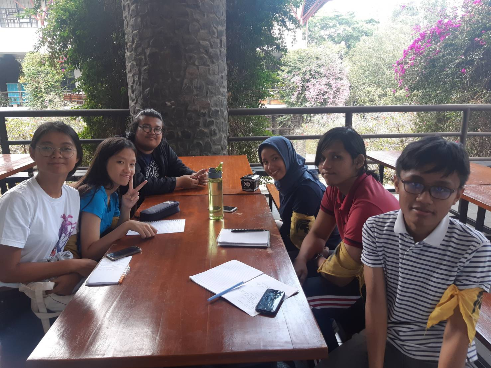

# Wawancara Kak Naufal (tictactoe)
1. Hollyana Puteri Haryono / 16518101
2. M. Mirza Fathan Al Arsyad / 16518189
3. Cindy Olivia Gunawan / 16518209
4. Jundullah / 16518288
5. Audrey Betsy Rumapea / 16518369

# Biodata
  Daemon yang satu ini bernama Naufal Putra Pamungkas atau akrab dipanggil Kak Naufal atau Kak Opal. Sekarang, Kak Naufal adalah mahasiswa Teknik Informatika ITB angkatan 2016 dan aktif di Himpunan Mahasiswa Informatika ITB (HMIF ITB). 

# Peran di DE
  Di HMIF, kak Naufal menjabat di DE sebagai kadiv Data & Archive (DnA). Sebetulnya, Kak Naufal udah gak mau lagi di DnA, karena di kepengurusan sebelumnya, Kak Naufal sudah pernah jadi anggota DnA dan Kak Naufal pengen mencoba kepengurusan di divisi lain. Tapi, karena gaada yang bersedia jadi kadiv DnA dan Kak Abay minta Kak Naufal untuk jadi kadiv secara personal, akhirnya Kak Naufal terima tanggung jawab tsb.
  Sebagai Kadiv DnA, Kak Naufal memiliki proker untuk dijalankan anggota DnA dan pastinya, prokernya berhubungan dengan keanggotan HMIF, diantaranya mengurus oprec divisi DE, pencatatan dan post apresiasi apabila ada anggota yang memenangkan perlombaan atau menjabat kepengurusan di luar HMIF, mengurus web database anggota HMIF, serta foto anggota HMIF.

# Pertanyaan bebas
  Sebagai kadiv Data And Archive, tentunya ada tantangan-tantangan dalam menjalankan kegiatan ataupun program kerja. Agar memastikan kelancaran program kerja tersebut, Kak Naufal pertama akan membagi tugas antara para anggota dan menunjuk penanggung jawab dari setiap program kerja (apabila memungkinkan). Saat keberjalanan persiapan dan pelaksanaan program kerja, biasanya kak Naufal menghubungi setiap anggotanya melalui personal chat untuk follow up perkembangan. Kak Naufal juga biasanya melakukan rapat ketika ada hal penting yang harus dibahas. Oh ya, Kak Naufal juga sebenarnya diminta melaksanakan rapat rutin, tetapi karena biasanya Kak Naufal menyediakan makanan untuk rapat, ia mengaku takut kehabisan uang, sehingga ia hanya melakukan rapat tanpa bahasan kalau sudah lama tidak berkumpul.
  Sebagai anggota HMIF, Kak Naufal pun mengaku bahwa anggota HMIF ITB biasanya dilihat 'cuek' atau apatis. Menurut kak Naufal, kita juga harus mampu melihat alasan dari ketidakpedulian anggota. Misal, karena alasan akademik. Orang-orang yang 'hilang' karena alasan akademik harusnya dirangkul dan diingatkan mengenai tanggung jawabnya, dan dari kesadaran tanggung jawab mungkin akan timbul kepedulian. Tetapi, apabila tidak peduli (melakukan sesuatu hanya karena tanggung jawab), kita harus bisa mengerti, karena tujuan orang beda-beda. Sementara, menurut Kak Naufal, untuk mengubah pandangan dari luar, kita harus mendukung orang-orang yang ingin aktif di pusat (Kabinet, Kongres, MWA-WM), misalnya dengan memberikan aspirasi kepada Senator, membantu menyebarkan kampanye calon K3M atau MWA-WM dari HMIF, dan sebagainya. Ingat juga untuk tidak meninggalkan dia di himpunan, ajak untuk ikut berkegiatan dan beritahu berita terbaru yang perlu untuk mereka ketahui.
  Ada beberapa saran yang kak Naufal beri untuk kami. Yang pertama, ikut lomba, karena ikut lomba merupakan wadah aktualisasi diri, men-challenge diri sendiri, dan juga untuk membuat CV lebih menarik. Kemudian, kak Naufal mengingatkan kami untuk cukup tidur dan istirahat, dan jangan lupa mencari teman.
  Ketika ditanya mengenai pengalaman paling berkesan selama SPARTA, menurut kak Naufal hal yang paling berkesan itu waktu nginep di basecamp sampe ada squad nginep di basecamp kayak Kak Faiz, Kak Yuly, dll. Biasanya juga pada bawa mainan kayak catur, kartu, monopoly, dsb. Karena itu,orang-orang yang tadinya ga deket jadi lebih deket. Pernah juga mereka iseng, istilahnya 'nyolong' password wifi tempat makan jadi dapet wifi gratis. Tapi pas akhir bulan, passwordnya diganti. Kayaknya ketahuan sama yang punya tempat makan.
  Dulu waktu jadi panitia SPARTA, menurut dia ada beberapa SPARTANS yang nyebelin. Contohnya Kristie yang suaranya kaya toa dan suka teriak-teriak gitu. Terus ada ka Isa yang katanya mukanya agak judes aja. Ada Ka Lucky yang banyak tingkah dan kelihatan caper ke panitia. Dulu Kak Rojab dianggap suka ngelawan Panitia karena dia juga anak panitia lapangan jadi biasa ngelawan.
  Kak Naufal punya satu keinginan terbesar yang sampai sekarang belum tercapai, yaitu ikut lomba atau proyekan HMIF. Sebenarnya, banyak orang-orang yang masuk HMIF cuma untuk dapat info tentang lomba atau proyek. Tapi, Kak Naufal belum pernah ikut satupun. Kak Naufal gak menyesal juga, kalau gabut, bukannya ikut lomba atau proyek tapi malah tidur atau gaming. Di HMIF ini dia dapet banyak temen yang saling merangkul.
  Kak Naufal cenderung aktif di himpunan sejak lantik dibandingkan di UKM. Dulu dia sempat daftar unit ISO (ITB Student Orchestra) namun dia aktifnya hanya di tahun pertama. Menurut Kak Naufal, dia lebih cocok di lingkungan HMIF daripada di lingkungan unit. 

# Kesan terhadap daemon
Kak Naufal kayaknya dulu manusia basecamp! Seru denger cerita-ceritanya heheh. Kak Naufal juga orang yang keliatan selo gitu hidupnya. 
# Foto

