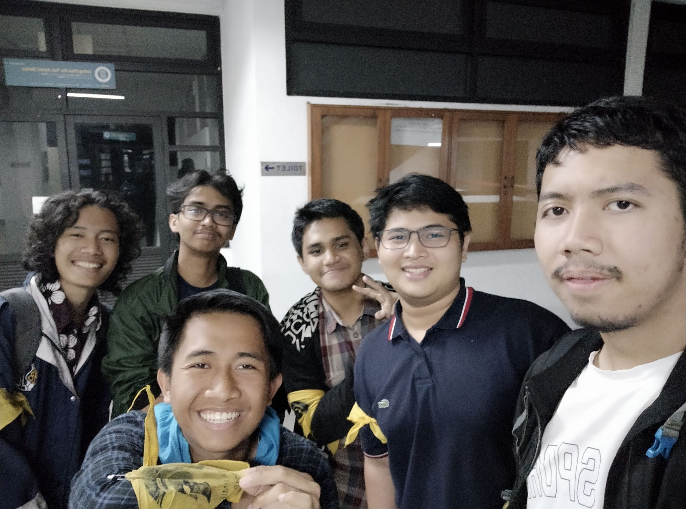

# Wawancara Kak Rifo Ahmad Genadi

Wawancara oleh :

1. Aditias Alif Mardiano (16518044)
2. Muhammad Fauzan Al-Ghifari (16518052)
3. Muhammad Firas (16518115)
4. Evan Pradanika (16518333)
5. Muhamad Hudan Widzamil (16518249)

Pada Rabu, 21 Agustus 2019 kami mewawancarai kak Rifo Ahmad Genadi, biasa dipanggil Rifo dari jurusan teknik informatika angkatan 2016. DI HMIF Kak Rifo menjabat di DPP sebagai ketua komisi pengawasan.

## Mengapa DPP?
Tahun lalu kak Rifo merasa DPP HMIF masih kurang bekerja dengan baik sehingga dia memiliki keinginan untuk memperbaiki sistem pengawasan di HMIF

Di DPP kak Rifo melakukan pengawasan kepada DE dan tim senator. Setiap 3 bulan DPP menerima laporan dari DE dan Tim Senator berupa LPJTT (Laporan Pertanggungjawaban Tenah Tahun) dan LPJAT (Laporan Pertanggungjawaban Akhir Tahun)

Dulu Kak Rifo juga magang di aksara, tetapi dia merasa kurang cocok di sana. Tidak semua orang berkomunikasi dengan baik dan orang-orang yang di reach hanya ring 1 nya saja.

## Beda sistem DPP Komisi Pengawasan yang Dulu dan Sekarang
Dulu sistem DPP Komisi pengawas hanya melakukan pengawasan dan melaporkan setelah 3 bulan. Kak Rivo bilang, itu semua terkesan template dan tidak terasa bekerja (gabut lah istilahanya), Peran pengawas sekarang terasa lebih jelas daripada sekarang, dulu bahkan briefing dan komunikasi terasa sangat kurang, Tidak ada SOP yang menyebutkan untuk pengawas agar bisa kontribusi. Sekarang DPP Pengawas sudah bisa membantu divisi yang bersangkutan jika dirasa dibutuhkan, dan lebih banyak komunikasi yang dilakukan secara berkala.

## Pengalaman KP
Kemarin kak Rifo sempat KP di GDP Labs, divisi IT sebagai konsultan dalam riset teknologi. Kak Rifo menggunakan bahasa assembly dan mempelajari tentang Web Assembly yang masih dalam tahap pengembangan. Web Assembly sendiri memungkinkan untuk menggunakan macam-macam bahasa untuk membuat suatu website yang nantinya di import menjafi Javascript. Ilmu-ilmu yang dipelajari saat kuliah memang terpakai di dunia kerja tetapi kita juga harus tetap eksplor lebih banyak karena di IF ITB kita hanya belajar tentang dasar-dasarnya saja.

## Masalah *fair* atau tidaknya jika badan pengawas ikut bekerja
Menurut kak Rifo pengawas agar tidak gabut bisa ikut bekerja di divisinya. Namun yang jadi masalah adalah keadilan dari penilaian karena pengawas yang ikut bekerja. Kak Rifo mengambil keputusan untuk mengorbankan rasa penilaian yang *fair* ketimbang si pengawas tidak tau mau berbuat apa yang berakibat pada tidak ada kontribusinya di divisi itu. *Trade off* adalah jalan yang diambil oleh kak Rifo sebagai ketua komisi pengawasan.

## Kesibukan di semester genap kemarin
Kak Rifo lebih memprioritaskan akademiknya dibanding aktivitas lain seperti DPP dan URO. Cara yang diambil olehnya adalah dengan memilih kelompok tugas sebaik mungkin, dan membagi tugas sebaik mungkin. Berdasarkan penuturan kak Rifo, di URO programnya tinggal dikembangkan saja, basisnya sudah cukup baik sehingga bebannya tidak terlalu berat.

## Kenapa ingin memperbaiki DPP?
Saat magang di HMIF, kak Rifo magang ke divisi Aksara namun merasa kurang cocok. Setelah itu karena di AD/ART ada kewajiban anggota DPP sebanyak 1/20 angkatan, kak Rifo akhirnya masuk ke DPP di menit-menit terakhir. Saat masuk ke DPP, kak Rifo merasa di DPP kurang ada komunikasi yang baik, lebih mengandalkan ke Ring 1. Kak Rifo juga merasa banyak menganggur di DPP sehingga kak Rifo ingin mengubah dan memperbaiki DPP untuk kedepannya.

# Foto

