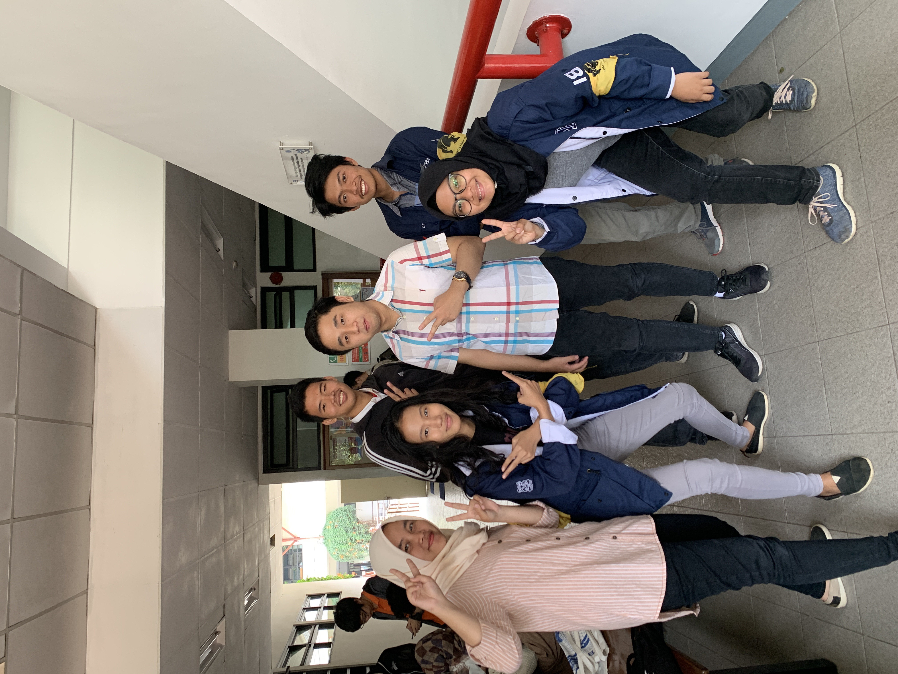

# Wawancara Daemon Kak Cornel
Wawancara oleh
* 16518046 - Annisa Ayu Pramesti
* 16518060 - Alexandra Angeline
* 16518160 - Naufal Dean Anugrah
* 16518269 - Chokyi Ozer
* 16518336 - Shafa Amarsya Madyaratri

Pada Senin 26 Agustus 2019, Kami mewawancara kak Cornelius Yan Mintareja atau biasa dipangil kak Cornel dari Teknik Informatika 2016. Kak Cornel menjabat di DE sebagai Kadiv Manpro atau yang sekarang disebut COO.
=======
Pada Senin 26 Agustus 2019, Kami mewawancara kak Cornelius Yan Mintareja atau biasa dipangil kak Cornel dari Teknik Informatika 2016. Kak Cornel menjabat di DE sebagai Kadiv Manajemen Proyek (Manpro) atau yang sekarang disebut COO.

Jobdesc divisi Manpro adalah langsung berhubungan dengan client. Menurutnya, divisi Manpro adalah wadah yang sangat baik untuk belajar teknis dari me-manage atau mengurusi proyekan, dan langsung turun ke dunia professional. Tugasnya adalah memastikan bahwa proyek dari client yang masuk ke Inkubator IT HMIF dapat dihandle oleh anggota yang berminat.

Nah, Kak Cornel ini merupakan orang yang self-proclaimed apatis. Maka, DECRYPT penasaran dan bertanya mengapa ia masuk divisi Manpro, yang sangat berhumas. Jawaban Kak Cornel adalah karena ia mendapat banyak pengalaman yang langsung hands-on dengan client dunia nyata. Kemudian, dia juga bilang dia meniknmati memanage orang-orang dari sisi technical. Menurutnya, banyak mahasiswa HMIF yang asik diajak bekerja sama untuk bagi tugas dan diskusi.

Setelah itu, Kak Cornel menceritakan pahit dan manisnya dari menjadi Kadiv Manpro ini. Mulai dari client nyebelin sampai pengambil proyek (terutama kating) yang sulit dicontact. Bahkan, pernah ada start-up dari luar negeri yang menjanjikan fee sebesar 180 juta rupiah, namun setelah proyekannya selesai dibuat, mereka malah menghilang. Menurut Kak Cornel, lebih banyak pahit daripada manisnya, dan duitnya "not that worth" karena sangat menghabiskan waktu dan energi.

## Shafa: Kak Cornel selama jadi manpro pernah dapet proyek apa yang sangat besar dan menjanjikan?
Dulu pernah sempat dapat client dari Korea. Mereka menjanjikan suatu proyek yang benar-benar gede senilai 180 juta rupiah. Karena cukup besar jadi proyek ini sejak dini udah mulai dipersiapkan, direncanakan, dan dilayout gitu secara garis besar. Tapi ternyata dibatalkan oleh clientnya, untungnya saat itu memang belom sempat MoU. Kata kak Cornel hal begini cukup sering juga terjadi. Nggak semua client itu baik dan sangat mudah untuk diajak berkomunikasi dan bernegosiasi. Tapi menurut Kak Cornel hal-hal ini jadi pembelajaran yang baik untuk ke depannya terkait bagaimana menanggapi client.

## Shafa : Pernah punya dream job gak kak?
Punya, sampe sekarang juga masih menjadi dream job. Kak Cornel dari kecil udah kenal DOTA dan udah main DOTA cukup lama. Beliau punya dream job yaitu menjadi salah satu orang yang bekerja dibalik development game DOTA. Pengen jadi game designer di DOTA sih katanya. Leh ugha.
