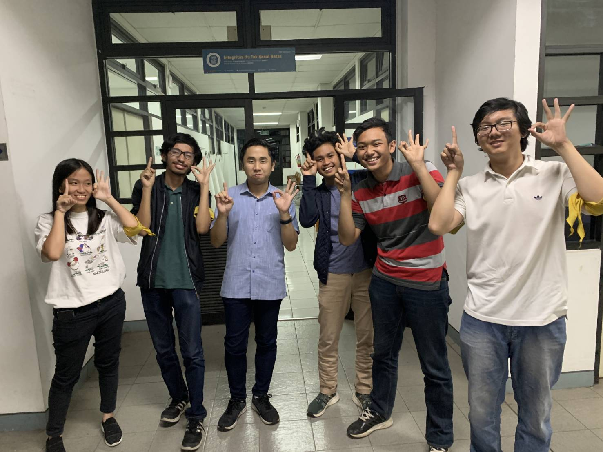

# Wawancara Daemon "Ka Cornelius"

Pewawancara
- Kevin Austin Stefano - 16518114
- Rafael Sean Putra    - 16518145
- Mario Gunawan        - 16518180
- Cindy Olivia         - 16518209
- Fabianus Harry       - 16518339

## Deskripsi
Pada hari Rabu, 21 Agustus 2019, kami berkesempatan mewawancarai daemon dengan kode "aes". Daemon ini bernama Cornelius Yan Mintoreja yang biasanya akrab dipanggil Kak Cornel atau Kak Onel. Saat ini, kak Cornel berkuliah di jurusan Teknik Informatika ITB angkatan 2016 dan aktif di Himpunan Mahasiswa Informatika ITB (HMIF ITB). Di HMIF, Kak Onel menjabat di DE sebagai kadiv Manajemen Proyek (ManPro). Adapun alasan Ka Cornell memilih sebagai Kadiv Manpro adalah karena dipercayai oleh kadiv sebelumnya dan niat untuk bekerja di manpro. Sebagai Kadiv Manajer Proyek IIT, Kak Cornel memiliki tugas atau program yang telah dilakukan, yaitu memastikan setiap proyek klien yang masuk ke Inkubator IT dapat di handle oleh manpro-manpro HMIF. Kak Cornel memiliki keinginan untuk menjadi seorang product manager di masa yang akan datang, karena pekerjaan ini ia anggap sebagai pekerjaan dengan prospek yang sangat besar.

## Pertanyaan
Pertanyaan pertama adalah gimana caranya Ka Cornell ngembangin startup. Yang pertama adalah cari atau punya tujuan dulu buat apa. Tujuan yang kuat dan benar yang bias menyelesaikan masalah banyak orang. Selanjutnya validate startup kita. Setelah itu kita bisa built something mulai dari Mockup hingga startup yang hamper jadi. Jangan lupa untuk melakukan test atas produk kita kata Ka Cornell. Dan setelah itu kita bisa mencari investor untuk ngembangin startup kita.

Pertanyaan kedua dari adalah gimana caranya belajar and mulai ngedevelop kemampuan atau skill kita. Ka Cornell menjawab kita bisa belajar dari online course yang ada di internet. Selain itu kita bisa cari dokumentasi-dokumentasi melalui website resmi atau website-website lainnya. Setelah kita belajar, kita bisa coba buat proyek kecil kecilan sebagai bentuk implementasi dari proses belajar kita.

Kami sebagai tingkat 2 tahu, bahwa jadwal di tingkat 2 selalu dimulai di siang hari. Oleh karena itu, kami pun bertanya kepada kak Cornel apa yang ia lakukan untuk mengisi kekosongan waktu di pagi hari tersebut sebelum kelas karena jujur kami pun masih bingung harus mengisinya dengan hal apa. Lalu, ia pun memberikan saran untuk lagi-lagi melakukan eksplorasi bidang favorit di Informatika dan memperdalamnya, agar nantinya saat akan masuk ke dunia kerja, kita sudah tau bidang spesialisasi kita dan dapat menyesuaikan dengan pekerjaan tersebut.

Menyambung dari pertanyaan kedua juga, banyak dari kami yang baru mulai belajar programming, dan kami pun bertanya apa rekomendasi online course terbaik yang dapat membantu kami untuk belajar dengan maksimal. Kak cornel sendiri tidak merekomendasikan suatu online course yang spesifik, dan menyarankan kami untuk melakukan googling sendiri karena banyak sekali pilihan online course yang tersedia di google dan kita tinggal memilih yang sekiranya cocok dengan kita.

Saat ditanyai tentang ingin menjadi apa saat mengalami reinkarnasi, kak Cornel menjawab ingin menjadi penguin. Hal ini karena penguin merupakan binatang favorit kak Cornel. Selain itu, kak Cornel merasa penguin merupakan binatang yang lucu. Namun sayang, kak Cornel belum pernah sekalipun bertemu secara langsung dengan binatang favoritnya tersebut.

Saat ditanyai tentang spesifikasi rumah idaman, kak Cornel ingin memiliki dua buah rumah. Rumah yang pertama berlokasi di daerah dengan alam yang masih terjaga dan masih sunyi. Rumah yang kedua berada di daerah perkotaan. Kak Cornel ingin agar rumah yang berada di daerah perkotaan ini memiliki sebuah ruangan yang khusus untuk segala macam peralatan VR.

Saat ditanyai tentang apa yang ingin dilakukan apabila memiliki mesin waktu, kak Cornel menjawab bahwa ia ingin kembali ke masa TPB nya. Dan di masa itu, ia ingin mempelajari hal-hal yang lebih teknis sehingga saat di Jurusan, kak Cornel dapat lebih menguasai hal-hal yang lebih bersifat teknis, karena pada kenyataannya sekarang, ia bilang bahwa ia lebih menguasai hal-hal yang bersifat soft skill daripada hal-hal berbau teknis.

Saat ditanya apakah pernah memiliki penyesalan masuk STEI/IF, kak Cornel tidak pernah menyesal. Justru kebalikannya, harusnya anak-anak dari jurusan lain yang ngiri. Karena, kalau magang, gaji untuk anak IF bisa dibilang sangat tinggi dibanding anak jurusan lain kalau magang. Selain itu, menurut Kak Cornel, IF tidak sesibuk itu asal bisa mengatur waktu dengan baik. Ga seharusnya, anak IF nyesel masuk IF, karena gimanapun juga, setiap jurusan pasti ada ga enaknya. Dijalanin aja dan ambil positifnya.

Kak Cornelius menjawab bahwa dia lebih memilih untuk tidak mengikuti unit saat masa TPB saat ditanya unit apa yang diikuti. Alasan dia tidak mengikuti unit adalah karena dia merasa semester satu dan dua TPB sangatlah sibuk sehingga sangat sulit untuk mengatur waktu antara unit dan pelajaran

Pertanyaan terakhir adalah ketika ditanyai bidang apa dalam keinformatikaan yang paling banyak menghasilkan uang, kak Cornel menjawab bahwa lebih baik kami belajar apa yang kami inginkan, karena bidang keinformatikaan itu pasti terjamin keuangannya. Jadi, apapun yang kita dalami pasti membuahkan hasil, terutama sedang banyak demand untuk anak IT. Mau web developer, software engineer, maupun program manager bisa ditekuni asalkan punya niat dan nilai jual lebih pasti membuahkan hasil, jadi jangan terlalu mengkhawatirkan tentang uang.

## Foto

