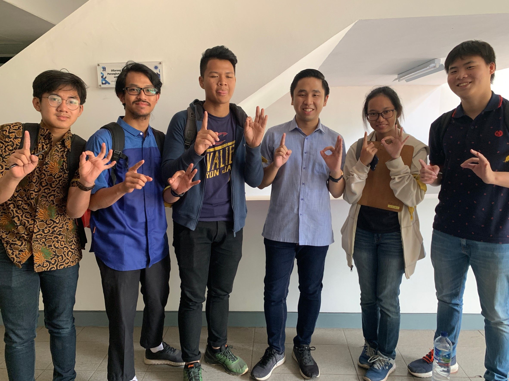

&nbsp;&nbsp;&nbsp;&nbsp;&nbsp;&nbsp;Kami berkesempatan untuk mewawancarai kaka tingkat kami angkatan 16 yang bernama **Cornelius Yan Mintareja**. Beliau sejurusan dengan kami yaitu teknik informatika (*IF*). Saat ini, beliau menjadi seorang Kadiv Manajemen Proyek Incubator IT (IIT). Keputusan menjadi kadiv bukan tidak ada alasan. Ia mengaku kenal dekat dan dipercayakan kadiv sebelumnya untuk mengemban tugas ini. Hal yang dikerjakan olehnya adalah memastikan proyek yang masuk ke IIT dari client dapat di *handle* oleh manpro-manpro

### Pendapat Tentang Online Course
&nbsp;&nbsp;&nbsp;&nbsp;&nbsp;&nbsp;Ka Cornelius termasuk sosok yang belajar banyak hal. Kami bertanya tentang pendapat terhadapa online course yang saat ini sedang marak digunakan dan tersebar di internet. Ka Cornelius berkata bahwa memang kita memiliki banyak cara belajar masing-masing, dan untuk belajar di online course juga begitu. Saran ia adalah gunakan online course jika memang kita ingin belajar sesuatu hal dari awal.

### Judul Tugas Akhir
&nbsp;&nbsp;&nbsp;&nbsp;&nbsp;&nbsp;Saat ini ia belum bisa memutuskan judul tugas akhirnya. Akan tetapi, untuk topik Kaka yang satu ini memiliki topik *software method engineering*.

### Cara belajar yang baik serta efektif dari kak Cornelius
&nbsp;&nbsp;&nbsp;&nbsp;&nbsp;&nbsp;Kata kakak Cornelius, ia belajar dari buku, slide karena hal itu penting. Jika kepepet, baca slide aja. 
### Apa cara terbaik dalam belajar skill baru terutama tentang skill keprofesian
&nbsp;&nbsp;&nbsp;&nbsp;&nbsp;&nbsp;Kata kak Cornelius si beda orang beda cara, tapi dia menganjurkan buat ikut online course.

### Lomba Selama di HMIF
&nbsp;&nbsp;&nbsp;&nbsp;&nbsp;&nbsp; Kak Yan sendiri sudah beberapa kali mengikuti lomba selama di HMIF. Namun ia baru berhasil mendapatkan juara ketika di tingkat 3. Dia berkata bahwa di tingkat 2 adalah fase pembelajaran, di fase ini sudah sewajarnya kita kalah karena pada fase ini merupakan fase pencarian ilmu dan pengalaman. Kak Yan sendiri sudah beberapa kali mengikuti lomba CP dan Data Science, namun tidak pernah berbuah hasil. Untuk lomba hackathon, kak Yan berhasil memenangi lomba tersebut sebanyak 2 kali dan 3 kali untuk lomba Idea Challenge

### Antara lomba, magang, dan bikin *startup*
#### Lomba
&nbsp;&nbsp;&nbsp;&nbsp;&nbsp;&nbsp; Kak Cornel adalah orang yang tidak segan mengatakan kalau dirinya apatis. Meski begitu, menurut aku kak Cornel bukannya apatis, dia cuma punya fokus yang berbeda dengan orang lain (hal ini dikuatkan dengan *statement* dari Kak Alfa yang mengatakan kalau Kak Cornel selalu membantu mengatur jadwal anggota kelompok tubesnya). Salah satu fokusnya adalah mengikuti lomba. Bagi Kak Cornel, ada dua tipe lomba: lomba 'tingkat tinggi' dan 'lomba *ecek-ecek*'. Lomba tingkat tinggi adalah lomba yang diadakan perusahaan untuk umum, biasanya hadiah lomba ini mencapai puluhan juta rupiah. Sementara itu, lomba *ecek-ecek* bukannya lomba tingkat rendah atau tidak berkualitas, melainkan lomba yang diadakan universitas, diikuti mahasiswa, dan hadiahnya 'cuma' sekian juta rupiah.

&nbsp;&nbsp;&nbsp;&nbsp;&nbsp;&nbsp; Tips dari Kak Cornel dalam mengikuti lomba adalah: *ikut aja dulu*. Di tingkat tiga ini, menurutnya, adalah waktunya kita kalah. Kita bisa memulai dengan ikut lomba *ecek-ecek* tadi. Kalau menang syukurlah, kalau kalah ya sudah tidak apa-apa; karena tingkat tiga memang waktunya untuk 'masih' mencari ilmu, belum untuk menang. Setelah ikut sekian banyak lomba dan sekian kali kalah, akan tiba saatnya di mana kita menang. Ketika kita sudah tahu bagaimana cara suatu lomba bekerja, seharusnya menang akan jadi hal mudah. Kak Cornel lalu memberi bukti dengan memamerkan fotonya yang memegang sertifikat bernilai 75 juta rupiah. Antara bikin iri dan memotivasi beda tipis.

#### Magang
&nbsp;&nbsp;&nbsp;&nbsp;&nbsp;&nbsp; Kalau soal magang, Kak Cornel berkata kalau dia pernah magang di Tokopedia dan Traveloka. Dia menyebutkan gaji yang diterimanya, tapi hal itu bersifat sensitif jadi tidak akan disebutkan di sini. Kak Cornel juga sering membantu dan mengarahkan adik-adik tingkatnya yang juga sedang mencari kerjaan magang dan/atau lomba. Kalau tidak salah, dia membuka sebuah 'kursus'(?) untuk membantu mereka secara khusus. Kak Cornel sangat terbuka untuk ditanya-tanya dan dimintai referensi.

#### *Startup*
&nbsp;&nbsp;&nbsp;&nbsp;&nbsp;&nbsp; Saat ini, Kak Cornel juga sedang mencoba untuk membuat *startup*-nya sendiri, namanya fluent.id. Konsep dari *startup* ini adalah membantu orang untuk terbiasa berbicara dalam bahasa Inggris. Jadi, pengguna bisa memilih topik untuk dibicarakan, lalu *match* dengan pengguna lain secara anonim kemudian mereka bisa berdiskusi bebas dalam bahasa Inggris. Aplikasi ini masih dalam pengembangan dan belum *launching*, tapi sudah mencapai seratus pengguna teregistrasi (meski yang aktif cuma empat). Untuk mengatasi kekurangan pengguna juga, Kak Cornel menerapkan *open-close system*. Jadi, aplikasi ini cuma buka jam 7 pagi sampai 9 malam, untuk memperbesar kemungkinan terjadinya *match*. 
