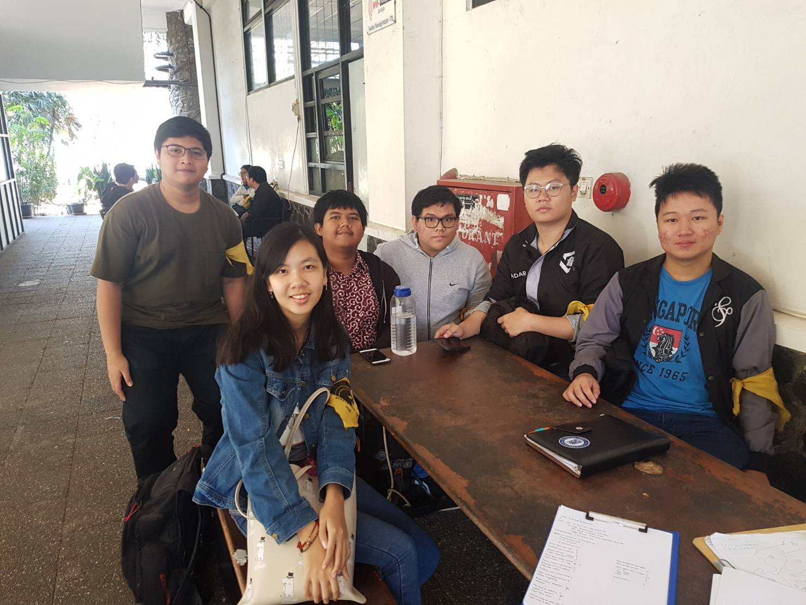

# Wawancara Daemon

Pada Jumat, 23 Agustus 2019, kami berlima mewawancarai Kak Yuda.
Anggota :
- 16518029 Florencia Wijaya
- 16518089
- 16518240 
- 16518249
- 16518407

# Summary
## Biodata
	Nama lengkap Kak Yuda adalah I Kadek Yuda Budipratama Giri. Jurusannya adalah Teknik Informatika.
	Perannya adalah Lead of Community Service. Alasan Kak Yuda mengambil peran ini adalah ingin membantu orang-orang.
	Proker yang dijalaninya sebagai berikut.
	1. Aku Pasti Bisa = melibatkan massa HMIF, bergerak di bidang pendidikan untuk panti asuhan. 
	2. HMIF Berbagi = melihat kondisi di masyarakat dan donasi.
	3. Tanggap Bencana = menyalurkan sumbangan ke yang membutuhkan melalui KM.
	
## Pertanyaan Bebas
### Floren : Pengalaman berkesan di HMIF?
	Kak Yuda pernah diusir seorang dosen dari lab karena udah lewat jam 10 malem. Dosen yang ngusir itu ruangannya di sebelah lab yang ditempati Kak Yuda, makanya bisa ketahuan.
	
### Floren : Awal belajar coding dan masuk STEI gimana?
	Kak Yuda kenal coding dari masuk kuliah dan suka coding karena seru, menurutnya. Terus awalnya disuruh masuk STEI karena suka main komputer. Pas masuk, sebenernya Kak Yuda mau masuk STI. 
