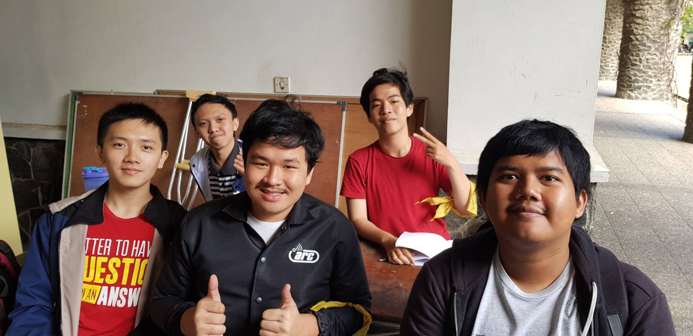

# Wawancara Daemon I Kadek Yuda Budipratama Giri

  

Pada hari rabu, 21 Agustus 2019 lalu, kami:
- 16518100 - Jun Ho Choi Hedyatmo
- 16518103 - Hardy Valenthio Amansyah
- 16518296 - Daniel Riyanto
- 16518354 - Zaidan Naufal Sudrajat

berkesempatan untuk mewawancarai kak I Kadek Yuda Budipratama Giri, berikut hasil wawancaranya

Daemon yang kami wawancara ini memiliki nama lengkap I Kadek Yuda Budipratama Giri, biasa dipanggil kak Yuda. kak Yuda ini jurusannya Teknik Informatika
dan Ia di HMIF bergabung di pengmas (pengabdian masyarakat) yaitu community service sebagai ketua. Nah kenapa kak Yuda ingin memegang peran tersebut?
katanya sih karena Ia bosan bertemu orang ITB. lalu apa sih proker yang dijalankan kak Yuda di community service ini? prokernya salah satunya
adalah akupastibisa, yaitu membawa massa HMIF untuk mengedukasi anak-anak panti asuhan, lalu ada juga proker lain seperti HMIF berbagi, yang didalamnya
terdapat tangga bencana, yang menggalang dana untuk membantu korban bencana.

Kemudian berlanjut ke sesi tanya jawab, Jun Ho bertanya, apa sih ketertarikan kak Yuda di bidang Informatika? nah menurut kak Yuda Ia tertarik di web development
dan cyber security pada awalnya, Ia juga anggota dari unit ARC (web development). Ia juga sempat tertarik dengan game development dan sekarang tertarik
dan ingin mencoba data science. Pertanyaan selanjutnya dari Jun Ho, kak Yuda ini ingin kerja dimana? menurut kak Yuda, Ia masih ingin belajar, tapi dibayar.
Kalau kerja pun dimana aja boleh, apakah kak Yuda ingin membuat start-up? sepertinya belum kepikiran. by the way kak Yuda ini sering ngecarry tubes lho. bisa dilihat
di pertanyaan-pertanyaan selanjutnya.

