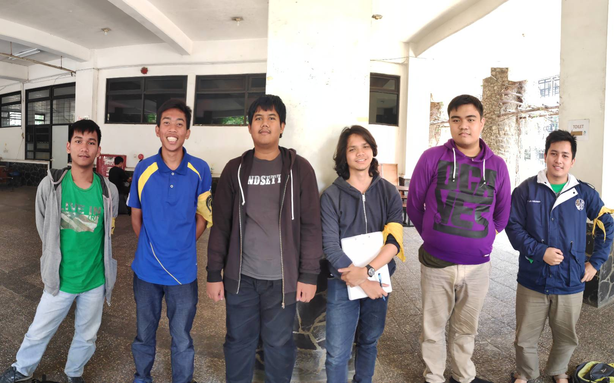

# Wawancara Daemon "Elgamal"

## Foto

## Summary
Pada hari Minggu, 25 Agustus 2019 sekitar jam 10 pagi, kami berkesempatan untuk mewawancarai kak Yuda. Nama lengkap kak Yuda adalah I Kadek Yuda Budipratama Giri. Jurusannya adalah Teknik Informatika. Kak Yuda di HMIF masuk di Pengmas bagian Community Service, di tahun lalu kak Yuda sempat menjadi Kadiv Entrepreneur Arkavidia. Alasan kak Yuda masuk Pengmas adalah karena kak Yuda mau coba bantu masyarakat dan sambil menghilangkan bosan karna biasanya ketemu orang orang ITB terus.

Pada divisi kak Yuda di HMIF yaitu Community Service ada beberapa program kerja. Pertama yaitu APB (Aku Pasti Bisa) yang merupakan sebuah acara yang melibatkan mahasiswa HMIF sebagai upaya pencerdasan khususnya diusahakan dalam bidang keinformatikaan. Kedua yaitu HMIF Berbagi yang merupakan program donasi HMIF dalam bentuk sumbangan atau makanan. Selain itu terdapat fungsi kerja Tanggap Bencana yang berfokus membantu finansial korban bencana melalui lembaga penyalur donasi bencana.

### Hal yang dulu sering dilakukan tapi sekarang gak bisa
Hal yang dulu kak Yuda bisa lakukan tapi sejak masuk ITB jadi nggak bisa adalah tidur dengan tenang dan juga tidur itu sendiri. Jam tidur rata-rata kak Yuda sejak masuk ITB adalah 5/4 jam. Rekor kak Yuda nggak tidur adalah 48 jam. Hal yang membuat kak Yuda 2 hari nggak tidur itu adalah Tubes OOP (Object Oriented Programming), yaitu membuat Insaniquarium. Tetapi menurut kak Yuda, asal pintar dalam ngatur, kita akan bisa tidur cukup.

### PengMas
Pada saat magang divisi HMIF kak Yuda sudah masuk dalam di bidang Pengabdian Masyarakat. Salah satu yang diingat adalah saat itu bersama melakukan survei tempat. Dan dari hasil survei harus melakukan analisis kendala yang ada di tempat tersebut. Sedangkan selama berada di pengmas hal yang paling berkesan dan diingat kak Yuda adalah ketika bertemu dengan seseorang yang pernah viral di media sosial karena kontribusi dan kepedualiannya dengan lingkungan walau di tengah kondisi yang kekurangan. Kak Yuda merasa asik ngobrol dengan orang-orang
saat melakukan acara pengmas.

### Ide TA
Ide TA yang kak Yuda miliki ialah sistem parking yang bikin kita gak usah berhenti buat bayar/ngambil tiket. Awalnya pengen pake plat nomor yang nantinya dihubungkan ke rekening bank. Masalahnya, plat plat di Indonesia banyak yang di custom sehingga kemungkinan dapat bermasalah. Kak Yuda mendapatkan ide ini saat ia ngantri parkir panjang, ia memikirkan gimana biar kalo ngantri bisa lebih cepet dan didapatkanlah ide ini.

### Pendapat mengenai Bandung
Kalau mengenai orang Bandung, menurut kak Yuda ada yang ramah dan murah senyum, tapi ada juga yang jutek. Kalo mengenai lingkungannya, di pagi hari adem, saat siang panas, malem dingin, tengah malem apalagi. Menurut kak Yuda keadaan lingkungan ini mirip seperti gurun pasir.

### Unit
Unit yang kak Yuda ikuti selama di ITB yaitu UKJ(unit kebudayaan Jepang), ARC(Amateur Radio Club), KMH(Keluarga Mahasiswa Hindu)

### Hobi
Hobi kak Yuda ada banyak yaitu main game biasanya yang genre balapan, masak, tidur, main komputer bisa dalam bentuk ngoding atau browsing browsing internet aja. Kak Yuda paling suka memasak Ayam Gorang Tepung, Kari Indonesia, Kari Jepang, dan Chiken Katsu. Biasanya dirinya masak hanya untuk diri sendiri saja. 

### Magang
Kak Yuda pernah melakukan kerja magang di perusahaan PT Montrax. Magang tersebut dilakukan secara remote dan kak Yuda mendapat tugas dalam web development dengan framework java.

### Kerja Praktek
Kak Yuda melakukan Kerja Praktek di Jepang tepatnya di Gifu Kosen, yaitu sebuah perguruan tinggi di Kota Motosu, Prefektur Gifu. Di Gifu Kosen kak Yuda bersama timnya melalakukan riset mengenai game. 

### Bucket List
Kak Yuda mempunyai bucked list yaitu kak Yuda ingin mempunyai rumah yang terletak tidak di jakarta maupun Bandung, yang suasananya sepi, rencananya kak Yuda ingin punya rumah dulu baru menikah

### Kedepannya
Kak Yuda masih mencari apa yang akan dia dalami di keinformatikaan dengan beberapa minat lebih pada web development, data science dan kriptografi. 

### Pendapat Mengenai Kerja Praktek Bersama Orang-Orang dari Berbagai Daerah
Pada saat KP di Jepang kak Yuda bertemu dengan mahasiswa dari Prancis, Uzbekistan, Kamboja, Vietnam, Jerman, Malaysia, dan Singapura. Yang paling teringat adalah orang Vietnam yang baik karena memberikan oleh-oleh dari negaranya karena kak Yuda mengajarkannya. Sedangkan orang-orang eropa cenderung sering pulang malam dan sering di laboratorium.

## Kesan terhadap kak Yuda
Kak Yuda adalah seseorang yang peduli akan orang lain, pandangan terhadap orang lain sangat multiparadigma atau melihat dari berbagai sudut pandang. Pengalamannya juga banyak apalagi samapai melakukan riset KP di luar negeri.
