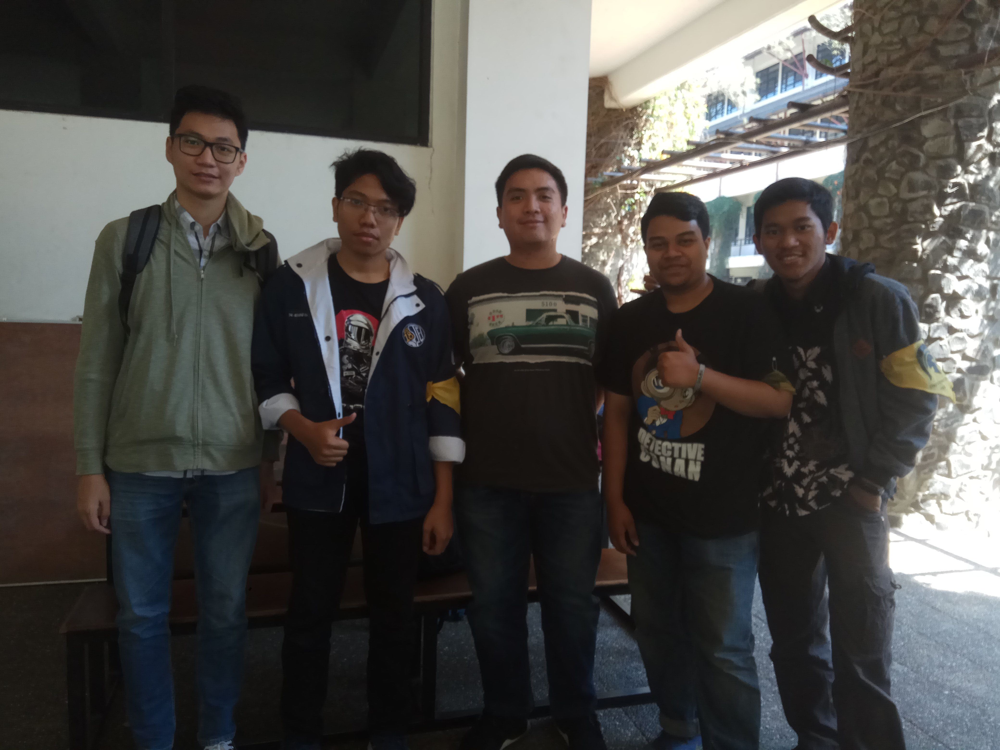

# Wawancara Dengan Kak Izzan 

Pagi hari Jum’at sekitar pukul 9 pagi tanggal 23 Agustus 2019, kami berkesempatan untuk mewawancarai daemon yang baru saja kembali dari Singapura untuk KP di salah satu perusahaan terbesar di dunia yaitu Google.

# Summary
## Siapa Kak Izzan ?

Kak Izzan ini adalah salah satu anak IF ITB yang brilian. Dia menjabat sebagai Kepala Departemen Teknologi yang ada di HMIF. Departemen ini adalah departemen baru yang ada di HMIF, dan banyak nilai-nilai perubahan yang dicanangkan oleh kak Izzan dan Kak Abbay untuk HMIF ini yang tentunya ke arah yang jauh lebih baik lagi. Sebelum memiliki peran di dalam Departemen Teknologi HMIF, Kak Izzan juga sering mengisi acara sharing mengenai Internship bersama dengan teman-temannya.

## Peran di HMIF

## Program Kerja
Program Kerja Departemen Teknologi yang dipimpin Kak Izzan adalah Internship Sharing, Internship Workshop Bootcamp CP, CTF, Data Science, UI/UX.

## Hal yang perlu dipersiapkan untuk magang?
Menurut Kak Izzan, hal yang perlu dipersiapkan untuk magang adalah resume. Sebaiknya resume satu halaman penuh terisi. Side projects dapat dimasukkan dalam resume. Hal lain yang perlu dipersiapkan adalah interview. Kak Izzan juga berkata bahwa magang saat liburan penting. Hal tersebut dikarenakan pada saat daftar magang untuk KP seseorang akan diprioritaskan apabila telah berpengalaman.   

## Hal positif di angkatan 2016?
Menurut Kak Izzan, angkatan 2016 sharing-nya bagus. Hal tersebut terlihat dari hampir tiap orang tahu temannya magang dimana. Angkatan 2016 juga memiliki grup BIT Internship dan menjadi wadah berbagi informasi magang. 
